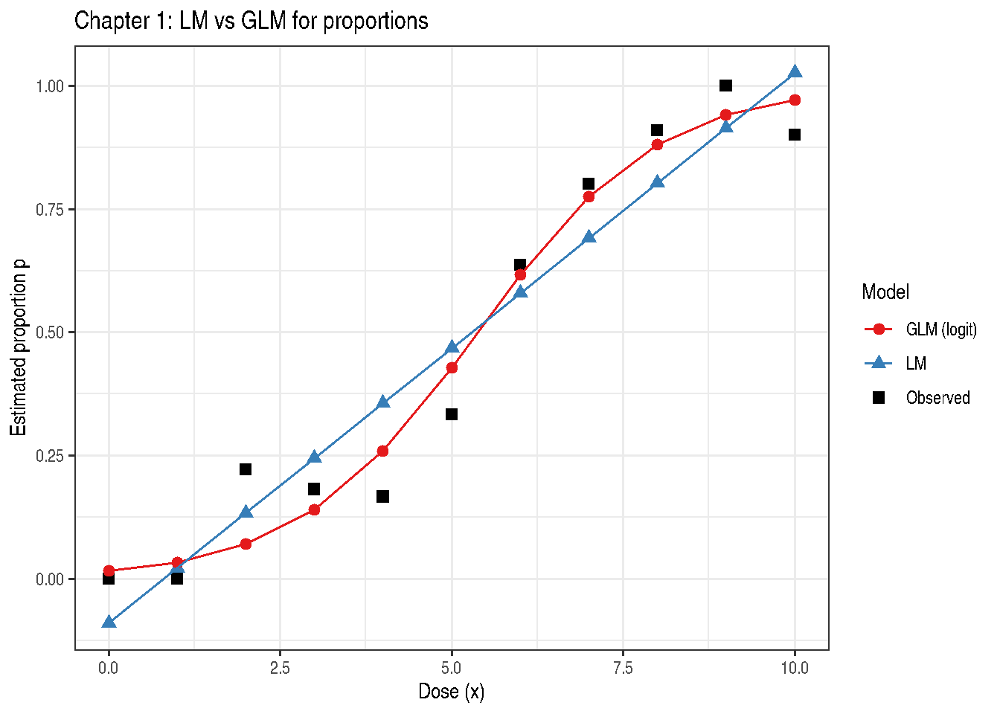

# Chapter 1: Modeling Basics

``` r

library(modernGLMM)
library(ggplot2)
library(emmeans)
if (requireNamespace("parameters", quietly = TRUE)) library(parameters)
```

## 1 Overview

Chapter 1 of Stroup, Ptukhina, and Garai (2024) introduces the
statistical landscape motivating GLMMs. The key insight is that
different response types — Gaussian, binomial, Poisson — require
different probability models, and forcing all of them into a
normal-error linear model leads to inferential distortions.

The chapter uses a dose–response dataset (Table 1.1) to contrast:

1.  A **linear model** (LM) — forced Gaussian assumption
2.  A **generalized linear model** (GLM) with logistic link —
    appropriate binomial model

## 2 Data

Table 1.1 records the number of successes \\y\\ out of \\N_x\\ trials
across 11 dose levels \\x = 0, 1, \ldots, 10\\.

``` r

data(Table1.1)
knitr::kable(Table1.1, caption = "Table 1.1: Dose-response data")
```

|   x |  Nx |   y |
|----:|----:|----:|
|   0 |  11 |   0 |
|   1 |   7 |   0 |
|   2 |   9 |   2 |
|   3 |  11 |   2 |
|   4 |  12 |   2 |
|   5 |  15 |   5 |
|   6 |  11 |   7 |
|   7 |  15 |  12 |
|   8 |  11 |  10 |
|   9 |  16 |  16 |
|  10 |  10 |   9 |

Table 1.1: Dose-response data {.table .caption-top}

The observed proportion \\p = y / N_x\\ and the two candidate model
predictions are shown in Figure 1.1 below.

## 3 Linear Model

The LM fits a straight line on the probability scale:

\\p_i = \beta_0 + \beta_1 x_i + \varepsilon_i, \quad \varepsilon_i \sim
\mathcal{N}(0, \sigma^2)\\

``` r

Exam1.1.lm <- stats::lm(formula = y / Nx ~ x, data = Table1.1)
if (requireNamespace("parameters", quietly = TRUE)) {
  parameters::model_parameters(Exam1.1.lm)
}
```

| Parameter | Coefficient | SE | CI | CI_low | CI_high | t | df_error | p |
|:---|---:|---:|---:|---:|---:|---:|---:|---:|
| (Intercept) | -0.0894399 | 0.0662511 | 0.95 | -0.2393102 | 0.0604305 | -1.350014 | 9 | 0.2099820 |
| x | 0.1115152 | 0.0111985 | 0.95 | 0.0861824 | 0.1368479 | 9.958067 | 9 | 0.0000037 |

**Problem**: the fitted line can exceed \\\[0, 1\]\\ and assumes
constant variance — neither of which is appropriate for proportions.

## 4 Generalized Linear Model (Logistic)

The logistic GLM uses:

\\\text{logit}(p_i) = \log\frac{p_i}{1 - p_i} = \beta_0 + \beta_1 x_i\\

so fitted values are automatically constrained to \\(0, 1)\\.

``` r

Exam1.1.glm <- stats::glm(
  formula = cbind(y, Nx - y) ~ x,
  family  = stats::binomial(link = "logit"),
  data    = Table1.1
)
if (requireNamespace("parameters", quietly = TRUE)) {
  parameters::model_parameters(Exam1.1.glm)
}
```

| Parameter | Coefficient | SE | CI | CI_low | CI_high | z | df_error | p |
|:---|---:|---:|---:|---:|---:|---:|---:|---:|
| (Intercept) | -4.1085728 | 0.7421399 | 0.95 | -5.7305417 | -2.795709 | -5.536116 | Inf | 0 |
| x | 0.7640431 | 0.1272572 | 0.95 | 0.5397411 | 1.043573 | 6.003930 | Inf | 0 |

``` r

if (requireNamespace("report", quietly = TRUE)) {
  tryCatch(
    print(report::report(Exam1.1.glm)),
    error = function(e) message("report() not supported for this model: ", conditionMessage(e))
  )
}
```

    Can't calculate log-loss.

    `performance_pcp()` only works for models with binary response values.

    Can't calculate log-loss.

    `performance_pcp()` only works for models with binary response values.
    We fitted a logistic model (estimated using ML) to predict cbind(y, Nx - y)
    with x (formula: cbind(y, Nx - y) ~ x). The model's intercept, corresponding to
    x = 0, is at -4.11 (95% CI [-5.73, -2.80], p < .001). Within this model:

      - The effect of x is statistically significant and positive (beta = 0.76, 95%
    CI [0.54, 1.04], p < .001; Std. beta = 2.44, 95% CI [1.73, 3.34])

    Standardized parameters were obtained by fitting the model on a standardized
    version of the dataset. 95% Confidence Intervals (CIs) and p-values were
    computed using a Wald z-distribution approximation.

## 5 Comparison: LM vs GLM

``` r

Table1.1$p_obs <- Table1.1$y / Table1.1$Nx
Table1.1$p_lm  <- Exam1.1.lm$fitted.values
Table1.1$p_glm <- Exam1.1.glm$fitted.values

plot_df <- rbind(
  data.frame(x = Table1.1$x, p = Table1.1$p_obs, Model = "Observed"),
  data.frame(x = Table1.1$x, p = Table1.1$p_lm,  Model = "LM"),
  data.frame(x = Table1.1$x, p = Table1.1$p_glm, Model = "GLM (logit)")
)

ggplot(plot_df, aes(x = x, y = p, colour = Model, shape = Model)) +
  geom_point(size = 2.5) +
  geom_line(data = subset(plot_df, Model != "Observed")) +
  scale_colour_manual(values = c("Observed" = "black",
                                 "LM"       = "#377EB8",
                                 "GLM (logit)" = "#E41A1C")) +
  labs(
    title = "Chapter 1: LM vs GLM for proportions",
    x     = "Dose (x)",
    y     = "Estimated proportion p",
    colour = "Model",
    shape  = "Model"
  ) +
  theme_bw()
```



Figure 1: Figure 1.1 — LM (blue) versus logistic GLM (red) fitted
proportions

## 6 Correlation of Fitted Values with Observed

``` r

cat("LM  correlation with observed:", round(cor(Table1.1$p_obs, Table1.1$p_lm),  4), "\n")
```

    LM  correlation with observed: 0.9575 

``` r

cat("GLM correlation with observed:", round(cor(Table1.1$p_obs, Table1.1$p_glm), 4), "\n")
```

    GLM correlation with observed: 0.9818 

The GLM consistently achieves higher correlation because it uses the
correct probability model.

## 7 Estimated Marginal Means

``` r

emm <- emmeans::emmeans(Exam1.1.glm, ~ 1, type = "response")
print(emm)
```

     1        prob     SE  df asymp.LCL asymp.UCL
     overall 0.428 0.0634 Inf     0.311     0.555

    Confidence level used: 0.95
    Intervals are back-transformed from the logit scale 

## 8 Key Takeaways

- **Always match the probability distribution to the response type.**
- Linear models impose Gaussian assumptions that are inappropriate for
  bounded or count responses.
- GLMs generalise LMs through the link function and variance function.
- The logistic GLM is preferred for binomial proportions.

## 9 References

Stroup, W. W., Ptukhina, M., and Garai, S. (2024). *Generalized Linear
Mixed Models: Modern Concepts, Methods and Applications* (2nd ed.). CRC
Press.
