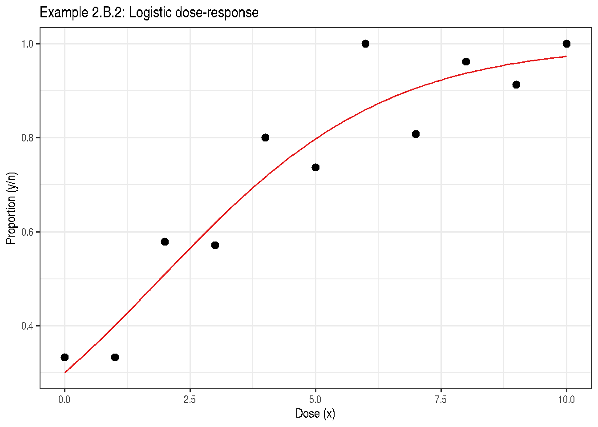

# Chapter 2: Design Matters

Code

``` r

library(modernGLMM)
library(emmeans)
library(ggplot2)
```

## 1 Overview

Chapter 2 establishes the inferential framework used throughout the
book. Key topics include:

- Likelihood-based inference
- Wald, likelihood ratio, and score tests
- Small-sample adjustments (Kenward-Roger, Satterthwaite)
- Two-sample design examples

## 2 Example 2.B.2 — Dose-Response Binomial Data

Code

``` r

data(DataExam2.B.2)
str(DataExam2.B.2)
```

    'data.frame':   11 obs. of  3 variables:
     $ x: int  0 1 2 3 4 5 6 7 8 9 ...
     $ y: int  9 10 11 16 16 14 20 21 25 21 ...
     $ n: int  27 30 19 28 20 19 20 26 26 23 ...

Code

``` r

knitr::kable(DataExam2.B.2,
             caption = "Example 2.B.2: Dose-response binomial data")
```

|   x |   y |   n |
|----:|----:|----:|
|   0 |   9 |  27 |
|   1 |  10 |  30 |
|   2 |  11 |  19 |
|   3 |  16 |  28 |
|   4 |  16 |  20 |
|   5 |  14 |  19 |
|   6 |  20 |  20 |
|   7 |  21 |  26 |
|   8 |  25 |  26 |
|   9 |  21 |  23 |
|  10 |  28 |  28 |

Example 2.B.2: Dose-response binomial data {.table .caption-top}

### 2.1 Logistic regression

Code

``` r

fit_2b2 <- stats::glm(
  cbind(y, n - y) ~ x,
  family = stats::binomial(link = "logit"),
  data   = DataExam2.B.2
)
summary(fit_2b2)
```


    Call:
    stats::glm(formula = cbind(y, n - y) ~ x, family = stats::binomial(link = "logit"),
        data = DataExam2.B.2)

    Coefficients:
                Estimate Std. Error z value Pr(>|z|)
    (Intercept) -0.84466    0.25438  -3.320 0.000899 ***
    x            0.44275    0.06154   7.195 6.24e-13 ***
    ---
    Signif. codes:  0 '***' 0.001 '**' 0.01 '*' 0.05 '.' 0.1 ' ' 1

    (Dispersion parameter for binomial family taken to be 1)

        Null deviance: 90.318  on 10  degrees of freedom
    Residual deviance: 13.572  on  9  degrees of freedom
    AIC: 46.133

    Number of Fisher Scoring iterations: 5

Code

``` r

if (requireNamespace("parameters", quietly = TRUE)) {
  parameters::model_parameters(fit_2b2)
}
```

| Parameter | Coefficient | SE | CI | CI_low | CI_high | z | df_error | p |
|:---|---:|---:|---:|---:|---:|---:|---:|---:|
| (Intercept) | -0.8446576 | 0.2543790 | 0.95 | -1.3552905 | -0.3546914 | -3.320469 | Inf | 0.0008987 |
| x | 0.4427542 | 0.0615358 | 0.95 | 0.3286354 | 0.5709146 | 7.195068 | Inf | 0.0000000 |

Code

``` r

if (requireNamespace("report", quietly = TRUE)) {
  report::report(fit_2b2)
}
```

    Can't calculate log-loss.

    `performance_pcp()` only works for models with binary response values.

    Can't calculate log-loss.

    `performance_pcp()` only works for models with binary response values.

    We fitted a logistic model (estimated using ML) to predict cbind(y, n - y) with
    x (formula: cbind(y, n - y) ~ x). The model's intercept, corresponding to x =
    0, is at -0.84 (95% CI [-1.36, -0.35], p < .001). Within this model:

      - The effect of x is statistically significant and positive (beta = 0.44, 95%
    CI [0.33, 0.57], p < .001; Std. beta = 1.53, 95% CI [1.14, 1.97])

    Standardized parameters were obtained by fitting the model on a standardized
    version of the dataset. 95% Confidence Intervals (CIs) and p-values were
    computed using a Wald z-distribution approximation.

### 2.2 Predicted probabilities

Code

``` r

xnew <- data.frame(x = seq(0, 10, by = 0.1))
xnew$p_hat <- stats::predict(fit_2b2, newdata = xnew, type = "response")

ggplot() +
  geom_line(data = xnew, aes(x = x, y = p_hat), colour = "#E41A1C") +
  geom_point(data = DataExam2.B.2,
             aes(x = x, y = y / n), size = 2.5) +
  labs(title = "Example 2.B.2: Logistic dose-response",
       x = "Dose (x)", y = "Proportion (y/n)") +
  theme_bw()
```



Figure 1: Fitted logistic curve for Example 2.B.2

## 3 Example 2.B.3 — Three Treatment Comparison (Gaussian)

Code

``` r

data(DataExam2.B.3)
DataExam2.B.3$trt <- factor(DataExam2.B.3$trt)
str(DataExam2.B.3)
```

    'data.frame':   6 obs. of  2 variables:
     $ trt: Factor w/ 3 levels "1","2","3": 1 1 2 2 3 3
     $ y  : num  19 19.2 21.9 20.8 21.2 23.3

Code

``` r

fit_2b3 <- stats::lm(y ~ trt, data = DataExam2.B.3)
summary(fit_2b3)
```


    Call:
    stats::lm(formula = y ~ trt, data = DataExam2.B.3)

    Residuals:
        1     2     3     4     5     6
    -0.10  0.10  0.55 -0.55 -1.05  1.05

    Coefficients:
                Estimate Std. Error t value Pr(>|t|)
    (Intercept)  19.1000     0.6868  27.811 0.000102 ***
    trt2          2.2500     0.9713   2.317 0.103405
    trt3          3.1500     0.9713   3.243 0.047734 *
    ---
    Signif. codes:  0 '***' 0.001 '**' 0.01 '*' 0.05 '.' 0.1 ' ' 1

    Residual standard error: 0.9713 on 3 degrees of freedom
    Multiple R-squared:  0.7882,    Adjusted R-squared:  0.647
    F-statistic: 5.581 on 2 and 3 DF,  p-value: 0.09749

Code

``` r

anova(fit_2b3)
```

|           |  Df | Sum Sq |   Mean Sq |  F value |   Pr(\>F) |
|:----------|----:|-------:|----------:|---------:|----------:|
| trt       |   2 |  10.53 | 5.2650000 | 5.581272 | 0.0974922 |
| Residuals |   3 |   2.83 | 0.9433333 |       NA |        NA |

Code

``` r

emm_2b3 <- emmeans::emmeans(fit_2b3, ~ trt)
print(emm_2b3)
```

     trt emmean    SE df lower.CL upper.CL
     1     19.1 0.687  3     16.9     21.3
     2     21.4 0.687  3     19.2     23.5
     3     22.2 0.687  3     20.1     24.4

    Confidence level used: 0.95 

Code

``` r

emmeans::contrast(emm_2b3, method = "pairwise", adjust = "tukey")
```

     contrast    estimate    SE df t.ratio p.value
     trt1 - trt2    -2.25 0.971  3  -2.317  0.1963
     trt1 - trt3    -3.15 0.971  3  -3.243  0.0940
     trt2 - trt3    -0.90 0.971  3  -0.927  0.6632

    P value adjustment: tukey method for comparing a family of 3 estimates 

## 4 Example 2.B.4 — Binomial Response, Three Treatments

Code

``` r

data(DataExam2.B.4)
DataExam2.B.4$trt <- factor(DataExam2.B.4$trt)
str(DataExam2.B.4)
```

    'data.frame':   6 obs. of  4 variables:
     $ obs: int  1 2 3 4 5 6
     $ trt: Factor w/ 3 levels "1","2","3": 1 1 2 2 3 3
     $ Nij: int  13 7 13 13 12 15
     $ Yij: int  2 2 4 9 8 7

Code

``` r

fit_2b4 <- stats::glm(
  cbind(Yij, Nij - Yij) ~ trt,
  family = stats::binomial(link = "logit"),
  data   = DataExam2.B.4
)
summary(fit_2b4)
```


    Call:
    stats::glm(formula = cbind(Yij, Nij - Yij) ~ trt, family = stats::binomial(link = "logit"),
        data = DataExam2.B.4)

    Coefficients:
                Estimate Std. Error z value Pr(>|z|)
    (Intercept)  -1.3863     0.5590  -2.480   0.0131 *
    trt2          1.3863     0.6829   2.030   0.0424 *
    trt3          1.6094     0.6801   2.367   0.0180 *
    ---
    Signif. codes:  0 '***' 0.001 '**' 0.01 '*' 0.05 '.' 0.1 ' ' 1

    (Dispersion parameter for binomial family taken to be 1)

        Null deviance: 12.4483  on 5  degrees of freedom
    Residual deviance:  5.5169  on 3  degrees of freedom
    AIC: 28.116

    Number of Fisher Scoring iterations: 4

Code

``` r

emm_2b4 <- emmeans::emmeans(fit_2b4, ~ trt, type = "response")
print(emm_2b4)
```

     trt  prob     SE  df asymp.LCL asymp.UCL
     1   0.200 0.0894 Inf    0.0771     0.428
     2   0.500 0.0981 Inf    0.3167     0.683
     3   0.556 0.0956 Inf    0.3691     0.728

    Confidence level used: 0.95
    Intervals are back-transformed from the logit scale 

Code

``` r

emmeans::contrast(emm_2b4, method = "pairwise")
```

     contrast    odds.ratio    SE  df null z.ratio p.value
     trt1 / trt2       0.25 0.171 Inf    1  -2.030  0.1051
     trt1 / trt3       0.20 0.136 Inf    1  -2.367  0.0472
     trt2 / trt3       0.80 0.441 Inf    1  -0.405  0.9136

    P value adjustment: tukey method for comparing a family of 3 estimates
    Tests are performed on the log odds ratio scale 

## 5 Example 2.B.7 — Two-Way Factorial

Code

``` r

data(DataExam2.B.7)
DataExam2.B.7$Rep <- factor(DataExam2.B.7$Rep)
DataExam2.B.7$a   <- factor(DataExam2.B.7$a)
DataExam2.B.7$b   <- factor(DataExam2.B.7$b)
str(DataExam2.B.7)
```

    'data.frame':   16 obs. of  4 variables:
     $ Rep: Factor w/ 4 levels "1","2","3","4": 1 1 1 1 2 2 2 2 3 3 ...
     $ a  : Factor w/ 2 levels "1","2": 1 1 2 2 1 1 2 2 1 1 ...
     $ b  : Factor w/ 2 levels "1","2": 1 2 1 2 1 2 1 2 1 2 ...
     $ y  : num  41 40.6 42.7 37.1 40 37.1 39.3 24.2 38.2 36.5 ...

Code

``` r

fit_2b7 <- lmerTest::lmer(
  y ~ a * b + (1 | Rep),
  data    = DataExam2.B.7,
  control = lme4::lmerControl(optimizer = "bobyqa")
)
summary(fit_2b7)
```

    Linear mixed model fit by REML. t-tests use Satterthwaite's method [
    lmerModLmerTest]
    Formula: y ~ a * b + (1 | Rep)
       Data: DataExam2.B.7
    Control: lme4::lmerControl(optimizer = "bobyqa")

    REML criterion at convergence: 70.8

    Scaled residuals:
        Min      1Q  Median      3Q     Max
    -1.6890 -0.2555  0.1485  0.3609  1.2943

    Random effects:
     Groups   Name        Variance Std.Dev.
     Rep      (Intercept) 9.899    3.146
     Residual             8.835    2.972
    Number of obs: 16, groups:  Rep, 4

    Fixed effects:
                Estimate Std. Error     df t value Pr(>|t|)
    (Intercept)   40.975      2.164  6.530  18.933 5.96e-07 ***
    a2             0.150      2.102  9.000   0.071    0.945
    b2            -2.725      2.102  9.000  -1.297    0.227
    a2:b2         -6.875      2.972  9.000  -2.313    0.046 *
    ---
    Signif. codes:  0 '***' 0.001 '**' 0.01 '*' 0.05 '.' 0.1 ' ' 1

    Correlation of Fixed Effects:
          (Intr) a2     b2
    a2    -0.486
    b2    -0.486  0.500
    a2:b2  0.343 -0.707 -0.707

Code

``` r

anova(fit_2b7)
```

|     |    Sum Sq |   Mean Sq | NumDF | DenDF |   F value |   Pr(\>F) |
|:----|----------:|----------:|------:|------:|----------:|----------:|
| a   |  43.23063 |  43.23063 |     1 |     9 |  4.893071 | 0.0542653 |
| b   | 151.90562 | 151.90562 |     1 |     9 | 17.193484 | 0.0024973 |
| a:b |  47.26562 |  47.26562 |     1 |     9 |  5.349774 | 0.0460132 |

Code

``` r

emm_2b7 <- emmeans::emmeans(fit_2b7, ~ a * b)
emmeans::contrast(emm_2b7, method = "pairwise",
                  by = "a", adjust = "tukey")
```

    a = 1:
     contrast estimate  SE df t.ratio p.value
     b1 - b2      2.73 2.1  9   1.297  0.2271

    a = 2:
     contrast estimate  SE df t.ratio p.value
     b1 - b2      9.60 2.1  9   4.568  0.0014

    Degrees-of-freedom method: kenward-roger 

## 6 Key Takeaways

- Likelihood-based inference is the foundation of GLMMs.
- For Gaussian models, \\t\\- and \\F\\-tests follow exactly; for GLMMs,
  Wald and likelihood ratio statistics are approximate.
- `emmeans` provides Satterthwaite-adjusted degrees of freedom for mixed
  model comparisons.

## 7 References

Stroup, W. W., Ptukhina, M., and Garai, S. (2024). *Generalized Linear
Mixed Models: Modern Concepts, Methods and Applications* (2nd ed.). CRC
Press.
