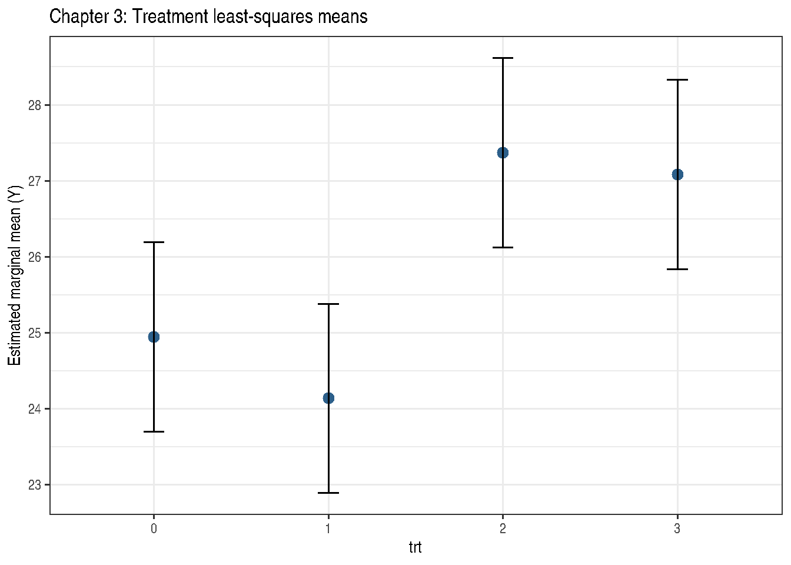

# Chapter 3: Setting the Stage

Code

``` r

library(modernGLMM)
library(emmeans)
library(ggplot2)
```

## 1 Overview

Chapter 3 covers fixed-effects analysis of designed experiments using
both linear models (LM) and generalised linear models (GLM). The three
datasets illustrate:

- **DataSet3.1**: Two-treatment comparison with Gaussian and binomial
  responses
- **DataSet3.2**: Multi-location, multi-treatment factorial
- **DataSet3.3**: Time-course experiment with batch effects

## 2 Example 3.2 — Two-Treatment Binomial GLM

The model is:

\\\text{logit}(p_i) = \mu + \tau_i, \quad i = 0, 1\\

Code

``` r

data(DataSet3.1)
DataSet3.1$trt <- factor(DataSet3.1$trt)
str(DataSet3.1)
```

    'data.frame':   20 obs. of  5 variables:
     $ trt: Factor w/ 2 levels "0","1": 1 1 1 1 1 1 1 1 1 1 ...
     $ rep: int  1 2 3 4 5 6 7 8 9 10 ...
     $ Y  : num  7.33 11.01 8.51 13.22 9.34 ...
     $ N  : int  21 28 28 42 32 22 33 25 19 29 ...
     $ F  : int  0 5 1 5 5 0 4 3 1 5 ...

Code

``` r

Exam3.2.glm <- stats::glm(
  cbind(F, N - F) ~ trt,
  family = stats::binomial(link = "logit"),
  data   = DataSet3.1
)
summary(Exam3.2.glm)
```


    Call:
    stats::glm(formula = cbind(F, N - F) ~ trt, family = stats::binomial(link = "logit"),
        data = DataSet3.1)

    Coefficients:
                Estimate Std. Error z value Pr(>|z|)
    (Intercept)  -2.1542     0.1962 -10.981  < 2e-16 ***
    trt1          1.2682     0.2339   5.422  5.9e-08 ***
    ---
    Signif. codes:  0 '***' 0.001 '**' 0.01 '*' 0.05 '.' 0.1 ' ' 1

    (Dispersion parameter for binomial family taken to be 1)

        Null deviance: 56.195  on 19  degrees of freedom
    Residual deviance: 23.169  on 18  degrees of freedom
    AIC: 86.498

    Number of Fisher Scoring iterations: 4

Code

``` r

if (requireNamespace("parameters", quietly = TRUE)) {
  parameters::model_parameters(Exam3.2.glm)
}
```

| Parameter | Coefficient | SE | CI | CI_low | CI_high | z | df_error | p |
|:---|---:|---:|---:|---:|---:|---:|---:|---:|
| (Intercept) | -2.154165 | 0.1961678 | 0.95 | -2.559677 | -1.787830 | -10.981239 | Inf | 0e+00 |
| trt1 | 1.268215 | 0.2339132 | 0.95 | 0.820860 | 1.740639 | 5.421734 | Inf | 1e-07 |

Code

``` r

## Marginal means on probability scale
emm3.2 <- emmeans::emmeans(Exam3.2.glm, ~ trt, type = "response")
print(emm3.2)
```

     trt  prob     SE  df asymp.LCL asymp.UCL
     0   0.104 0.0183 Inf    0.0732     0.146
     1   0.292 0.0263 Inf    0.2431     0.346

    Confidence level used: 0.95
    Intervals are back-transformed from the logit scale 

Code

``` r

emmeans::contrast(emm3.2, method = "pairwise")
```

     contrast    odds.ratio     SE  df null z.ratio p.value
     trt0 / trt1      0.281 0.0658 Inf    1  -5.422 <0.0001

    Tests are performed on the log odds ratio scale 

Code

``` r

if (requireNamespace("report", quietly = TRUE)) {
  tryCatch(
    print(report::report(Exam3.2.glm)),
    error = function(e) message("report() not supported for this model: ", conditionMessage(e))
  )
}
```

    Can't calculate log-loss.

    `performance_pcp()` only works for models with binary response values.

    Can't calculate log-loss.

    `performance_pcp()` only works for models with binary response values.
    We fitted a logistic model (estimated using ML) to predict cbind(F, N - F) with
    trt (formula: cbind(F, N - F) ~ trt). The model's intercept, corresponding to
    trt = 0, is at -2.15 (95% CI [-2.56, -1.79], p < .001). Within this model:

      - The effect of trt [1] is statistically significant and positive (beta = 1.27,
    95% CI [0.82, 1.74], p < .001; Std. beta = 1.27, 95% CI [0.82, 1.74])

    Standardized parameters were obtained by fitting the model on a standardized
    version of the dataset. 95% Confidence Intervals (CIs) and p-values were
    computed using a Wald z-distribution approximation.

## 3 Example 3.3 — Multi-Location Factorial

Code

``` r

data(DataSet3.2)
DataSet3.2$loc <- factor(DataSet3.2$loc)
DataSet3.2$trt <- factor(DataSet3.2$trt)
str(DataSet3.2)
```

    'data.frame':   32 obs. of  10 variables:
     $ loc   : Factor w/ 8 levels "1","2","3","4",..: 1 1 1 1 2 2 2 2 3 3 ...
     $ trt   : Factor w/ 4 levels "0","1","2","3": 1 2 3 4 1 2 3 4 1 2 ...
     $ Y     : num  26 25.1 28.7 24.5 20.5 21.7 26.7 26.3 25.5 21.7 ...
     $ Nbin  : int  60 60 60 60 60 60 60 60 60 60 ...
     $ S1    : int  0 1 10 19 12 13 31 31 11 20 ...
     $ S2    : int  12 7 16 14 9 26 25 29 4 19 ...
     $ count1: int  0 3 4 4 5 3 6 17 7 6 ...
     $ count2: int  8 4 4 4 1 21 6 15 4 12 ...
     $ A     : int  0 0 1 1 0 0 1 1 0 0 ...
     $ B     : int  0 1 0 1 0 1 0 1 0 1 ...

Code

``` r

Exam3.3.lm <- stats::lm(Y ~ loc + trt, data = DataSet3.2)
summary(Exam3.3.lm)
```


    Call:
    stats::lm(formula = Y ~ loc + trt, data = DataSet3.2)

    Residuals:
        Min      1Q  Median      3Q     Max
    -2.7750 -0.7875  0.3625  1.0813  2.3000

    Coefficients:
                Estimate Std. Error t value Pr(>|t|)
    (Intercept)  25.1375     0.9945  25.277  < 2e-16 ***
    loc2         -2.2750     1.1994  -1.897  0.07169 .
    loc3         -0.7000     1.1994  -0.584  0.56568
    loc4          0.6250     1.1994   0.521  0.60775
    loc5          1.8000     1.1994   1.501  0.14830
    loc6          0.6750     1.1994   0.563  0.57954
    loc7         -2.6000     1.1994  -2.168  0.04181 *
    loc8          0.9750     1.1994   0.813  0.42538
    trt1         -0.8125     0.8481  -0.958  0.34895
    trt2          2.4250     0.8481   2.859  0.00939 **
    trt3          2.1375     0.8481   2.520  0.01988 *
    ---
    Signif. codes:  0 '***' 0.001 '**' 0.01 '*' 0.05 '.' 0.1 ' ' 1

    Residual standard error: 1.696 on 21 degrees of freedom
    Multiple R-squared:  0.6818,    Adjusted R-squared:  0.5303
    F-statistic:   4.5 on 10 and 21 DF,  p-value: 0.001795

Code

``` r

anova(Exam3.3.lm)
```

|           |  Df |  Sum Sq |   Mean Sq |  F value |   Pr(\>F) |
|:----------|----:|--------:|----------:|---------:|----------:|
| loc       |   7 | 68.7250 |  9.817857 | 3.412505 | 0.0135440 |
| trt       |   3 | 60.7525 | 20.250833 | 7.038813 | 0.0018727 |
| Residuals |  21 | 60.4175 |  2.877024 |       NA |        NA |

Code

``` r

emm3.3 <- emmeans::emmeans(Exam3.3.lm, ~ trt)
print(emm3.3)
```

     trt emmean  SE df lower.CL upper.CL
     0     24.9 0.6 21     23.7     26.2
     1     24.1 0.6 21     22.9     25.4
     2     27.4 0.6 21     26.1     28.6
     3     27.1 0.6 21     25.8     28.3

    Results are averaged over the levels of: loc
    Confidence level used: 0.95 

Code

``` r

emmeans::contrast(emm3.3, method = "pairwise", adjust = "none")
```

     contrast    estimate    SE df t.ratio p.value
     trt0 - trt1    0.812 0.848 21   0.958  0.3489
     trt0 - trt2   -2.425 0.848 21  -2.859  0.0094
     trt0 - trt3   -2.138 0.848 21  -2.520  0.0199
     trt1 - trt2   -3.237 0.848 21  -3.817  0.0010
     trt1 - trt3   -2.950 0.848 21  -3.478  0.0022
     trt2 - trt3    0.287 0.848 21   0.339  0.7380

    Results are averaged over the levels of: loc 

### 3.1 Interaction plot

Code

``` r

emm_plot3.3 <- as.data.frame(emm3.3)
ggplot(emm_plot3.3, aes(x = trt, y = emmean)) +
  geom_point(size = 3, colour = "#2c5f8a") +
  geom_errorbar(aes(ymin = lower.CL, ymax = upper.CL), width = 0.12) +
  theme_bw() +
  labs(title = "Chapter 3: Treatment least-squares means",
       y = "Estimated marginal mean (Y)")
```



Figure 1: Treatment means averaged over locations

## 4 Example 3.5 — Factorial Treatment Structure

Code

``` r

DataSet3.2$A <- factor(DataSet3.2$A)
DataSet3.2$B <- factor(DataSet3.2$B)
str(DataSet3.2)
```

    'data.frame':   32 obs. of  10 variables:
     $ loc   : Factor w/ 8 levels "1","2","3","4",..: 1 1 1 1 2 2 2 2 3 3 ...
     $ trt   : Factor w/ 4 levels "0","1","2","3": 1 2 3 4 1 2 3 4 1 2 ...
     $ Y     : num  26 25.1 28.7 24.5 20.5 21.7 26.7 26.3 25.5 21.7 ...
     $ Nbin  : int  60 60 60 60 60 60 60 60 60 60 ...
     $ S1    : int  0 1 10 19 12 13 31 31 11 20 ...
     $ S2    : int  12 7 16 14 9 26 25 29 4 19 ...
     $ count1: int  0 3 4 4 5 3 6 17 7 6 ...
     $ count2: int  8 4 4 4 1 21 6 15 4 12 ...
     $ A     : Factor w/ 2 levels "0","1": 1 1 2 2 1 1 2 2 1 1 ...
     $ B     : Factor w/ 2 levels "0","1": 1 2 1 2 1 2 1 2 1 2 ...

Code

``` r

Exam3.5.lm <- stats::lm(Y ~ A * B + loc, data = DataSet3.2)
summary(Exam3.5.lm)
```


    Call:
    stats::lm(formula = Y ~ A * B + loc, data = DataSet3.2)

    Residuals:
        Min      1Q  Median      3Q     Max
    -2.7750 -0.7875  0.3625  1.0813  2.3000

    Coefficients:
                Estimate Std. Error t value Pr(>|t|)
    (Intercept)  25.1375     0.9945  25.277  < 2e-16 ***
    A1            2.4250     0.8481   2.859  0.00939 **
    B1           -0.8125     0.8481  -0.958  0.34895
    loc2         -2.2750     1.1994  -1.897  0.07169 .
    loc3         -0.7000     1.1994  -0.584  0.56568
    loc4          0.6250     1.1994   0.521  0.60775
    loc5          1.8000     1.1994   1.501  0.14830
    loc6          0.6750     1.1994   0.563  0.57954
    loc7         -2.6000     1.1994  -2.168  0.04181 *
    loc8          0.9750     1.1994   0.813  0.42538
    A1:B1         0.5250     1.1994   0.438  0.66605
    ---
    Signif. codes:  0 '***' 0.001 '**' 0.01 '*' 0.05 '.' 0.1 ' ' 1

    Residual standard error: 1.696 on 21 degrees of freedom
    Multiple R-squared:  0.6818,    Adjusted R-squared:  0.5303
    F-statistic:   4.5 on 10 and 21 DF,  p-value: 0.001795

Code

``` r

anova(Exam3.5.lm)
```

|           |  Df |   Sum Sq |   Mean Sq |    F value |   Pr(\>F) |
|:----------|----:|---------:|----------:|-----------:|----------:|
| A         |   1 | 57.78125 | 57.781250 | 20.0836885 | 0.0002055 |
| B         |   1 |  2.42000 |  2.420000 |  0.8411470 | 0.3694824 |
| loc       |   7 | 68.72500 |  9.817857 |  3.4125047 | 0.0135440 |
| A:B       |   1 |  0.55125 |  0.551250 |  0.1916043 | 0.6660538 |
| Residuals |  21 | 60.41750 |  2.877024 |         NA |        NA |

Code

``` r

emm3.5 <- emmeans::emmeans(Exam3.5.lm, ~ A * B)
print(emm3.5)
```

     A B emmean  SE df lower.CL upper.CL
     0 0   24.9 0.6 21     23.7     26.2
     1 0   27.4 0.6 21     26.1     28.6
     0 1   24.1 0.6 21     22.9     25.4
     1 1   27.1 0.6 21     25.8     28.3

    Results are averaged over the levels of: loc
    Confidence level used: 0.95 

Code

``` r

emmeans::contrast(
  emmeans::emmeans(Exam3.5.lm, ~ A | B),
  method = "pairwise",
  by = "B"
)
```

    B = 0:
     contrast estimate    SE df t.ratio p.value
     A0 - A1     -2.42 0.848 21  -2.859  0.0094

    B = 1:
     contrast estimate    SE df t.ratio p.value
     A0 - A1     -2.95 0.848 21  -3.478  0.0022

    Results are averaged over the levels of: loc 

Code

``` r

emmeans::contrast(
  emmeans::emmeans(Exam3.5.lm, ~ B | A),
  method = "pairwise",
  by = "A"
)
```

    A = 0:
     contrast estimate    SE df t.ratio p.value
     B0 - B1     0.812 0.848 21   0.958  0.3489

    A = 1:
     contrast estimate    SE df t.ratio p.value
     B0 - B1     0.287 0.848 21   0.339  0.7380

    Results are averaged over the levels of: loc 

## 5 Key Takeaways

- Use the binomial-count response `cbind(successes, failures)` when the
  book model is binomial with known denominators.
- `emmeans` provides estimated marginal means with proper standard
  errors accounting for the design structure.
- Interactions between treatment and location/batch should always be
  tested before interpreting main effects.

## 6 References

Stroup, W. W., Ptukhina, M., and Garai, S. (2024). *Generalized Linear
Mixed Models: Modern Concepts, Methods and Applications* (2nd ed.). CRC
Press.
