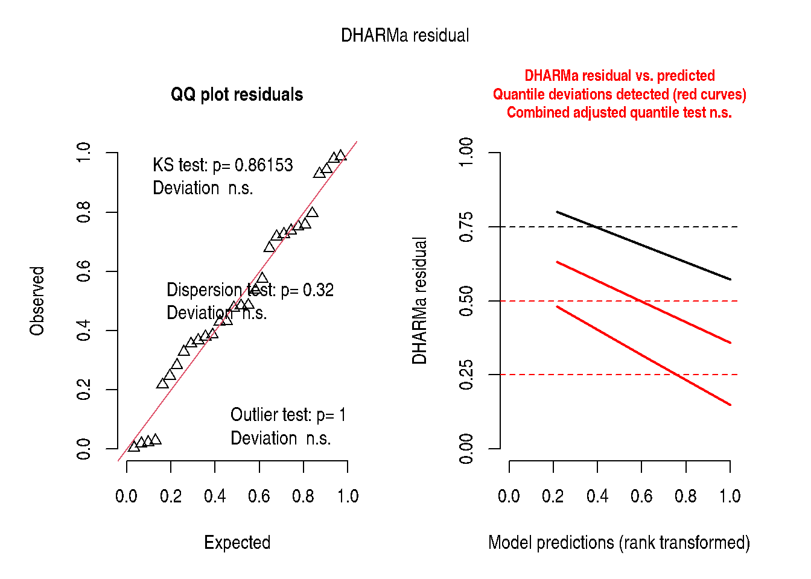

# Chapter 6: Inference, Part I

``` r
library(modernGLMM)
library(lme4)
library(emmeans)
library(ggplot2)
```

## 1 Overview

Chapter 6 unifies the models developed in earlier chapters under the
**Generalised Linear Mixed Model (GLMM)** framework.

The GLMM has three components:

1.  **Random component**: \\Y_i \mid \mathbf{b} \sim\\ exponential
    family with mean \\\mu_i\\
2.  **Systematic component** (linear predictor): \\\eta_i =
    \mathbf{x}\_i^\top\boldsymbol{\beta} +
    \mathbf{z}\_i^\top\mathbf{b}\\
3.  **Link function**: \\g(\mu_i) = \eta_i\\

### 1.1 Common link functions

| Distribution | Link     | \\g(\mu)\\              |
|--------------|----------|-------------------------|
| Gaussian     | Identity | \\\mu\\                 |
| Binomial     | Logit    | \\\log\[\mu/(1-\mu)\]\\ |
| Poisson      | Log      | \\\log(\mu)\\           |
| Gamma        | Log      | \\\log(\mu)\\           |
| Beta         | Logit    | \\\log\[\mu/(1-\mu)\]\\ |

### 1.2 Random effects structure

\\\mathbf{b} \sim \mathcal{N}(\mathbf{0},
\mathbf{G}(\boldsymbol{\theta}))\\

The variance component vector \\\boldsymbol{\theta}\\ is estimated by
REML (for Gaussian) or by maximum likelihood / Laplace approximation
(for non-Gaussian families).

## 2 The lme4 Formula Language

The GLMM formula in `lme4` follows a compact syntax:

``` r
response ~ fixed_effects + (random_slope | grouping_factor)
```

| Formula part   | Meaning                                     |
|----------------|---------------------------------------------|
| `(1 \| g)`     | Random intercept by group \\g\\             |
| `(x \| g)`     | Random intercept + slope for \\x\\ by \\g\\ |
| `(0 + x \| g)` | Random slope only (no intercept)            |
| `(1 \| g/h)`   | Random intercept, \\h\\ nested in \\g\\     |

## 3 Illustration: Poisson GLMM

The following illustrates a Poisson GLMM using the blocked count data
from Chapter 11 (`DataSet11.3`):

``` r
data(DataSet11.3)
DataSet11.3$block <- factor(DataSet11.3$block)
DataSet11.3$trt   <- factor(DataSet11.3$trt)

## Fit Poisson GLMM
fit_pois <- lme4::glmer(
  count ~ trt + (1 | block),
  family  = stats::poisson(link = "log"),
  data    = DataSet11.3,
  control = lme4::glmerControl(optimizer = "bobyqa")
)
summary(fit_pois)
```

    Generalized linear mixed model fit by maximum likelihood (Laplace
      Approximation) [glmerMod]
     Family: poisson  ( log )
    Formula: count ~ trt + (1 | block)
       Data: DataSet11.3
    Control: lme4::glmerControl(optimizer = "bobyqa")

          AIC       BIC    logLik -2*log(L)  df.resid
        375.0     380.6    -183.5     367.0        26

    Scaled residuals:
        Min      1Q  Median      3Q     Max
    -6.4780 -1.3441  0.0751  1.3780  6.0191

    Random effects:
     Groups Name        Variance Std.Dev.
     block  (Intercept) 1.233    1.111
    Number of obs: 30, groups:  block, 10

    Fixed effects:
                Estimate Std. Error z value Pr(>|z|)
    (Intercept)   1.4549     0.3744   3.886 0.000102 ***
    trt2          0.5083     0.1408   3.610 0.000306 ***
    trt3          1.1670     0.1274   9.160  < 2e-16 ***
    ---
    Signif. codes:  0 '***' 0.001 '**' 0.01 '*' 0.05 '.' 0.1 ' ' 1

    Correlation of Fixed Effects:
         (Intr) trt2
    trt2 -0.235
    trt3 -0.260  0.690

``` r
## Overdispersion check
if (requireNamespace("performance", quietly = TRUE)) {
  performance::check_overdispersion(fit_pois)
}
```

    # Overdispersion test

           dispersion ratio =   7.129
      Pearson's Chi-Squared = 185.365
                    p-value = < 0.001

``` r
## DHARMa diagnostics
if (requireNamespace("DHARMa", quietly = TRUE)) {
  DHARMa::simulateResiduals(fit_pois, plot = TRUE)
}
```



    Object of Class DHARMa with simulated residuals based on 250 simulations with refit = FALSE . See ?DHARMa::simulateResiduals for help.

    Scaled residual values: 0.7574428 0.6786155 0.5365879 0.47588 0.944 0.7954783 0.5746475 0.7175266 0.02834456 0.7374608 0.7252719 0.7522183 0.02194105 0.3661984 0.3275792 0.98 0.4298969 0.4834902 0.2166665 0.385463 ...

``` r
emm6 <- emmeans::emmeans(fit_pois, ~ trt, type = "response")
print(emm6)
```

     trt  rate   SE  df asymp.LCL asymp.UCL
     1    4.28 1.60 Inf      2.06      8.92
     2    7.12 2.62 Inf      3.46     14.64
     3   13.76 4.99 Inf      6.76     28.03

    Confidence level used: 0.95
    Intervals are back-transformed from the log scale 

``` r
if (requireNamespace("report", quietly = TRUE)) {
  report::report(fit_pois)
}
```

    We fitted a poisson mixed model (estimated using ML and BOBYQA optimizer) to
    predict count with trt (formula: count ~ trt). The model included block as
    random effect (formula: ~1 | block). The model's total explanatory power is
    substantial (conditional R2 = 0.96) and the part related to the fixed effects
    alone (marginal R2) is of 0.15. The model's intercept, corresponding to trt =
    1, is at 1.45 (95% CI [0.72, 2.19], p < .001). Within this model:

      - The effect of trt [2] is statistically significant and positive (beta = 0.51,
    95% CI [0.23, 0.78], p < .001; Std. beta = 0.51, 95% CI [0.23, 0.78])
      - The effect of trt [3] is statistically significant and positive (beta = 1.17,
    95% CI [0.92, 1.42], p < .001; Std. beta = 1.17, 95% CI [0.92, 1.42])

    Standardized parameters were obtained by fitting the model on a standardized
    version of the dataset. 95% Confidence Intervals (CIs) and p-values were
    computed using a Wald z-distribution approximation.

## 4 The Modern GLMM Ecosystem

| Package       | Purpose                                        |
|---------------|------------------------------------------------|
| `lme4`        | Core LMM/GLMM fitting                          |
| `lmerTest`    | Satterthwaite df for LMMs                      |
| `glmmTMB`     | Flexible GLMMs (NB, beta, zero-inflated, etc.) |
| `emmeans`     | Marginal means and contrasts                   |
| `DHARMa`      | Simulation-based residual diagnostics          |
| `performance` | ICC, overdispersion, model fit                 |
| `parameters`  | Tidy parameter tables                          |
| `report`      | Automatic model interpretation                 |
| `broom.mixed` | Tidy outputs                                   |

## 5 Key Takeaways

- The GLMM unifies all models: LM, GLM, LMM, and GLMM are special cases.
- The choice of link function and distribution is driven by the **data
  generating process**, not convenience.
- Modern tools (`DHARMa`, `performance`) provide powerful diagnostics
  unavailable in the original SAS/PROC GLIMMIX workflow.

## 6 References

Stroup, W. W., Ptukhina, M., and Garai, S. (2024). *Generalized Linear
Mixed Models: Modern Concepts, Methods and Applications* (2nd ed.). CRC
Press.

Bates, D., Maechler, M., Bolker, B., & Walker, S. (2015). Fitting linear
mixed-effects models using lme4. *Journal of Statistical Software*,
67(1), 1–48.
