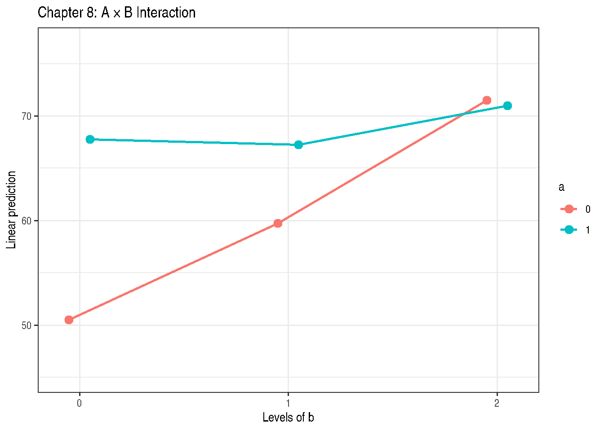
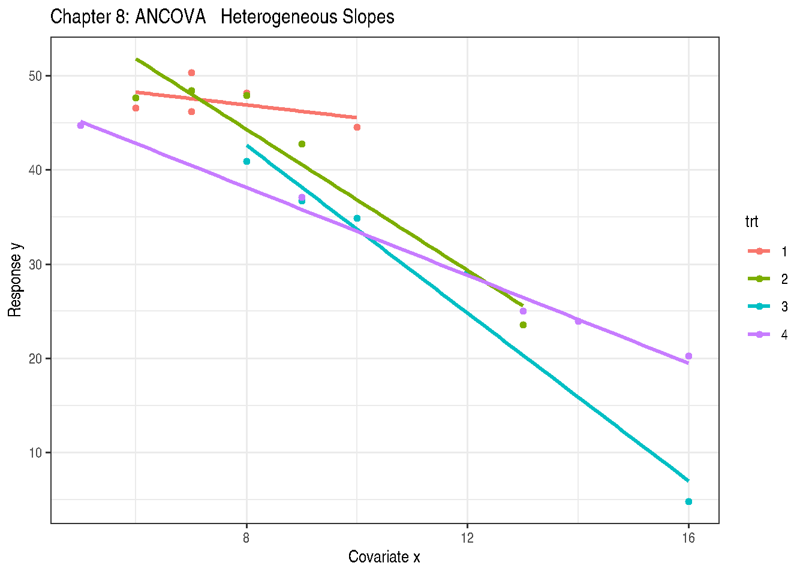
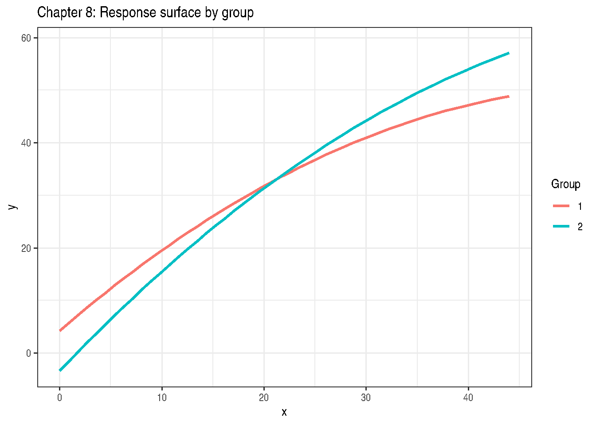

# Chapter 8: Treatment and Explanatory Variable Structure

``` r
library(modernGLMM)
library(lme4)
library(lmerTest)
library(emmeans)
library(ggplot2)
```

## 1 Overview

Chapter 8 covers treatment and regression structures for GLMMs:

- **Factorial designs** with qualitative factors
- **Analysis of covariance** (ANCOVA)
- **Response surface methodology** (RSM)
- **Nested and crossed** factor structures

## 2 Example 8.1 — Two-Way Factorial (All Qualitative)

The two-way factorial model:

\\y\_{ijk} = \mu + \alpha_i + \beta_j + (\alpha\beta)\_{ij} +
\varepsilon\_{ijk}\\

``` r
data(DataSet8.1)
DataSet8.1$a <- factor(DataSet8.1$a)
DataSet8.1$b <- factor(DataSet8.1$b)
str(DataSet8.1)
```

    'data.frame':   24 obs. of  3 variables:
     $ a: Factor w/ 2 levels "0","1": 1 1 1 1 1 1 1 1 1 1 ...
     $ b: Factor w/ 3 levels "0","1","2": 1 1 1 1 2 2 2 2 3 3 ...
     $ y: int  55 48 51 48 60 59 66 54 75 61 ...

``` r
Exam8.1.lm <- stats::lm(y ~ a * b, data = DataSet8.1)
summary(Exam8.1.lm)
```

    Call:
    stats::lm(formula = y ~ a * b, data = DataSet8.1)

    Residuals:
       Min     1Q Median     3Q    Max
    -10.50  -2.50   0.00   3.25   7.75

    Coefficients:
                Estimate Std. Error t value Pr(>|t|)
    (Intercept)   50.500      2.561  19.718 1.23e-13 ***
    a1            17.250      3.622   4.763 0.000156 ***
    b1             9.250      3.622   2.554 0.019936 *
    b2            21.000      3.622   5.798 1.71e-05 ***
    a1:b1         -9.750      5.122  -1.904 0.073089 .
    a1:b2        -17.750      5.122  -3.465 0.002761 **
    ---
    Signif. codes:  0 '***' 0.001 '**' 0.01 '*' 0.05 '.' 0.1 ' ' 1

    Residual standard error: 5.122 on 18 degrees of freedom
    Multiple R-squared:  0.7352,    Adjusted R-squared:  0.6617
    F-statistic: 9.997 on 5 and 18 DF,  p-value: 0.0001049

``` r
anova(Exam8.1.lm)
```

|           |  Df |   Sum Sq |   Mean Sq |   F value |   Pr(\>F) |
|:----------|----:|---------:|----------:|----------:|----------:|
| a         |   1 | 392.0417 | 392.04167 | 14.942827 | 0.0011330 |
| b         |   2 | 603.2500 | 301.62500 | 11.496559 | 0.0006068 |
| a:b       |   2 | 316.0833 | 158.04167 |  6.023822 | 0.0099348 |
| Residuals |  18 | 472.2500 |  26.23611 |        NA |        NA |

``` r
emm8.1 <- emmeans::emmeans(Exam8.1.lm, ~ a * b)
print(emm8.1)
```

     a b emmean   SE df lower.CL upper.CL
     0 0   50.5 2.56 18     45.1     55.9
     1 0   67.8 2.56 18     62.4     73.1
     0 1   59.8 2.56 18     54.4     65.1
     1 1   67.2 2.56 18     61.9     72.6
     0 2   71.5 2.56 18     66.1     76.9
     1 2   71.0 2.56 18     65.6     76.4

    Confidence level used: 0.95 

``` r
## Simple effects: b within each level of a
emmeans::contrast(
  emmeans::emmeans(Exam8.1.lm, ~ b | a),
  method = "pairwise", adjust = "tukey"
)
```

    a = 0:
     contrast estimate   SE df t.ratio p.value
     b0 - b1     -9.25 3.62 18  -2.554  0.0498
     b0 - b2    -21.00 3.62 18  -5.798 <0.0001
     b1 - b2    -11.75 3.62 18  -3.244  0.0119

    a = 1:
     contrast estimate   SE df t.ratio p.value
     b0 - b1      0.50 3.62 18   0.138  0.9896
     b0 - b2     -3.25 3.62 18  -0.897  0.6488
     b1 - b2     -3.75 3.62 18  -1.035  0.5649

    P value adjustment: tukey method for comparing a family of 3 estimates 

``` r
emmeans::emmip(Exam8.1.lm, a ~ b, CIs = TRUE) +
  theme_bw() +
  labs(title = "Chapter 8: A × B Interaction")
```



Figure 1: Interaction plot: Factor A × Factor B

## 3 Example 8.2 — ANCOVA

Analysis of covariance with treatment and continuous covariate \\x\\:

\\y\_{ij} = \mu + \tau_i + \beta x\_{ij} + \varepsilon\_{ij}\\

``` r
data(DataSet8.2)
DataSet8.2$trt <- factor(DataSet8.2$trt)
str(DataSet8.2)
```

    'data.frame':   20 obs. of  3 variables:
     $ trt: Factor w/ 4 levels "1","2","3","4": 1 1 1 1 1 2 2 2 2 2 ...
     $ x  : int  12 13 12 7 14 10 6 12 10 11 ...
     $ y  : num  46 41.8 46.9 57 36.9 ...

``` r
Exam8.2.lm <- stats::lm(y ~ trt + x, data = DataSet8.2)
summary(Exam8.2.lm)
```

    Call:
    stats::lm(formula = y ~ trt + x, data = DataSet8.2)

    Residuals:
        Min      1Q  Median      3Q     Max
    -2.7908 -1.6151 -0.3901  1.2320  6.1796

    Coefficients:
                Estimate Std. Error t value Pr(>|t|)
    (Intercept)  76.6348     3.6123  21.215 1.34e-12 ***
    trt2          6.8865     1.7156   4.014  0.00113 **
    trt3         -2.8297     1.7558  -1.612  0.12787
    trt4          5.4011     1.6578   3.258  0.00530 **
    x            -2.6657     0.2951  -9.033 1.87e-07 ***
    ---
    Signif. codes:  0 '***' 0.001 '**' 0.01 '*' 0.05 '.' 0.1 ' ' 1

    Residual standard error: 2.579 on 15 degrees of freedom
    Multiple R-squared:  0.9029,    Adjusted R-squared:  0.877
    F-statistic: 34.88 on 4 and 15 DF,  p-value: 1.968e-07

``` r
anova(Exam8.2.lm)
```

|           |  Df |    Sum Sq |    Mean Sq |  F value |  Pr(\>F) |
|:----------|----:|----------:|-----------:|---------:|---------:|
| trt       |   3 | 385.28225 | 128.427416 | 19.30303 | 2.08e-05 |
| x         |   1 | 542.89514 | 542.895141 | 81.59879 | 2.00e-07 |
| Residuals |  15 |  99.79838 |   6.653225 |       NA |       NA |

``` r
## Adjusted means (covariate at its mean)
emm8.2 <- emmeans::emmeans(Exam8.2.lm, ~ trt,
                            at = list(x = mean(DataSet8.2$x)))
print(emm8.2)
```

     trt emmean   SE df lower.CL upper.CL
     1     47.7 1.17 15     45.2     50.2
     2     54.6 1.19 15     52.1     57.1
     3     44.9 1.23 15     42.3     47.5
     4     53.1 1.26 15     50.4     55.8

    Confidence level used: 0.95 

``` r
emmeans::contrast(emm8.2, method = "pairwise")
```

     contrast    estimate   SE df t.ratio p.value
     trt1 - trt2    -6.89 1.72 15  -4.014  0.0055
     trt1 - trt3     2.83 1.76 15   1.612  0.4018
     trt1 - trt4    -5.40 1.66 15  -3.258  0.0244
     trt2 - trt3     9.72 1.64 15   5.940  0.0001
     trt2 - trt4     1.49 1.83 15   0.812  0.8477
     trt3 - trt4    -8.23 1.88 15  -4.367  0.0028

    P value adjustment: tukey method for comparing a family of 4 estimates 

## 4 Example 8.3 — Heterogeneous Slopes ANCOVA

``` r
data(DataSet8.3)
DataSet8.3$trt <- factor(DataSet8.3$trt)

Exam8.3.lm <- stats::lm(y ~ trt * x, data = DataSet8.3)
summary(Exam8.3.lm)
```

    Call:
    stats::lm(formula = y ~ trt * x, data = DataSet8.3)

    Residuals:
        Min      1Q  Median      3Q     Max
    -4.1473 -1.5168 -0.3092  1.2697  4.2013

    Coefficients:
                Estimate Std. Error t value Pr(>|t|)
    (Intercept)  52.2940     6.8869   7.593 6.39e-06 ***
    trt2         21.9884     8.2121   2.678  0.02013 *
    trt3         25.9683     8.4286   3.081  0.00952 **
    trt4          4.5282     7.8242   0.579  0.57347
    x            -0.6754     0.8921  -0.757  0.46357
    trt2:x       -3.0704     1.0230  -3.001  0.01104 *
    trt3:x       -3.7798     0.9894  -3.820  0.00244 **
    trt4:x       -1.6591     0.9437  -1.758  0.10419
    ---
    Signif. codes:  0 '***' 0.001 '**' 0.01 '*' 0.05 '.' 0.1 ' ' 1

    Residual standard error: 2.706 on 12 degrees of freedom
    Multiple R-squared:  0.9696,    Adjusted R-squared:  0.9519
    F-statistic:  54.7 on 7 and 12 DF,  p-value: 3.676e-08

``` r
anova(Exam8.3.lm)
```

|           |  Df |     Sum Sq |     Mean Sq |    F value |   Pr(\>F) |
|:----------|----:|-----------:|------------:|-----------:|----------:|
| trt       |   3 | 1174.59905 |  391.533016 |  53.478284 | 0.0000003 |
| x         |   1 | 1444.11688 | 1444.116881 | 197.247458 | 0.0000000 |
| trt:x     |   3 |  184.50998 |   61.503328 |   8.400549 | 0.0028089 |
| Residuals |  12 |   87.85615 |    7.321346 |         NA |        NA |

``` r
ggplot(DataSet8.3, aes(x = x, y = y, colour = trt, group = trt)) +
  geom_point() +
  geom_smooth(method = "lm", se = FALSE) +
  labs(title = "Chapter 8: ANCOVA — Heterogeneous Slopes",
       x = "Covariate x", y = "Response y") +
  theme_bw()
```



Figure 2: Heterogeneous slopes: y vs x by treatment

## 5 Example 8.7 — Response Surface

``` r
data(DataSet8.7)
DataSet8.7$a <- factor(DataSet8.7$a)
str(DataSet8.7)
```

    'data.frame':   270 obs. of  3 variables:
     $ a: Factor w/ 2 levels "1","2": 1 1 1 1 1 1 1 1 1 1 ...
     $ x: int  0 0 0 1 1 1 2 2 2 3 ...
     $ y: num  3.5 3 7.3 5.2 5.2 5.5 3.1 7.1 5 6.3 ...

``` r
## Quadratic response surface within groups
Exam8.7.lm <- stats::lm(y ~ a + x + I(x^2) + a:x, data = DataSet8.7)
summary(Exam8.7.lm)
```

    Call:
    stats::lm(formula = y ~ a + x + I(x^2) + a:x, data = DataSet8.7)

    Residuals:
         Min       1Q   Median       3Q      Max
    -13.7817  -3.6370  -0.1813   4.0536  14.0868

    Coefficients:
                 Estimate Std. Error t value Pr(>|t|)
    (Intercept)  4.256016   1.204546   3.533 0.000484 ***
    a2          -7.642834   1.361533  -5.613 5.00e-08 ***
    x            1.678950   0.107811  15.573  < 2e-16 ***
    I(x^2)      -0.015140   0.002296  -6.595 2.30e-10 ***
    a2:x         0.361779   0.053294   6.788 7.41e-11 ***
    ---
    Signif. codes:  0 '***' 0.001 '**' 0.01 '*' 0.05 '.' 0.1 ' ' 1

    Residual standard error: 5.687 on 265 degrees of freedom
    Multiple R-squared:  0.8878,    Adjusted R-squared:  0.8861
    F-statistic: 524.1 on 4 and 265 DF,  p-value: < 2.2e-16

``` r
xseq <- seq(min(DataSet8.7$x), max(DataSet8.7$x), length.out = 50L)
pred_df <- do.call(rbind, lapply(levels(DataSet8.7$a), function(ai) {
  nd <- data.frame(a = factor(ai, levels = levels(DataSet8.7$a)), x = xseq)
  nd$y_hat <- stats::predict(Exam8.7.lm, newdata = nd)
  nd
}))

ggplot(DataSet8.7, aes(x = x, y = y, colour = a)) +
  geom_point(alpha = 0.5) +
  geom_line(data = pred_df, aes(x = x, y = y_hat, colour = a),
            linewidth = 1) +
  labs(title = "Chapter 8: Response surface by group",
       x = "x", y = "y", colour = "Group") +
  theme_bw()
```



Figure 3: Response surface: y vs x by group a

## 6 Key Takeaways

- Factorial interactions require **simple effects** comparisons
  (comparing one factor at each level of the other).
- ANCOVA requires checking the **homogeneity of slopes** assumption.
- `emmeans` handles adjusted means, custom contrasts, and interaction
  decomposition seamlessly.
- Response surface models use polynomial terms; for GLMMs, the
  polynomial is on the linear predictor scale.

## 7 References

Stroup, W. W., Ptukhina, M., and Garai, S. (2024). *Generalized Linear
Mixed Models: Modern Concepts, Methods and Applications* (2nd ed.). CRC
Press.
