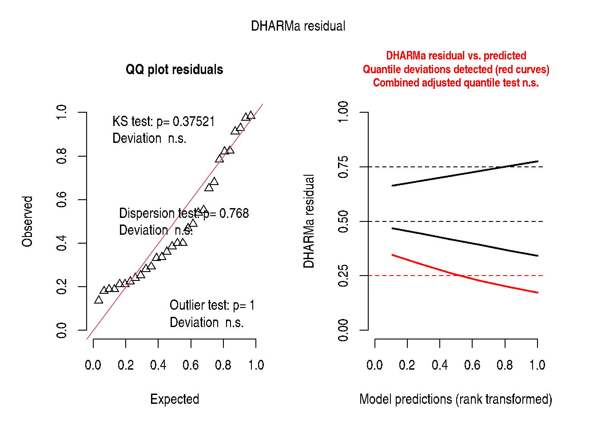

# Chapter 9: Multi-Level Models

``` r

library(modernGLMM)
library(lme4)
library(lmerTest)
library(emmeans)
```

## 1 Overview

Chapter 9 extends the GLMM framework to **binary and binomial
responses**. A binary observation \\y_i \in \\0, 1\\\\ follows a
Bernoulli distribution; a binomial aggregate \\y_i \sim
\text{Binomial}(n_i, p_i)\\ counts successes among \\n_i\\ trials.

The canonical link for both is the **logit**:

\\\eta_i = \text{logit}(p_i) = \log\frac{p_i}{1-p_i} =
\mathbf{x}\_i^\top\boldsymbol{\beta} + \mathbf{z}\_i^\top\mathbf{b}\\

with \\\mathbf{b} \sim \mathcal{N}(\mathbf{0}, \mathbf{G})\\.

## 2 Example 9.1 — Nested Factorial Structure

Dataset: 3 sets, 2 treatments per set, arranged in blocks nested within
sets.

``` r

data(DataSet9.1)
DataSet9.1$block <- factor(DataSet9.1$block)
DataSet9.1$set   <- factor(DataSet9.1$set)
DataSet9.1$trt   <- factor(DataSet9.1$trt)
str(DataSet9.1)
```

    'data.frame':   30 obs. of  4 variables:
     $ block: Factor w/ 10 levels "1","2","3","4",..: 1 1 1 2 2 2 3 3 3 4 ...
     $ trt  : Factor w/ 6 levels "1","2","3","4",..: 1 2 3 4 5 6 1 2 3 4 ...
     $ set  : Factor w/ 2 levels "1","2": 1 1 1 2 2 2 1 1 1 2 ...
     $ y    : num  4.6 17.8 16.6 2.2 7.1 14.9 0.4 0.8 0.8 1 ...

### 2.1 Fit the LMM (Gaussian approximation)

``` r

Exam9.1Lmer <- lmerTest::lmer(
  y ~ set + set:trt + (1 | set:block),
  data    = DataSet9.1,
  control = lme4::lmerControl(optimizer = "bobyqa")
)
summary(Exam9.1Lmer)
```

    Linear mixed model fit by REML. t-tests use Satterthwaite's method [
    lmerModLmerTest]
    Formula: y ~ set + set:trt + (1 | set:block)
       Data: DataSet9.1
    Control: lme4::lmerControl(optimizer = "bobyqa")

    REML criterion at convergence: 170.3

    Scaled residuals:
        Min      1Q  Median      3Q     Max
    -1.5721 -0.2644 -0.1207  0.3136  2.0303

    Random effects:
     Groups    Name        Variance Std.Dev.
     set:block (Intercept) 60.55    7.781
     Residual              22.75    4.770
    Number of obs: 30, groups:  set:block, 10

    Fixed effects:
                Estimate Std. Error      df t value Pr(>|t|)
    (Intercept)    8.200      4.082  11.669   2.009 0.068249 .
    set2           8.960      5.772  11.669   1.552 0.147295
    set1:trt2      0.700      3.017  16.000   0.232 0.819445
    set1:trt3      0.540      3.017  16.000   0.179 0.860180
    set2:trt4    -12.720      3.017  16.000  -4.217 0.000655 ***
    set2:trt5     -9.880      3.017  16.000  -3.275 0.004762 **
    ---
    Signif. codes:  0 '***' 0.001 '**' 0.01 '*' 0.05 '.' 0.1 ' ' 1

    Correlation of Fixed Effects:
              (Intr) set2   st1:t2 st1:t3 st2:t4
    set2      -0.707
    set1:trt2 -0.370  0.261
    set1:trt3 -0.370  0.261  0.500
    set2:trt4  0.000 -0.261  0.000  0.000
    set2:trt5  0.000 -0.261  0.000  0.000  0.500
    fit warnings:
    fixed-effect model matrix is rank deficient so dropping 6 columns / coefficients

``` r

stats::anova(Exam9.1Lmer, ddf = "Kenward-Roger")
```

|         |    Sum Sq |   Mean Sq | NumDF |    DenDF |  F value |   Pr(\>F) |
|:--------|----------:|----------:|------:|---------:|---------:|----------:|
| set     |  54.81561 |  54.81561 |     1 | 11.66907 | 2.409407 | 0.1472945 |
| set:trt | 447.14267 | 111.78567 |     4 | 16.00000 | 4.913512 | 0.0088978 |

### 2.2 Estimated Marginal Means

``` r

emm9.1 <- emmeans::emmeans(Exam9.1Lmer, ~ trt | set)
print(emm9.1)
```

    set = 1:
     trt emmean   SE   df lower.CL upper.CL
     1     8.20 4.08 11.7  -0.7212     17.1
     2     8.90 4.08 11.7  -0.0212     17.8
     3     8.74 4.08 11.7  -0.1812     17.7

    set = 2:
     trt emmean   SE   df lower.CL upper.CL
     4     4.44 4.08 11.7  -4.4812     13.4
     5     7.28 4.08 11.7  -1.6412     16.2
     6    17.16 4.08 11.7   8.2388     26.1

    Degrees-of-freedom method: kenward-roger
    Confidence level used: 0.95 

``` r

emmeans::contrast(emm9.1, method = "pairwise", by = "set")
```

    set = 1:
     contrast    estimate   SE df t.ratio p.value
     trt1 - trt2    -0.70 3.02 16  -0.232  0.9999
     trt1 - trt3    -0.54 3.02 16  -0.179  1.0000
     trt2 - trt3     0.16 3.02 16   0.053  1.0000

    set = 2:
     contrast    estimate   SE df t.ratio p.value
     trt4 - trt5    -2.84 3.02 16  -0.941  0.9295
     trt4 - trt6   -12.72 3.02 16  -4.217  0.0071
     trt5 - trt6    -9.88 3.02 16  -3.275  0.0452

    Degrees-of-freedom method: kenward-roger
    P value adjustment: tukey method for comparing a family of 6 estimates 

### 2.3 Interpretation

``` r

if (requireNamespace("report", quietly = TRUE)) {
  report::report(Exam9.1Lmer)
}
```

    We fitted a linear mixed model (estimated using REML and BOBYQA optimizer) to
    predict y with set and trt (formula: y ~ set + set:trt). The model included set
    as random effects (formula: ~1 | set:block). The model's total explanatory
    power is substantial (conditional R2 = 0.77) and the part related to the fixed
    effects alone (marginal R2) is of 0.16. The model's intercept, corresponding to
    set = 1 and trt = 1, is at 8.20 (95% CI [-0.26, 16.66], t(22) = 2.01, p =
    0.057). Within this model:

      - The effect of set [2] is statistically non-significant and positive (beta =
    8.96, 95% CI [-3.01, 20.93], t(22) = 1.55, p = 0.135; Std. beta = 0.97, 95% CI
    [-0.33, 2.28])
      - The effect of set [1] × trt2 is statistically non-significant and positive
    (beta = 0.70, 95% CI [-5.56, 6.96], t(22) = 0.23, p = 0.819; Std. beta = 0.08,
    95% CI [-0.60, 0.76])
      - The effect of set [1] × trt3 is statistically non-significant and positive
    (beta = 0.54, 95% CI [-5.72, 6.80], t(22) = 0.18, p = 0.860; Std. beta = 0.06,
    95% CI [-0.62, 0.74])
      - The effect of set [2] × trt4 is statistically significant and negative (beta
    = -12.72, 95% CI [-18.98, -6.46], t(22) = -4.22, p < .001; Std. beta = -1.38,
    95% CI [-2.06, -0.70])
      - The effect of set [2] × trt5 is statistically significant and negative (beta
    = -9.88, 95% CI [-16.14, -3.62], t(22) = -3.28, p = 0.003; Std. beta = -1.07,
    95% CI [-1.75, -0.39])

    Standardized parameters were obtained by fitting the model on a standardized
    version of the dataset. 95% Confidence Intervals (CIs) and p-values were
    computed using a Wald t-distribution approximation.

## 3 Example 9.2 — Split-Plot with Row-Column Structure

``` r

data(DataSet9.2)
DataSet9.2$block <- factor(DataSet9.2$block)
DataSet9.2$row   <- factor(DataSet9.2$row)
DataSet9.2$col   <- factor(DataSet9.2$col)
DataSet9.2$a     <- factor(DataSet9.2$a)
DataSet9.2$b     <- factor(DataSet9.2$b)
str(DataSet9.2)
```

    'data.frame':   36 obs. of  6 variables:
     $ block: Factor w/ 9 levels "1","2","3","4",..: 1 1 1 1 2 2 2 2 3 3 ...
     $ row  : Factor w/ 2 levels "1","2": 1 1 2 2 1 1 2 2 1 1 ...
     $ col  : Factor w/ 2 levels "1","2": 1 2 1 2 1 2 1 2 1 2 ...
     $ a    : Factor w/ 3 levels "1","2","3": 1 1 2 2 1 1 2 2 1 1 ...
     $ b    : Factor w/ 3 levels "1","2","3": 1 2 1 2 1 3 1 3 2 3 ...
     $ y    : num  19.2 23.2 15 15.9 22.4 27.1 21.3 22.9 29.6 27.4 ...

``` r

Exam9.2Lmer <- lmerTest::lmer(
  y ~ a * b + (1 | block) + (1 | block:a) + (1 | block:b),
  data    = DataSet9.2,
  control = lme4::lmerControl(optimizer = "bobyqa")
)
summary(Exam9.2Lmer)
```

    Linear mixed model fit by REML. t-tests use Satterthwaite's method [
    lmerModLmerTest]
    Formula: y ~ a * b + (1 | block) + (1 | block:a) + (1 | block:b)
       Data: DataSet9.2
    Control: lme4::lmerControl(optimizer = "bobyqa")

    REML criterion at convergence: 163.6

    Scaled residuals:
         Min       1Q   Median       3Q      Max
    -0.85748 -0.31360  0.04801  0.29434  0.97549

    Random effects:
     Groups   Name        Variance Std.Dev.
     block:b  (Intercept) 8.161    2.857
     block:a  (Intercept) 9.778    3.127
     block    (Intercept) 2.635    1.623
     Residual             2.245    1.498
    Number of obs: 36, groups:  block:b, 18; block:a, 18; block, 9

    Fixed effects:
                Estimate Std. Error       df t value Pr(>|t|)
    (Intercept)  21.2455     2.0947  24.3769  10.143 3.16e-10 ***
    a2            0.9660     2.3340  12.8830   0.414 0.685772
    a3           -0.1162     2.3340  12.8830  -0.050 0.961065
    b2            9.1852     2.2119  12.5580   4.153 0.001220 **
    b3            6.9539     2.2119  12.5580   3.144 0.008059 **
    a2:b2        -2.9890     1.9226   5.9938  -1.555 0.171074
    a3:b2       -11.8429     1.9226   5.9938  -6.160 0.000843 ***
    a2:b3        -2.2593     1.9226   5.9938  -1.175 0.284516
    a3:b3        -9.5602     1.9226   5.9938  -4.972 0.002528 **
    ---
    Signif. codes:  0 '***' 0.001 '**' 0.01 '*' 0.05 '.' 0.1 ' ' 1

    Correlation of Fixed Effects:
          (Intr) a2     a3     b2     b3     a2:b2  a3:b2  a2:b3
    a2    -0.557
    a3    -0.557  0.500
    b2    -0.528  0.179  0.179
    b3    -0.528  0.179  0.179  0.500
    a2:b2  0.229 -0.412 -0.206 -0.435 -0.217
    a3:b2  0.229 -0.206 -0.412 -0.435 -0.217  0.500
    a2:b3  0.229 -0.412 -0.206 -0.217 -0.435  0.500  0.250
    a3:b3  0.229 -0.206 -0.412 -0.217 -0.435  0.250  0.500  0.500

``` r

stats::anova(Exam9.2Lmer, ddf = "Kenward-Roger")
```

|     |   Sum Sq |   Mean Sq | NumDF |    DenDF |   F value |   Pr(\>F) |
|:----|---------:|----------:|------:|---------:|----------:|----------:|
| a   | 29.71284 | 14.856421 |     2 | 8.842661 |  6.617342 | 0.0175034 |
| b   | 10.43492 |  5.217462 |     2 | 8.472110 |  2.323960 | 0.1568158 |
| a:b | 94.71857 | 23.679643 |     4 | 5.853597 | 10.547380 | 0.0075334 |

``` r

emm9.2 <- emmeans::emmeans(Exam9.2Lmer, ~ a * b)
print(emm9.2)
```

     a b emmean   SE   df lower.CL upper.CL
     1 1   21.2 2.18 24.4     16.7     25.7
     2 1   22.2 2.18 24.4     17.7     26.7
     3 1   21.1 2.18 24.4     16.6     25.6
     1 2   30.4 2.18 24.4     25.9     34.9
     2 2   28.4 2.18 24.4     23.9     32.9
     3 2   18.5 2.18 24.4     14.0     23.0
     1 3   28.2 2.18 24.4     23.7     32.7
     2 3   26.9 2.18 24.4     22.4     31.4
     3 3   18.5 2.18 24.4     14.0     23.0

    Degrees-of-freedom method: kenward-roger
    Confidence level used: 0.95 

``` r

emmeans::contrast(emm9.2, method = "pairwise",
                  by = "a", adjust = "tukey")
```

    a = 1:
     contrast estimate   SE   df t.ratio p.value
     b1 - b2   -9.1852 2.34 12.9  -3.933  0.0046
     b1 - b3   -6.9539 2.34 12.9  -2.978  0.0271
     b2 - b3    2.2313 2.34 12.9   0.956  0.6165

    a = 2:
     contrast estimate   SE   df t.ratio p.value
     b1 - b2   -6.1962 2.34 12.9  -2.653  0.0491
     b1 - b3   -4.6946 2.34 12.9  -2.010  0.1492
     b2 - b3    1.5016 2.34 12.9   0.643  0.7995

    a = 3:
     contrast estimate   SE   df t.ratio p.value
     b1 - b2    2.6577 2.34 12.9   1.138  0.5089
     b1 - b3    2.6063 2.34 12.9   1.116  0.5215
     b2 - b3   -0.0514 2.34 12.9  -0.022  0.9997

    Degrees-of-freedom method: kenward-roger
    P value adjustment: tukey method for comparing a family of 3 estimates 

## 4 Example 9.3 — Factorial with Blocks

``` r

data(DataSet9.3)
DataSet9.3$block <- factor(DataSet9.3$block)
DataSet9.3$aa    <- factor(DataSet9.3$a)
DataSet9.3$bb    <- factor(DataSet9.3$b)
DataSet9.3$cc    <- factor(DataSet9.3$c)
DataSet9.3$a2    <- DataSet9.3$a^2
DataSet9.3$b2    <- DataSet9.3$b^2
DataSet9.3$c2    <- DataSet9.3$c^2
DataSet9.3$ab    <- DataSet9.3$a * DataSet9.3$b
DataSet9.3$ac    <- DataSet9.3$a * DataSet9.3$c
DataSet9.3$bc    <- DataSet9.3$b * DataSet9.3$c
str(DataSet9.3)
```

    'data.frame':   28 obs. of  14 variables:
     $ block: Factor w/ 7 levels "1","2","3","4",..: 1 1 1 1 2 2 2 2 3 3 ...
     $ a    : int  0 0 0 0 1 1 -1 -1 1 1 ...
     $ b    : int  1 1 -1 -1 0 0 0 0 1 -1 ...
     $ c    : int  1 -1 1 -1 1 -1 1 -1 0 0 ...
     $ y    : num  50.2 50.5 46.6 45.3 49.5 50.3 45.6 44.1 45.8 41.8 ...
     $ aa   : Factor w/ 3 levels "-1","0","1": 2 2 2 2 3 3 1 1 3 3 ...
     $ bb   : Factor w/ 3 levels "-1","0","1": 3 3 1 1 2 2 2 2 3 1 ...
     $ cc   : Factor w/ 3 levels "-1","0","1": 3 1 3 1 3 1 3 1 2 2 ...
     $ a2   : num  0 0 0 0 1 1 1 1 1 1 ...
     $ b2   : num  1 1 1 1 0 0 0 0 1 1 ...
     $ c2   : num  1 1 1 1 1 1 1 1 0 0 ...
     $ ab   : int  0 0 0 0 0 0 0 0 1 -1 ...
     $ ac   : int  0 0 0 0 1 -1 -1 1 0 0 ...
     $ bc   : int  1 -1 -1 1 0 0 0 0 0 0 ...

``` r

Exam9.3Lmer <- lmerTest::lmer(
  y ~ a + a2 + b + b2 + c + bc + (1 | block),
  data    = DataSet9.3,
  control = lme4::lmerControl(optimizer = "bobyqa")
)
summary(Exam9.3Lmer)
```

    Linear mixed model fit by REML. t-tests use Satterthwaite's method [
    lmerModLmerTest]
    Formula: y ~ a + a2 + b + b2 + c + bc + (1 | block)
       Data: DataSet9.3
    Control: lme4::lmerControl(optimizer = "bobyqa")

    REML criterion at convergence: 93.4

    Scaled residuals:
        Min      1Q  Median      3Q     Max
    -1.5824 -0.5006 -0.2802  0.6912  1.5429

    Random effects:
     Groups   Name        Variance Std.Dev.
     block    (Intercept) 0.6776   0.8231
     Residual             1.8206   1.3493
    Number of obs: 28, groups:  block, 7

    Fixed effects:
                Estimate Std. Error      df t value Pr(>|t|)
    (Intercept)  50.0850     0.8244  4.0000  60.753  4.4e-07 ***
    a             1.6000     0.3373 17.0000   4.743 0.000188 ***
    a2           -3.3025     0.8244  4.0000  -4.006 0.016050 *
    b             1.6938     0.3373 17.0000   5.021 0.000105 ***
    b2           -3.5150     0.8244  4.0000  -4.264 0.013015 *
    c             0.5188     0.3373 17.0000   1.538 0.142491
    bc           -1.1625     0.4770 17.0000  -2.437 0.026101 *
    ---
    Signif. codes:  0 '***' 0.001 '**' 0.01 '*' 0.05 '.' 0.1 ' ' 1

    Correlation of Fixed Effects:
       (Intr) a      a2     b      b2     c
    a   0.000
    a2 -0.667  0.000
    b   0.000  0.000  0.000
    b2 -0.667  0.000  0.167  0.000
    c   0.000  0.000  0.000  0.000  0.000
    bc  0.000  0.000  0.000  0.000  0.000  0.000

``` r

stats::anova(Exam9.3Lmer, ddf = "Kenward-Roger", type = 1)
```

|     |    Sum Sq |   Mean Sq | NumDF | DenDF |   F value |   Pr(\>F) |
|:----|----------:|----------:|------:|------:|----------:|----------:|
| a   | 40.960000 | 40.960000 |     1 |    17 | 22.498223 | 0.0001881 |
| a2  | 20.335065 | 20.335065 |     1 |     4 | 11.169503 | 0.0287800 |
| b   | 45.900625 | 45.900625 |     1 |    17 | 25.211975 | 0.0001048 |
| b2  | 33.097032 | 33.097032 |     1 |     4 | 18.179307 | 0.0130150 |
| c   |  4.305625 |  4.305625 |     1 |    17 |  2.364964 | 0.1424910 |
| bc  | 10.811250 | 10.811250 |     1 |    17 |  5.938328 | 0.0261009 |

## 5 Overdispersion Diagnostics

``` r

if (requireNamespace("performance", quietly = TRUE)) {
  tryCatch(
    performance::check_model(Exam9.1Lmer),
    error = function(e) message("check_model() error: ", conditionMessage(e))
  )
}
```

``` r

if (requireNamespace("DHARMa", quietly = TRUE)) {
  sim_r <- DHARMa::simulateResiduals(Exam9.1Lmer, plot = TRUE)
}
```



## 6 Key Takeaways

- **Nested and split-plot structures** require matching random effects
  specifications to the design structure.
- The `(1 | set:block)` term captures blocks nested within sets without
  adding an unprinted random set variance component.
- `emmeans` provides estimated marginal means with proper standard
  errors that account for the random effects structure.
- DHARMa diagnostics help identify departures from model assumptions.

## 7 References

Stroup, W. W., Ptukhina, M., and Garai, S. (2024). *Generalized Linear
Mixed Models: Modern Concepts, Methods and Applications* (2nd ed.). CRC
Press.
