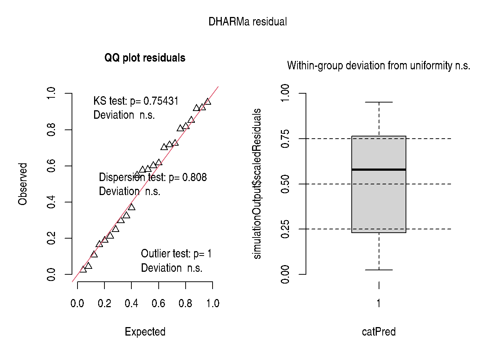

# Chapter 10: Best Linear Unbiased Prediction

``` r
library(modernGLMM)
library(lme4)
library(lmerTest)
library(emmeans)
```

## 1 Overview

Chapter 10 introduces **Best Linear Unbiased Prediction (BLUP)** for
random effects in mixed models. The key ideas are:

- **Variance decomposition**: total variance split into between-group
  (\\\sigma^2_a\\) and within-group (\\\sigma^2_e\\) components
- **BLUP shrinkage**: group-specific predictions are shrunk toward the
  overall mean — more so when sample sizes are small or when
  \\\sigma^2_a / \sigma^2_e\\ is small
- **Broad vs narrow inference**: broad inference averages over all
  possible random effect levels; narrow inference conditions on observed
  levels

The mixed model for observation \\y\_{ij}\\ in group \\i\\, observation
\\j\\:

\\y\_{ij} = \mu + a_i + e\_{ij}, \quad a_i \sim \mathcal{N}(0,
\sigma^2_a),\quad e\_{ij} \sim \mathcal{N}(0, \sigma^2_e)\\

## 2 Example 10.1 — One-Way Random Effects Model

DataSet 10.1: 12 groups, 2 observations each (continuous response
\\y\\).

``` r
data(DataSet10.1)
DataSet10.1$a <- factor(DataSet10.1$a)
str(DataSet10.1)
```

    'data.frame':   24 obs. of  2 variables:
     $ a: Factor w/ 12 levels "1","2","3","4",..: 1 1 2 2 3 3 4 4 5 5 ...
     $ y: num  14.9 17.4 18.2 16.5 13.4 10.9 16.3 16.4 14.6 14.2 ...

### 2.1 Random effects model

``` r
Exam10.1Lmer <- lmerTest::lmer(
  y ~ 1 + (1 | a),
  data    = DataSet10.1,
  control = lme4::lmerControl(optimizer = "bobyqa")
)
summary(Exam10.1Lmer)
```

    Linear mixed model fit by REML. t-tests use Satterthwaite's method [
    lmerModLmerTest]
    Formula: y ~ 1 + (1 | a)
       Data: DataSet10.1
    Control: lme4::lmerControl(optimizer = "bobyqa")

    REML criterion at convergence: 101.4

    Scaled residuals:
         Min       1Q   Median       3Q      Max
    -1.37988 -0.56281  0.05619  0.52242  1.44495

    Random effects:
     Groups   Name        Variance Std.Dev.
     a        (Intercept) 5.511    2.348
     Residual             1.531    1.237
    Number of obs: 24, groups:  a, 12

    Fixed effects:
                Estimate Std. Error      df t value Pr(>|t|)
    (Intercept)  15.9000     0.7232 11.0000   21.98 1.93e-10 ***
    ---
    Signif. codes:  0 '***' 0.001 '**' 0.01 '*' 0.05 '.' 0.1 ' ' 1

### 2.2 Variance components

``` r
as.data.frame(lme4::VarCorr(Exam10.1Lmer))
```

| grp      | var1        | var2 |     vcov |    sdcor |
|:---------|:------------|:-----|---------:|---------:|
| a        | (Intercept) | NA   | 5.511402 | 2.347637 |
| Residual | NA          | NA   | 1.530833 | 1.237269 |

The intra-class correlation (ICC) quantifies the proportion of total
variance attributable to group differences:

\\\text{ICC} = \frac{\sigma^2_a}{\sigma^2_a + \sigma^2_e}\\

``` r
if (requireNamespace("performance", quietly = TRUE)) {
  performance::icc(Exam10.1Lmer)
}
```

| ICC_adjusted | ICC_unadjusted | optional |
|-------------:|---------------:|:---------|
|    0.7826211 |      0.7826211 | FALSE    |

### 2.3 BLUPs (Best Linear Unbiased Predictors)

``` r
blup <- unlist(lme4::ranef(Exam10.1Lmer))
blup_df <- data.frame(
  group    = names(blup),
  intercept = blup,
  group_mean = mean(DataSet10.1$y) + blup
)
knitr::kable(blup_df, digits = 3,
             caption = "Table 10.1: BLUP estimates")
```

|                 | group           | intercept | group_mean |
|:----------------|:----------------|----------:|-----------:|
| a.(Intercept)1  | a.(Intercept)1  |     0.220 |     16.120 |
| a.(Intercept)2  | a.(Intercept)2  |     1.273 |     17.173 |
| a.(Intercept)3  | a.(Intercept)3  |    -3.293 |     12.607 |
| a.(Intercept)4  | a.(Intercept)4  |     0.395 |     16.295 |
| a.(Intercept)5  | a.(Intercept)5  |    -1.317 |     14.583 |
| a.(Intercept)6  | a.(Intercept)6  |     1.712 |     17.612 |
| a.(Intercept)7  | a.(Intercept)7  |     3.644 |     19.544 |
| a.(Intercept)8  | a.(Intercept)8  |     2.195 |     18.095 |
| a.(Intercept)9  | a.(Intercept)9  |     1.405 |     17.305 |
| a.(Intercept)10 | a.(Intercept)10 |    -2.898 |     13.002 |
| a.(Intercept)11 | a.(Intercept)11 |    -2.634 |     13.266 |
| a.(Intercept)12 | a.(Intercept)12 |    -0.702 |     15.198 |

Table 10.1: BLUP estimates

### 2.4 Overall mean (narrow inference)

``` r
emm10.1 <- emmeans::emmeans(Exam10.1Lmer, ~ 1)
print(emm10.1)
```

     1       emmean    SE df lower.CL upper.CL
     overall   15.9 0.723 11     14.3     17.5

    Degrees-of-freedom method: kenward-roger
    Confidence level used: 0.95 

### 2.5 Report

``` r
if (requireNamespace("report", quietly = TRUE)) {
  report::report(Exam10.1Lmer)
}
```

     We fitted a constant (intercept-only) linear mixed model (estimated using REML
    and BOBYQA optimizer) to predict y (formula: y ~ 1). The model included a as
    random effect (formula: ~1 | a). The model's intercept is at 15.90 (95% CI
    [14.40, 17.40], t(21) = 21.98, p < .001).

    Standardized parameters were obtained by fitting the model on a standardized
    version of the dataset. 95% Confidence Intervals (CIs) and p-values were
    computed using a Wald t-distribution approximation.

## 3 Example 10.2 — Two-Way Nested Random Effects Model

``` r
data(DataSet10.2)
DataSet10.2$a <- factor(DataSet10.2$a)
DataSet10.2$b <- factor(DataSet10.2$b)
str(DataSet10.2)
```

    'data.frame':   28 obs. of  3 variables:
     $ a: Factor w/ 7 levels "1","2","3","4",..: 1 1 1 1 2 2 2 2 3 3 ...
     $ b: Factor w/ 2 levels "1","2": 1 1 2 2 1 1 2 2 1 1 ...
     $ y: num  17 17.1 17.7 17 18.8 18.6 20 20.1 17.6 19.5 ...

``` r
Exam10.2Lmer <- lmerTest::lmer(
  y ~ 1 + (1 | a / b),
  data    = DataSet10.2,
  control = lme4::lmerControl(optimizer = "bobyqa")
)
summary(Exam10.2Lmer)
```

    Linear mixed model fit by REML. t-tests use Satterthwaite's method [
    lmerModLmerTest]
    Formula: y ~ 1 + (1 | a/b)
       Data: DataSet10.2
    Control: lme4::lmerControl(optimizer = "bobyqa")

    REML criterion at convergence: 106.5

    Scaled residuals:
         Min       1Q   Median       3Q      Max
    -1.63430 -0.45931  0.03736  0.33445  2.48865

    Random effects:
     Groups   Name        Variance Std.Dev.
     b:a      (Intercept) 0.7704   0.8777
     a        (Intercept) 2.1917   1.4804
     Residual             1.3614   1.1668
    Number of obs: 28, groups:  b:a, 14; a, 7

    Fixed effects:
                Estimate Std. Error      df t value Pr(>|t|)
    (Intercept)  19.2571     0.6456  6.0000   29.83 9.41e-08 ***
    ---
    Signif. codes:  0 '***' 0.001 '**' 0.01 '*' 0.05 '.' 0.1 ' ' 1

``` r
emm10.2 <- emmeans::emmeans(Exam10.2Lmer, ~ 1)
print(emm10.2)
```

     1       emmean    SE df lower.CL upper.CL
     overall   19.3 0.646  6     17.7     20.8

    Degrees-of-freedom method: kenward-roger
    Confidence level used: 0.95 

## 4 Example 10.4 — BLUP vs Fixed Effect Estimators

``` r
data(DataSet10.4)
DataSet10.4$a <- factor(DataSet10.4$a)
DataSet10.4$b <- factor(DataSet10.4$b)
str(DataSet10.4)
```

    'data.frame':   32 obs. of  3 variables:
     $ a: Factor w/ 2 levels "1","2": 1 1 2 2 1 1 2 2 1 1 ...
     $ b: Factor w/ 8 levels "1","2","3","4",..: 1 1 1 1 2 2 2 2 3 3 ...
     $ y: num  12.9 13.6 10 9.8 16 13.6 11.3 16.1 12.4 14.3 ...

``` r
Exam10.4Lmer <- lmerTest::lmer(
  y ~ a + (1 | b) + (1 | b:a),
  data    = DataSet10.4,
  control = lme4::lmerControl(optimizer = "bobyqa")
)
stats::anova(Exam10.4Lmer, ddf = "Kenward-Roger")
```

|     |   Sum Sq |  Mean Sq | NumDF | DenDF |  F value |   Pr(\>F) |
|:----|---------:|---------:|------:|------:|---------:|----------:|
| a   | 11.68332 | 11.68332 |     1 |     7 | 3.203379 | 0.1166121 |

``` r
emmeans::emmeans(Exam10.4Lmer, ~ a)
```

     a emmean   SE   df lower.CL upper.CL
     1   14.8 1.23 12.6    12.15     17.5
     2   12.3 1.23 12.6     9.61     14.9

    Degrees-of-freedom method: kenward-roger
    Confidence level used: 0.95 

## 5 Diagnostics

``` r
if (requireNamespace("DHARMa", quietly = TRUE)) {
  sim_r <- DHARMa::simulateResiduals(Exam10.1Lmer, plot = TRUE)
}
```



## 6 Key Takeaways

- Random effects models decompose variance into between-group
  (\\\sigma^2_a\\) and within-group (\\\sigma^2_e\\) components.
- BLUPs “shrink” group means toward the overall mean — particularly
  useful when group sample sizes are small.
- ICC quantifies clustering: high ICC → observations within groups are
  very similar.
- `emmeans` provides overall marginal means under both narrow and broad
  inference depending on the `lmer.df` option.

## 7 References

Stroup, W. W., Ptukhina, M., and Garai, S. (2024). *Generalized Linear
Mixed Models: Modern Concepts, Methods and Applications*. CRC Press.
