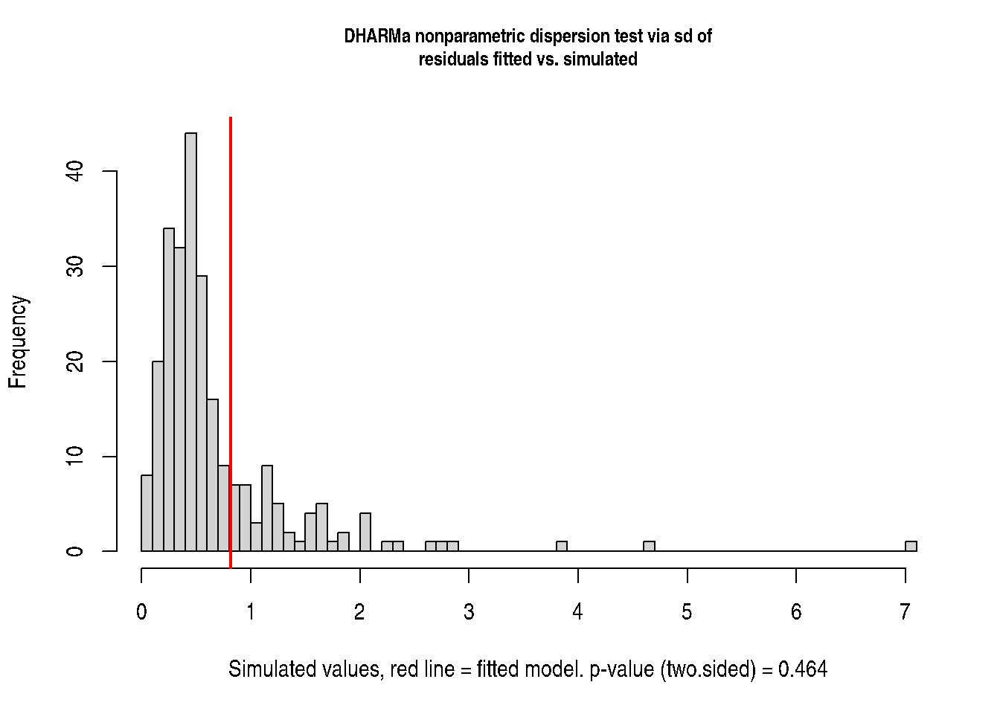
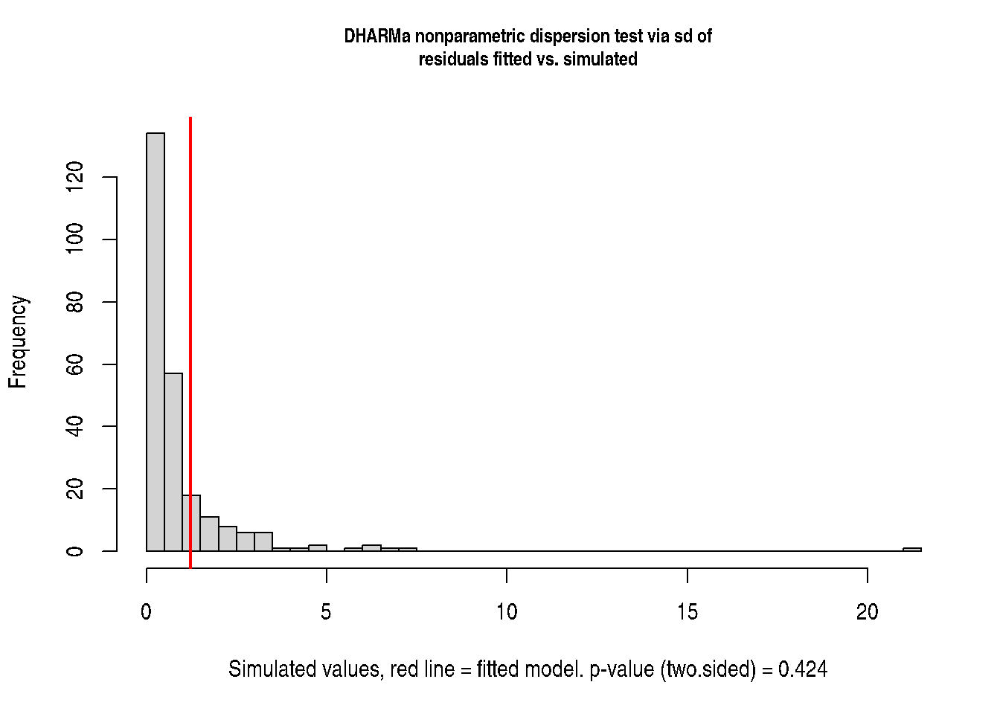
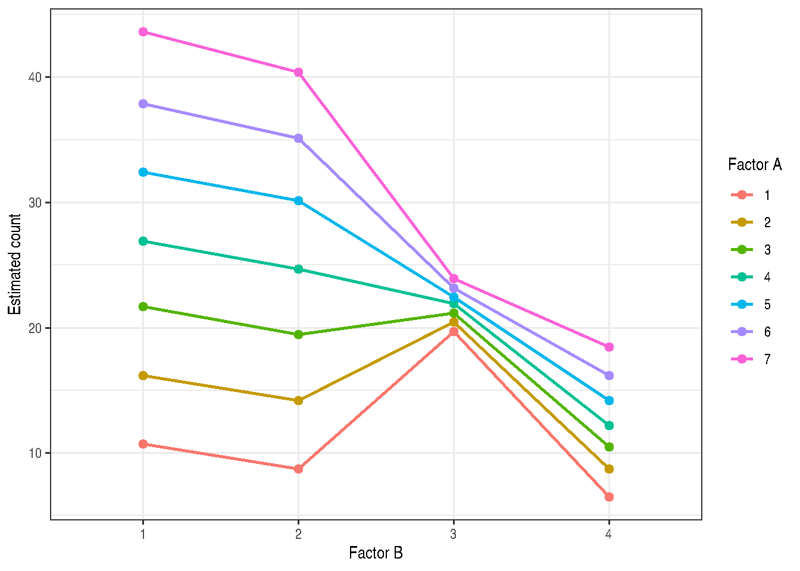

# 

# Chapter 11: Counts

Muhammad Yaseen

May 17, 2026

Code

``` r
knitr::opts_chunk$set(collapse = TRUE, comment = "#>")
```

### 1 Count Models

Chapter 11 develops GLMMs for non-negative integer responses. The
Poisson model assumes

\\ Y_i \mid b_i \sim \operatorname{Poisson}(\lambda_i), \qquad
\operatorname{E}(Y_i \mid b_i) = \operatorname{Var}(Y_i \mid b_i) =
\lambda_i. \\

With a log link,

\\ \log(\lambda_i) = x_i^\top \beta + z_i^\top b. \\

Overdispersion is present when the conditional variance is larger than
the Poisson variance. A negative-binomial GLMM adds a scale parameter:

\\ Y_i \mid b_i \sim \operatorname{NB}(\lambda_i, \phi), \qquad
\operatorname{Var}(Y_i \mid b_i) = \lambda_i(1 + \phi\lambda_i). \\

### 2 Example 11.1

Section 11.1.2 compares pre-GLM ANOVA methods and a Poisson-normal GLMM
for a two-treatment completely randomized count dataset.

Code

``` r
data(DataSet11.1, package = "modernGLMM")
utils::str(DataSet11.1)
#> 'data.frame':    10 obs. of  3 variables:
#>  $ trt  : Factor w/ 2 levels "1","2": 1 1 1 1 1 2 2 2 2 2
#>  $ unit : Factor w/ 5 levels "1","2","3","4",..: 1 2 3 4 5 1 2 3 4 5
#>  $ count: int  2 2 3 5 12 6 11 12 12 34
stats::aggregate(count ~ trt, data = DataSet11.1, FUN = mean)
#>   trt count
#> 1   1   4.8
#> 2   2  15.0
```

#### 2.1 ANOVA on Counts

Code

``` r
fit_count <- stats::lm(count ~ trt, data = DataSet11.1)
stats::anova(fit_count)
#> Analysis of Variance Table
#> 
#> Response: count
#>           Df Sum Sq Mean Sq F value  Pr(>F)  
#> trt        1  260.1  260.10  3.8054 0.08689 .
#> Residuals  8  546.8   68.35                  
#> ---
#> Signif. codes:  0 '***' 0.001 '**' 0.01 '*' 0.05 '.' 0.1 ' ' 1
emmeans::emmeans(fit_count, specs = ~ trt)
#>  trt emmean  SE df lower.CL upper.CL
#>  1      4.8 3.7  8    -3.73     13.3
#>  2     15.0 3.7  8     6.47     23.5
#> 
#> Confidence level used: 0.95
```

The reconstructed counts reproduce the printed treatment means, residual
mean square, F statistic, and p-value for the untransformed ANOVA.

#### 2.2 ANOVA on Log Counts

Code

``` r
DataSet11.1$log_count <- log(DataSet11.1$count)
fit_log <- stats::lm(log_count ~ trt, data = DataSet11.1)
stats::anova(fit_log)
#> Analysis of Variance Table
#> 
#> Response: log_count
#>           Df Sum Sq Mean Sq F value  Pr(>F)  
#> trt        1 3.7290  3.7290  7.7798 0.02359 *
#> Residuals  8 3.8346  0.4793                  
#> ---
#> Signif. codes:  0 '***' 0.001 '**' 0.01 '*' 0.05 '.' 0.1 ' ' 1
emmeans::emmeans(fit_log, specs = ~ trt)
#>  trt emmean   SE df lower.CL upper.CL
#>  1     1.32 0.31  8    0.602     2.03
#>  2     2.54 0.31  8    1.823     3.25
#> 
#> Confidence level used: 0.95
```

#### 2.3 Poisson GLM

Code

``` r
fit_pois_glm <- stats::glm(
  count ~ trt,
  family = stats::poisson(link = "log"),
  data = DataSet11.1
)

emmeans::emmeans(fit_pois_glm, specs = ~ trt, type = "response")
#>  trt rate   SE  df asymp.LCL asymp.UCL
#>  1    4.8 0.98 Inf      3.22      7.16
#>  2   15.0 1.73 Inf     11.96     18.81
#> 
#> Confidence level used: 0.95 
#> Intervals are back-transformed from the log scale
sum(stats::residuals(fit_pois_glm, type = "pearson")^2) /
  stats::df.residual(fit_pois_glm)
#> [1] 5.810417
```

The Pearson chi-square/DF is much larger than one, indicating that the
Poisson GLM has not accounted for the unit-level source of variation.

#### 2.4 Poisson-Normal GLMM

Code

``` r
fit_pois_normal <- lme4::glmer(
  count ~ trt + (1 | trt:unit),
  family = stats::poisson(link = "log"),
  data = DataSet11.1,
  nAGQ = 0,
  control = lme4::glmerControl(optimizer = "bobyqa")
)

summary(fit_pois_normal)
#> Generalized linear mixed model fit by maximum likelihood (Adaptive
#>   Gauss-Hermite Quadrature, nAGQ = 0) [glmerMod]
#>  Family: poisson  ( log )
#> Formula: count ~ trt + (1 | trt:unit)
#>    Data: DataSet11.1
#> Control: lme4::glmerControl(optimizer = "bobyqa")
#> 
#>       AIC       BIC    logLik -2*log(L)  df.resid 
#>      65.2      66.1     -29.6      59.2         7 
#> 
#> Scaled residuals: 
#>      Min       1Q   Median       3Q      Max 
#> -0.65465 -0.56392 -0.11551  0.07439  0.85875 
#> 
#> Random effects:
#>  Groups   Name        Variance Std.Dev.
#>  trt:unit (Intercept) 0.2908   0.5392  
#> Number of obs: 10, groups:  trt:unit, 10
#> 
#> Fixed effects:
#>             Estimate Std. Error z value Pr(>|z|)    
#> (Intercept)   1.4732     0.3235   4.554 5.28e-06 ***
#> trt2          1.1178     0.4227   2.644  0.00819 ** 
#> ---
#> Signif. codes:  0 '***' 0.001 '**' 0.01 '*' 0.05 '.' 0.1 ' ' 1
#> 
#> Correlation of Fixed Effects:
#>      (Intr)
#> trt2 -0.765
lme4::VarCorr(fit_pois_normal)
#>  Groups   Name        Std.Dev.
#>  trt:unit (Intercept) 0.53924
emmeans::emmeans(fit_pois_normal, specs = ~ trt, type = "response")
#>  trt  rate   SE  df asymp.LCL asymp.UCL
#>  1    4.36 1.41 Inf      2.31      8.23
#>  2   13.34 3.63 Inf      7.83     22.74
#> 
#> Confidence level used: 0.95 
#> Intervals are back-transformed from the log scale
```

Code

``` r
if (requireNamespace("DHARMa", quietly = TRUE)) {
  sim_11_1 <- DHARMa::simulateResiduals(fit_pois_normal, plot = FALSE)
  DHARMa::testDispersion(sim_11_1)
}
```



    #>
    #>  DHARMa nonparametric dispersion test via sd of residuals fitted vs.
    #>  simulated
    #>
    #> data:  simulationOutput
    #> dispersion = 1.2129, p-value = 0.464
    #> alternative hypothesis: two.sided

    if (requireNamespace("report", quietly = TRUE)) {
      report::report(fit_pois_normal)
    }
    #> We fitted a poisson mixed model (estimated using ML and BOBYQA optimizer) to
    #> predict count with trt (formula: count ~ trt). The model included trt as random
    #> effects (formula: ~1 | trt:unit). The model's intercept, corresponding to trt =
    #> 1, is at 1.47 (95% CI [0.84, 2.11], p < .001). Within this model:
    #>
    #>   - The effect of trt [2] is statistically significant and positive (beta = 1.12,
    #> 95% CI [0.29, 1.95], p = 0.008; Std. beta = 1.12, 95% CI [0.29, 1.95])
    #>
    #> Standardized parameters were obtained by fitting the model on a standardized
    #> version of the dataset. 95% Confidence Intervals (CIs) and p-values were
    #> computed using a Wald z-distribution approximation.

### 3 Example 11.3

Section 11.4 uses a randomized complete block design with three
treatments and ten blocks to show how overdispersion changes inference.

Code

``` r
data(DataSet11.3, package = "modernGLMM")
utils::str(DataSet11.3)
#> 'data.frame':    30 obs. of  3 variables:
#>  $ block: Factor w/ 10 levels "1","2","3","4",..: 1 2 3 4 5 6 7 8 9 10 ...
#>  $ trt  : Factor w/ 3 levels "1","2","3": 1 1 1 1 1 1 1 1 1 1 ...
#>  $ count: int  8 7 5 3 25 10 5 9 0 8 ...
stats::aggregate(count ~ trt, data = DataSet11.3, FUN = mean)
#>   trt count
#> 1   1   8.0
#> 2   2  13.3
#> 3   3  25.7
```

#### 3.1 Naive Poisson GLMM

Code

``` r
fit_naive <- lme4::glmer(
  count ~ trt + (1 | block),
  family = stats::poisson(link = "log"),
  data = DataSet11.3,
  nAGQ = 1,
  control = lme4::glmerControl(optimizer = "bobyqa")
)

pearson_df <- sum(stats::residuals(fit_naive, type = "pearson")^2) /
  stats::df.residual(fit_naive)
pearson_df
#> [1] 7.129416
emmeans::emmeans(fit_naive, specs = ~ trt, type = "response")
#>  trt  rate   SE  df asymp.LCL asymp.UCL
#>  1    4.28 1.60 Inf      2.06      8.92
#>  2    7.12 2.62 Inf      3.46     14.64
#>  3   13.76 4.99 Inf      6.76     28.03
#> 
#> Confidence level used: 0.95 
#> Intervals are back-transformed from the log scale
```

The diagnostic remains high, so the naive model should not be used for
final inference.

#### 3.2 Poisson-Normal GLMM

Code

``` r
fit_unit <- lme4::glmer(
  count ~ trt + (1 | block) + (1 | block:trt),
  family = stats::poisson(link = "log"),
  data = DataSet11.3,
  nAGQ = 0,
  control = lme4::glmerControl(optimizer = "bobyqa")
)

lme4::VarCorr(fit_unit)
#>  Groups    Name        Std.Dev.
#>  block:trt (Intercept) 0.88323 
#>  block     (Intercept) 0.84608
emmeans::emmeans(fit_unit, specs = ~ trt, type = "response")
#>  trt rate   SE  df asymp.LCL asymp.UCL
#>  1   6.02 2.48 Inf      2.68      13.5
#>  2   6.55 2.70 Inf      2.91      14.7
#>  3   9.47 3.88 Inf      4.24      21.1
#> 
#> Confidence level used: 0.95 
#> Intervals are back-transformed from the log scale
```

The block-by-treatment random term is the conditional-model analogue of
the unit-level source of variation in the repurposed ANOVA.

#### 3.3 Negative-Binomial GLMM

Code

``` r
if (requireNamespace("glmmTMB", quietly = TRUE)) {
  fit_nb <- glmmTMB::glmmTMB(
    count ~ trt + (1 | block),
    family = glmmTMB::nbinom2(link = "log"),
    data = DataSet11.3
  )

  summary(fit_nb)
  emmeans::emmeans(fit_nb, specs = ~ trt, type = "response")
  1 / sigma(fit_nb)
}
#> [1] 0.6829583
```

Code

``` r
if (requireNamespace("glmmTMB", quietly = TRUE) &&
    requireNamespace("DHARMa", quietly = TRUE)) {
  sim_11_3 <- DHARMa::simulateResiduals(fit_nb, plot = FALSE)
  DHARMa::testDispersion(sim_11_3)
}
```



    #>
    #>  DHARMa nonparametric dispersion test via sd of residuals fitted vs.
    #>  simulated
    #>
    #> data:  simulationOutput
    #> dispersion = 1.2991, p-value = 0.424
    #> alternative hypothesis: two.sided

    if (requireNamespace("glmmTMB", quietly = TRUE) &&
        requireNamespace("report", quietly = TRUE)) {
      report::report(fit_nb)
    }
    #> We fitted a negative-binomial mixed model (estimated using ML and nlminb
    #> optimizer) to predict count with trt (formula: count ~ trt). The model included
    #> block as random effect (formula: ~1 | block). The model's total explanatory
    #> power is substantial (conditional R2 = 0.62) and the part related to the fixed
    #> effects alone (marginal R2) is of 0.05. The model's intercept, corresponding to
    #> trt = 1, is at 1.90 (95% CI [1.07, 2.73], p < .001). Within this model:
    #>
    #>   - The effect of trt [2] is statistically non-significant and positive (beta =
    #> 0.30, 95% CI [-0.55, 1.14], p = 0.495)
    #>   - The effect of trt [3] is statistically non-significant and positive (beta =
    #> 0.68, 95% CI [-0.17, 1.52], p = 0.116)
    #>
    #> Standardized parameters were obtained by fitting the model on a standardized
    #> version of the dataset. 95% Confidence Intervals (CIs) and p-values were
    #> computed using a Wald z-distribution approximation.

### 4 Example 11.4

Section 11.5 considers a multi-level split-plot design with a 7 by 4
factorial treatment structure. The package data are synthetic because
the original `sp_counts` file was not available.

Code

``` r
data(DataSet11.4, package = "modernGLMM")
utils::str(DataSet11.4)
#> 'data.frame':    112 obs. of  4 variables:
#>  $ block: Factor w/ 4 levels "1","2","3","4": 1 2 3 4 1 2 3 4 1 2 ...
#>  $ a    : Factor w/ 7 levels "1","2","3","4",..: 1 1 1 1 2 2 2 2 3 3 ...
#>  $ b    : Factor w/ 4 levels "1","2","3","4": 1 1 1 1 1 1 1 1 1 1 ...
#>  $ count: int  11 10 10 12 13 17 16 19 19 24 ...
stats::aggregate(count ~ a + b, data = DataSet11.4, FUN = mean)
#>    a b count
#> 1  1 1 10.75
#> 2  2 1 16.25
#> 3  3 1 21.75
#> 4  4 1 27.00
#> 5  5 1 32.50
#> 6  6 1 38.00
#> 7  7 1 43.75
#> 8  1 2  8.75
#> 9  2 2 14.25
#> 10 3 2 19.50
#> 11 4 2 24.75
#> 12 5 2 30.25
#> 13 6 2 35.25
#> 14 7 2 40.50
#> 15 1 3 19.75
#> 16 2 3 20.50
#> 17 3 3 21.25
#> 18 4 3 22.00
#> 19 5 3 22.50
#> 20 6 3 23.25
#> 21 7 3 24.00
#> 22 1 4  6.50
#> 23 2 4  8.75
#> 24 3 4 10.50
#> 25 4 4 12.25
#> 26 5 4 14.25
#> 27 6 4 16.25
#> 28 7 4 18.50
```

Code

``` r
if (requireNamespace("glmmTMB", quietly = TRUE)) {
  fit_sp_nb <- glmmTMB::glmmTMB(
    count ~ a * b + (1 | block) + (1 | block:a),
    family = glmmTMB::nbinom2(link = "log"),
    data = DataSet11.4
  )

  summary(fit_sp_nb)
  emm_sp <- emmeans::emmeans(fit_sp_nb, specs = ~ a * b, type = "response")
  emm_sp
}
#>  a b response   SE  df asymp.LCL asymp.UCL
#>  1 1    10.72 1.69 Inf      7.87     14.59
#>  2 1    16.20 2.11 Inf     12.55     20.91
#>  3 1    21.68 2.48 Inf     17.34     27.12
#>  4 1    26.92 2.80 Inf     21.96     33.00
#>  5 1    32.40 3.11 Inf     26.84     39.12
#>  6 1    37.88 3.41 Inf     31.75     45.20
#>  7 1    43.62 3.72 Inf     36.91     51.54
#>  1 2     8.72 1.51 Inf      6.21     12.26
#>  2 2    14.21 1.96 Inf     10.84     18.62
#>  3 2    19.44 2.33 Inf     15.37     24.59
#>  4 2    24.67 2.66 Inf     19.97     30.49
#>  5 2    30.16 2.99 Inf     24.84     36.62
#>  6 2    35.14 3.27 Inf     29.29     42.16
#>  7 2    40.38 3.55 Inf     33.99     47.96
#>  1 3    19.69 2.35 Inf     15.59     24.87
#>  2 3    20.44 2.40 Inf     16.24     25.72
#>  3 3    21.18 2.44 Inf     16.90     26.56
#>  4 3    21.93 2.49 Inf     17.55     27.40
#>  5 3    22.43 2.52 Inf     17.99     27.96
#>  6 3    23.18 2.57 Inf     18.65     28.81
#>  7 3    23.93 2.62 Inf     19.31     29.65
#>  1 4     6.48 1.30 Inf      4.38      9.59
#>  2 4     8.72 1.51 Inf      6.21     12.26
#>  3 4    10.47 1.67 Inf      7.66     14.30
#>  4 4    12.21 1.81 Inf      9.13     16.33
#>  5 4    14.21 1.96 Inf     10.84     18.62
#>  6 4    16.20 2.11 Inf     12.55     20.91
#>  7 4    18.44 2.26 Inf     14.50     23.46
#> 
#> Confidence level used: 0.95 
#> Intervals are back-transformed from the log scale
```

Code

``` r
if (requireNamespace("glmmTMB", quietly = TRUE)) {
  emm_df <- as.data.frame(emm_sp)
  ggplot2::ggplot(
    emm_df,
    ggplot2::aes(x = b, y = response, group = a, colour = a)
  ) +
    ggplot2::geom_line(linewidth = 0.8) +
    ggplot2::geom_point(size = 2) +
    ggplot2::labs(x = "Factor B", y = "Estimated count", colour = "Factor A") +
    ggplot2::theme_bw()
}
```



### 5 Chapter Summary

Poisson GLMMs are useful starting points for count data, but their
mean-variance restriction is often too rigid. The practical workflow is
to fit a model that matches the design skeleton, check overdispersion,
and then choose an inference target. Conditional inference uses random
effects and distributions such as Poisson-normal or negative binomial;
marginal inference uses working covariance or quasi-likelihood
machinery.

Code

``` r
knitr::opts_chunk$set(collapse = TRUE, comment = "#>")
```

### 1 Count Models

Chapter 11 develops GLMMs for non-negative integer responses. The
Poisson model assumes

\\ Y_i \mid b_i \sim \operatorname{Poisson}(\lambda_i), \qquad
\operatorname{E}(Y_i \mid b_i) = \operatorname{Var}(Y_i \mid b_i) =
\lambda_i. \\

With a log link,

\\ \log(\lambda_i) = x_i^\top \beta + z_i^\top b. \\

Overdispersion is present when the conditional variance is larger than
the Poisson variance. A negative-binomial GLMM adds a scale parameter:

\\ Y_i \mid b_i \sim \operatorname{NB}(\lambda_i, \phi), \qquad
\operatorname{Var}(Y_i \mid b_i) = \lambda_i(1 + \phi\lambda_i). \\

### 2 Example 11.1

Section 11.1.2 compares pre-GLM ANOVA methods and a Poisson-normal GLMM
for a two-treatment completely randomized count dataset.

Code

``` r
data(DataSet11.1, package = "modernGLMM")
utils::str(DataSet11.1)
#> 'data.frame':    10 obs. of  3 variables:
#>  $ trt  : Factor w/ 2 levels "1","2": 1 1 1 1 1 2 2 2 2 2
#>  $ unit : Factor w/ 5 levels "1","2","3","4",..: 1 2 3 4 5 1 2 3 4 5
#>  $ count: int  2 2 3 5 12 6 11 12 12 34
stats::aggregate(count ~ trt, data = DataSet11.1, FUN = mean)
#>   trt count
#> 1   1   4.8
#> 2   2  15.0
```

#### 2.1 ANOVA on Counts

Code

``` r
fit_count <- stats::lm(count ~ trt, data = DataSet11.1)
stats::anova(fit_count)
#> Analysis of Variance Table
#> 
#> Response: count
#>           Df Sum Sq Mean Sq F value  Pr(>F)  
#> trt        1  260.1  260.10  3.8054 0.08689 .
#> Residuals  8  546.8   68.35                  
#> ---
#> Signif. codes:  0 '***' 0.001 '**' 0.01 '*' 0.05 '.' 0.1 ' ' 1
emmeans::emmeans(fit_count, specs = ~ trt)
#>  trt emmean  SE df lower.CL upper.CL
#>  1      4.8 3.7  8    -3.73     13.3
#>  2     15.0 3.7  8     6.47     23.5
#> 
#> Confidence level used: 0.95
```

The reconstructed counts reproduce the printed treatment means, residual
mean square, F statistic, and p-value for the untransformed ANOVA.

#### 2.2 ANOVA on Log Counts

Code

``` r
DataSet11.1$log_count <- log(DataSet11.1$count)
fit_log <- stats::lm(log_count ~ trt, data = DataSet11.1)
stats::anova(fit_log)
#> Analysis of Variance Table
#> 
#> Response: log_count
#>           Df Sum Sq Mean Sq F value  Pr(>F)  
#> trt        1 3.7290  3.7290  7.7798 0.02359 *
#> Residuals  8 3.8346  0.4793                  
#> ---
#> Signif. codes:  0 '***' 0.001 '**' 0.01 '*' 0.05 '.' 0.1 ' ' 1
emmeans::emmeans(fit_log, specs = ~ trt)
#>  trt emmean   SE df lower.CL upper.CL
#>  1     1.32 0.31  8    0.602     2.03
#>  2     2.54 0.31  8    1.823     3.25
#> 
#> Confidence level used: 0.95
```

#### 2.3 Poisson GLM

Code

``` r
fit_pois_glm <- stats::glm(
  count ~ trt,
  family = stats::poisson(link = "log"),
  data = DataSet11.1
)

emmeans::emmeans(fit_pois_glm, specs = ~ trt, type = "response")
#>  trt rate   SE  df asymp.LCL asymp.UCL
#>  1    4.8 0.98 Inf      3.22      7.16
#>  2   15.0 1.73 Inf     11.96     18.81
#> 
#> Confidence level used: 0.95 
#> Intervals are back-transformed from the log scale
sum(stats::residuals(fit_pois_glm, type = "pearson")^2) /
  stats::df.residual(fit_pois_glm)
#> [1] 5.810417
```

The Pearson chi-square/DF is much larger than one, indicating that the
Poisson GLM has not accounted for the unit-level source of variation.

#### 2.4 Poisson-Normal GLMM

Code

``` r
fit_pois_normal <- lme4::glmer(
  count ~ trt + (1 | trt:unit),
  family = stats::poisson(link = "log"),
  data = DataSet11.1,
  nAGQ = 0,
  control = lme4::glmerControl(optimizer = "bobyqa")
)

summary(fit_pois_normal)
#> Generalized linear mixed model fit by maximum likelihood (Adaptive
#>   Gauss-Hermite Quadrature, nAGQ = 0) [glmerMod]
#>  Family: poisson  ( log )
#> Formula: count ~ trt + (1 | trt:unit)
#>    Data: DataSet11.1
#> Control: lme4::glmerControl(optimizer = "bobyqa")
#> 
#>       AIC       BIC    logLik -2*log(L)  df.resid 
#>      65.2      66.1     -29.6      59.2         7 
#> 
#> Scaled residuals: 
#>      Min       1Q   Median       3Q      Max 
#> -0.65465 -0.56392 -0.11551  0.07439  0.85875 
#> 
#> Random effects:
#>  Groups   Name        Variance Std.Dev.
#>  trt:unit (Intercept) 0.2908   0.5392  
#> Number of obs: 10, groups:  trt:unit, 10
#> 
#> Fixed effects:
#>             Estimate Std. Error z value Pr(>|z|)    
#> (Intercept)   1.4732     0.3235   4.554 5.28e-06 ***
#> trt2          1.1178     0.4227   2.644  0.00819 ** 
#> ---
#> Signif. codes:  0 '***' 0.001 '**' 0.01 '*' 0.05 '.' 0.1 ' ' 1
#> 
#> Correlation of Fixed Effects:
#>      (Intr)
#> trt2 -0.765
lme4::VarCorr(fit_pois_normal)
#>  Groups   Name        Std.Dev.
#>  trt:unit (Intercept) 0.53924
emmeans::emmeans(fit_pois_normal, specs = ~ trt, type = "response")
#>  trt  rate   SE  df asymp.LCL asymp.UCL
#>  1    4.36 1.41 Inf      2.31      8.23
#>  2   13.34 3.63 Inf      7.83     22.74
#> 
#> Confidence level used: 0.95 
#> Intervals are back-transformed from the log scale
```

Code

``` r
if (requireNamespace("DHARMa", quietly = TRUE)) {
  sim_11_1 <- DHARMa::simulateResiduals(fit_pois_normal, plot = FALSE)
  DHARMa::testDispersion(sim_11_1)
}
```


    #>
    #>  DHARMa nonparametric dispersion test via sd of residuals fitted vs.
    #>  simulated
    #>
    #> data:  simulationOutput
    #> dispersion = 1.2129, p-value = 0.464
    #> alternative hypothesis: two.sided

    if (requireNamespace("report", quietly = TRUE)) {
      report::report(fit_pois_normal)
    }
    #> We fitted a poisson mixed model (estimated using ML and BOBYQA optimizer) to
    #> predict count with trt (formula: count ~ trt). The model included trt as random
    #> effects (formula: ~1 | trt:unit). The model's intercept, corresponding to trt =
    #> 1, is at 1.47 (95% CI [0.84, 2.11], p < .001). Within this model:
    #>
    #>   - The effect of trt [2] is statistically significant and positive (beta = 1.12,
    #> 95% CI [0.29, 1.95], p = 0.008; Std. beta = 1.12, 95% CI [0.29, 1.95])
    #>
    #> Standardized parameters were obtained by fitting the model on a standardized
    #> version of the dataset. 95% Confidence Intervals (CIs) and p-values were
    #> computed using a Wald z-distribution approximation.

### 3 Example 11.3

Section 11.4 uses a randomized complete block design with three
treatments and ten blocks to show how overdispersion changes inference.

Code

``` r
data(DataSet11.3, package = "modernGLMM")
utils::str(DataSet11.3)
#> 'data.frame':    30 obs. of  3 variables:
#>  $ block: Factor w/ 10 levels "1","2","3","4",..: 1 2 3 4 5 6 7 8 9 10 ...
#>  $ trt  : Factor w/ 3 levels "1","2","3": 1 1 1 1 1 1 1 1 1 1 ...
#>  $ count: int  8 7 5 3 25 10 5 9 0 8 ...
stats::aggregate(count ~ trt, data = DataSet11.3, FUN = mean)
#>   trt count
#> 1   1   8.0
#> 2   2  13.3
#> 3   3  25.7
```

#### 3.1 Naive Poisson GLMM

Code

``` r
fit_naive <- lme4::glmer(
  count ~ trt + (1 | block),
  family = stats::poisson(link = "log"),
  data = DataSet11.3,
  nAGQ = 1,
  control = lme4::glmerControl(optimizer = "bobyqa")
)

pearson_df <- sum(stats::residuals(fit_naive, type = "pearson")^2) /
  stats::df.residual(fit_naive)
pearson_df
#> [1] 7.129416
emmeans::emmeans(fit_naive, specs = ~ trt, type = "response")
#>  trt  rate   SE  df asymp.LCL asymp.UCL
#>  1    4.28 1.60 Inf      2.06      8.92
#>  2    7.12 2.62 Inf      3.46     14.64
#>  3   13.76 4.99 Inf      6.76     28.03
#> 
#> Confidence level used: 0.95 
#> Intervals are back-transformed from the log scale
```

The diagnostic remains high, so the naive model should not be used for
final inference.

#### 3.2 Poisson-Normal GLMM

Code

``` r
fit_unit <- lme4::glmer(
  count ~ trt + (1 | block) + (1 | block:trt),
  family = stats::poisson(link = "log"),
  data = DataSet11.3,
  nAGQ = 0,
  control = lme4::glmerControl(optimizer = "bobyqa")
)

lme4::VarCorr(fit_unit)
#>  Groups    Name        Std.Dev.
#>  block:trt (Intercept) 0.88323 
#>  block     (Intercept) 0.84608
emmeans::emmeans(fit_unit, specs = ~ trt, type = "response")
#>  trt rate   SE  df asymp.LCL asymp.UCL
#>  1   6.02 2.48 Inf      2.68      13.5
#>  2   6.55 2.70 Inf      2.91      14.7
#>  3   9.47 3.88 Inf      4.24      21.1
#> 
#> Confidence level used: 0.95 
#> Intervals are back-transformed from the log scale
```

The block-by-treatment random term is the conditional-model analogue of
the unit-level source of variation in the repurposed ANOVA.

#### 3.3 Negative-Binomial GLMM

Code

``` r
if (requireNamespace("glmmTMB", quietly = TRUE)) {
  fit_nb <- glmmTMB::glmmTMB(
    count ~ trt + (1 | block),
    family = glmmTMB::nbinom2(link = "log"),
    data = DataSet11.3
  )

  summary(fit_nb)
  emmeans::emmeans(fit_nb, specs = ~ trt, type = "response")
  1 / sigma(fit_nb)
}
#> [1] 0.6829583
```

Code

``` r
if (requireNamespace("glmmTMB", quietly = TRUE) &&
    requireNamespace("DHARMa", quietly = TRUE)) {
  sim_11_3 <- DHARMa::simulateResiduals(fit_nb, plot = FALSE)
  DHARMa::testDispersion(sim_11_3)
}
```


    #>
    #>  DHARMa nonparametric dispersion test via sd of residuals fitted vs.
    #>  simulated
    #>
    #> data:  simulationOutput
    #> dispersion = 1.2991, p-value = 0.424
    #> alternative hypothesis: two.sided

    if (requireNamespace("glmmTMB", quietly = TRUE) &&
        requireNamespace("report", quietly = TRUE)) {
      report::report(fit_nb)
    }
    #> We fitted a negative-binomial mixed model (estimated using ML and nlminb
    #> optimizer) to predict count with trt (formula: count ~ trt). The model included
    #> block as random effect (formula: ~1 | block). The model's total explanatory
    #> power is substantial (conditional R2 = 0.62) and the part related to the fixed
    #> effects alone (marginal R2) is of 0.05. The model's intercept, corresponding to
    #> trt = 1, is at 1.90 (95% CI [1.07, 2.73], p < .001). Within this model:
    #>
    #>   - The effect of trt [2] is statistically non-significant and positive (beta =
    #> 0.30, 95% CI [-0.55, 1.14], p = 0.495)
    #>   - The effect of trt [3] is statistically non-significant and positive (beta =
    #> 0.68, 95% CI [-0.17, 1.52], p = 0.116)
    #>
    #> Standardized parameters were obtained by fitting the model on a standardized
    #> version of the dataset. 95% Confidence Intervals (CIs) and p-values were
    #> computed using a Wald z-distribution approximation.

### 4 Example 11.4

Section 11.5 considers a multi-level split-plot design with a 7 by 4
factorial treatment structure. The package data are synthetic because
the original `sp_counts` file was not available.

Code

``` r
data(DataSet11.4, package = "modernGLMM")
utils::str(DataSet11.4)
#> 'data.frame':    112 obs. of  4 variables:
#>  $ block: Factor w/ 4 levels "1","2","3","4": 1 2 3 4 1 2 3 4 1 2 ...
#>  $ a    : Factor w/ 7 levels "1","2","3","4",..: 1 1 1 1 2 2 2 2 3 3 ...
#>  $ b    : Factor w/ 4 levels "1","2","3","4": 1 1 1 1 1 1 1 1 1 1 ...
#>  $ count: int  11 10 10 12 13 17 16 19 19 24 ...
stats::aggregate(count ~ a + b, data = DataSet11.4, FUN = mean)
#>    a b count
#> 1  1 1 10.75
#> 2  2 1 16.25
#> 3  3 1 21.75
#> 4  4 1 27.00
#> 5  5 1 32.50
#> 6  6 1 38.00
#> 7  7 1 43.75
#> 8  1 2  8.75
#> 9  2 2 14.25
#> 10 3 2 19.50
#> 11 4 2 24.75
#> 12 5 2 30.25
#> 13 6 2 35.25
#> 14 7 2 40.50
#> 15 1 3 19.75
#> 16 2 3 20.50
#> 17 3 3 21.25
#> 18 4 3 22.00
#> 19 5 3 22.50
#> 20 6 3 23.25
#> 21 7 3 24.00
#> 22 1 4  6.50
#> 23 2 4  8.75
#> 24 3 4 10.50
#> 25 4 4 12.25
#> 26 5 4 14.25
#> 27 6 4 16.25
#> 28 7 4 18.50
```

Code

``` r
if (requireNamespace("glmmTMB", quietly = TRUE)) {
  fit_sp_nb <- glmmTMB::glmmTMB(
    count ~ a * b + (1 | block) + (1 | block:a),
    family = glmmTMB::nbinom2(link = "log"),
    data = DataSet11.4
  )

  summary(fit_sp_nb)
  emm_sp <- emmeans::emmeans(fit_sp_nb, specs = ~ a * b, type = "response")
  emm_sp
}
#>  a b response   SE  df asymp.LCL asymp.UCL
#>  1 1    10.72 1.69 Inf      7.87     14.59
#>  2 1    16.20 2.11 Inf     12.55     20.91
#>  3 1    21.68 2.48 Inf     17.34     27.12
#>  4 1    26.92 2.80 Inf     21.96     33.00
#>  5 1    32.40 3.11 Inf     26.84     39.12
#>  6 1    37.88 3.41 Inf     31.75     45.20
#>  7 1    43.62 3.72 Inf     36.91     51.54
#>  1 2     8.72 1.51 Inf      6.21     12.26
#>  2 2    14.21 1.96 Inf     10.84     18.62
#>  3 2    19.44 2.33 Inf     15.37     24.59
#>  4 2    24.67 2.66 Inf     19.97     30.49
#>  5 2    30.16 2.99 Inf     24.84     36.62
#>  6 2    35.14 3.27 Inf     29.29     42.16
#>  7 2    40.38 3.55 Inf     33.99     47.96
#>  1 3    19.69 2.35 Inf     15.59     24.87
#>  2 3    20.44 2.40 Inf     16.24     25.72
#>  3 3    21.18 2.44 Inf     16.90     26.56
#>  4 3    21.93 2.49 Inf     17.55     27.40
#>  5 3    22.43 2.52 Inf     17.99     27.96
#>  6 3    23.18 2.57 Inf     18.65     28.81
#>  7 3    23.93 2.62 Inf     19.31     29.65
#>  1 4     6.48 1.30 Inf      4.38      9.59
#>  2 4     8.72 1.51 Inf      6.21     12.26
#>  3 4    10.47 1.67 Inf      7.66     14.30
#>  4 4    12.21 1.81 Inf      9.13     16.33
#>  5 4    14.21 1.96 Inf     10.84     18.62
#>  6 4    16.20 2.11 Inf     12.55     20.91
#>  7 4    18.44 2.26 Inf     14.50     23.46
#> 
#> Confidence level used: 0.95 
#> Intervals are back-transformed from the log scale
```

Code

``` r
if (requireNamespace("glmmTMB", quietly = TRUE)) {
  emm_df <- as.data.frame(emm_sp)
  ggplot2::ggplot(
    emm_df,
    ggplot2::aes(x = b, y = response, group = a, colour = a)
  ) +
    ggplot2::geom_line(linewidth = 0.8) +
    ggplot2::geom_point(size = 2) +
    ggplot2::labs(x = "Factor B", y = "Estimated count", colour = "Factor A") +
    ggplot2::theme_bw()
}
```


### 5 Chapter Summary

Poisson GLMMs are useful starting points for count data, but their
mean-variance restriction is often too rigid. The practical workflow is
to fit a model that matches the design skeleton, check overdispersion,
and then choose an inference target. Conditional inference uses random
effects and distributions such as Poisson-normal or negative binomial;
marginal inference uses working covariance or quasi-likelihood
machinery.
