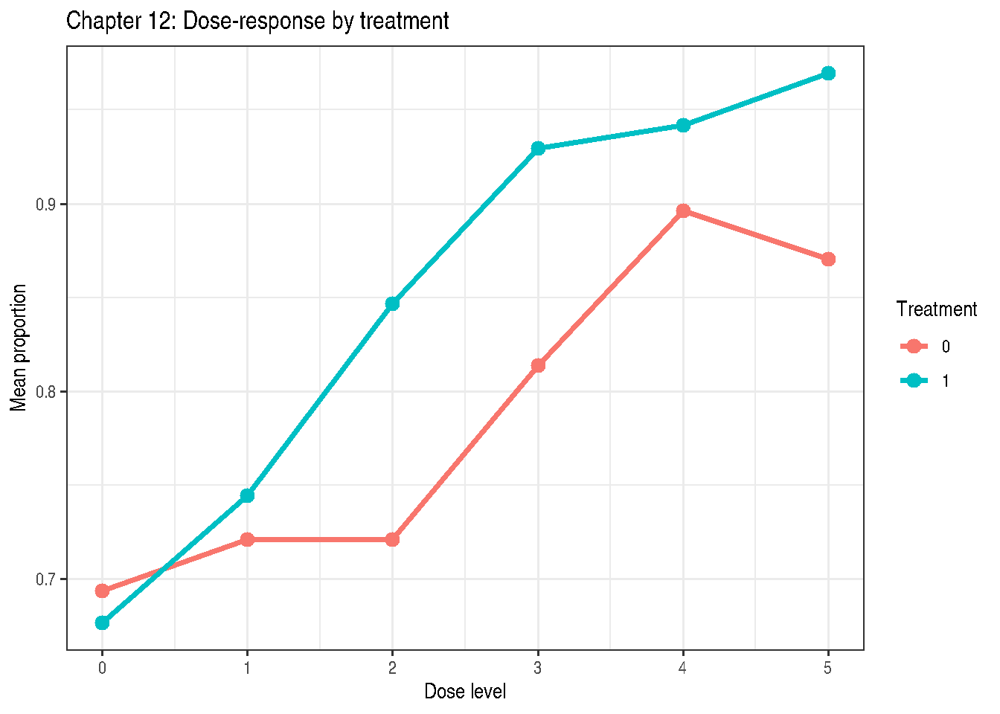

# Chapter 12: Rates and Proportions

Code

``` r

library(modernGLMM)
library(lme4)
library(emmeans)
library(ggplot2)
```

## 1 Overview

Chapter 12 addresses responses that are **proportions or rates** —
either continuous values strictly in \\(0, 1)\\ (Section 12.6) or
binomial counts with a fixed denominator (Section 12.3).

Two primary approaches:

1.  **Beta GLMM**: models a continuous proportion using the Beta
    distribution with a logit link; accommodates between-run variability
    via random effects
2.  **Binomial GLMM**: models the number of successes out of a fixed
    total with a nested or split-plot random-effect structure

## 2 Example 12.1 — Continuous Proportions: Beta GLMM (Section 12.6.2)

`DataSet12.1`: 2 treatments × 12 runs × 6 dose levels = 144
observations. Response is a continuous proportion in \\(0, 1)\\.

Code

``` r

data(DataSet12.1)
str(DataSet12.1)
```

    'data.frame':   144 obs. of  4 variables:
     $ trt       : Factor w/ 2 levels "0","1": 1 1 1 1 1 1 1 1 1 1 ...
     $ run       : Factor w/ 24 levels "t0r1","t0r10",..: 1 1 1 1 1 1 2 2 2 2 ...
     $ dose      : int  0 1 2 3 4 5 0 1 2 3 ...
     $ proportion: num  0.688 0.957 0.863 0.74 0.89 ...

Code

``` r

## Mean proportion by treatment and dose
with(DataSet12.1, tapply(proportion, list(trt, dose), mean))
```

              0         1         2         3         4         5
    0 0.6939107 0.7212031 0.7210461 0.8140771 0.8964916 0.8705738
    1 0.6766403 0.7444827 0.8466202 0.9294818 0.9419682 0.9697002

Code

``` r

ggplot(DataSet12.1, aes(x = dose, y = proportion,
                         colour = trt, group = trt)) +
  stat_summary(fun = mean, geom = "line", linewidth = 1.2) +
  stat_summary(fun = mean, geom = "point", size = 3) +
  labs(title = "Chapter 12: Dose-response by treatment",
       x = "Dose level", y = "Mean proportion",
       colour = "Treatment") +
  theme_bw()
```



Figure 1: Dose-response profiles by treatment

### 2.1 Beta GLMM via glmmTMB

Code

``` r

if (requireNamespace("glmmTMB", quietly = TRUE)) {
  fit_beta <- glmmTMB::glmmTMB(
    proportion ~ trt * dose + (1 | run),
    family  = glmmTMB::beta_family(link = "logit"),
    data    = DataSet12.1
  )
  summary(fit_beta)
}
```

     Family: beta  ( logit )
    Formula:          proportion ~ trt * dose + (1 | run)
    Data: DataSet12.1

          AIC       BIC    logLik -2*log(L)  df.resid
       -327.8    -310.0     169.9    -339.8       138

    Random effects:

    Conditional model:
     Groups Name        Variance Std.Dev.
     run    (Intercept) 0.1782   0.4222
    Number of obs: 144, groups:  run, 24

    Dispersion parameter for beta family (): 10.1

    Conditional model:
                Estimate Std. Error z value Pr(>|z|)
    (Intercept)  0.76428    0.18528   4.125 3.71e-05 ***
    trt1        -0.09428    0.26413  -0.357    0.721
    dose         0.25377    0.05021   5.054 4.33e-07 ***
    trt1:dose    0.32889    0.07601   4.327 1.51e-05 ***
    ---
    Signif. codes:  0 '***' 0.001 '**' 0.01 '*' 0.05 '.' 0.1 ' ' 1

Code

``` r

if (requireNamespace("glmmTMB", quietly = TRUE)) {
  emm_beta <- emmeans::emmeans(fit_beta, ~ trt | dose,
                                at = list(dose = c(0, 5)),
                                type = "response")
  print(emm_beta)
  emmeans::contrast(emm_beta, method = "pairwise")
}
```

    dose = 0:
     trt response      SE  df asymp.LCL asymp.UCL
     0      0.682 0.04020 Inf     0.599     0.755
     1      0.662 0.04220 Inf     0.575     0.739

    dose = 5:
     trt response      SE  df asymp.LCL asymp.UCL
     0      0.884 0.02120 Inf     0.836     0.920
     1      0.973 0.00656 Inf     0.957     0.983

    Confidence level used: 0.95
    Intervals are back-transformed from the logit scale 

    dose = 0:
     contrast    odds.ratio    SE  df null z.ratio p.value
     trt0 / trt1      1.099 0.290 Inf    1   0.357  0.7211

    dose = 5:
     contrast    odds.ratio    SE  df null z.ratio p.value
     trt0 / trt1      0.212 0.066 Inf    1  -4.986 <0.0001

    Tests are performed on the log odds ratio scale 

## 3 Example 12.2 — Binomial Nested Factorial (Section 12.3.2)

`DataSet12.2`: 10 blocks × 6 treatments (factor A with 2 levels, factor
B with 3 levels nested within A) = 60 observations. Response is count of
successes `f` out of total `n`.

Code

``` r

data(DataSet12.2)
str(DataSet12.2)
```

    'data.frame':   30 obs. of  5 variables:
     $ block: Factor w/ 10 levels "1","2","3","4",..: 1 1 1 2 2 2 3 3 3 4 ...
     $ a    : Factor w/ 2 levels "setA","setB": 1 1 1 1 1 1 1 1 1 1 ...
     $ b    : Factor w/ 3 levels "B0","B1","B2": 1 2 3 1 2 3 1 2 3 1 ...
     $ f    : int  9 9 8 13 10 10 14 14 15 6 ...
     $ n    : int  20 20 20 20 20 20 20 20 20 20 ...

Code

``` r

## Observed proportions by A and B
with(DataSet12.2, tapply(f / n, list(a, b), mean))
```

           B0   B1   B2
    setA 0.52 0.59 0.50
    setB 0.28 0.33 0.48

Code

``` r

fit_nb <- lme4::glmer(
  cbind(f, n - f) ~ a / b + (1 + a | block),
  family  = stats::binomial(link = "logit"),
  data    = DataSet12.2,
  control = lme4::glmerControl(optimizer = "bobyqa")
)
summary(fit_nb)
```

    Generalized linear mixed model fit by maximum likelihood (Laplace
      Approximation) [glmerMod]
     Family: binomial  ( logit )
    Formula: cbind(f, n - f) ~ a/b + (1 + a | block)
       Data: DataSet12.2
    Control: lme4::glmerControl(optimizer = "bobyqa")

          AIC       BIC    logLik -2*log(L)  df.resid
        156.4     169.0     -69.2     138.4        21

    Scaled residuals:
        Min      1Q  Median      3Q     Max
    -1.9511 -0.4279  0.0596  0.5048  1.2731

    Random effects:
     Groups Name        Variance Std.Dev. Corr
     block  (Intercept) 0.1061   0.3257
            asetB       0.6715   0.8194   -0.20
    Number of obs: 30, groups:  block, 10

    Fixed effects:
                Estimate Std. Error z value Pr(>|z|)
    (Intercept)  0.08323    0.24966   0.333  0.73884
    asetB       -1.16210    0.50491  -2.302  0.02136 *
    asetA:bB1    0.29114    0.28893   1.008  0.31362
    asetB:bB1    0.27123    0.32916   0.824  0.40993
    asetA:bB2   -0.08213    0.28659  -0.287  0.77444
    asetB:bB2    0.99917    0.32356   3.088  0.00201 **
    ---
    Signif. codes:  0 '***' 0.001 '**' 0.01 '*' 0.05 '.' 0.1 ' ' 1

    Correlation of Fixed Effects:
              (Intr) asetB  asA:B1 asB:B1 asA:B2
    asetB     -0.494
    asetA:bB1 -0.569  0.282
    asetB:bB1  0.000 -0.342  0.000
    asetA:bB2 -0.574  0.284  0.496  0.000
    asetB:bB2  0.000 -0.357  0.000  0.534  0.000
    optimizer (bobyqa) convergence code: 0 (OK)
    Model is nearly unidentifiable: large eigenvalue ratio
     - Rescale variables?

Code

``` r

if (requireNamespace("car", quietly = TRUE)) {
  car::Anova(fit_nb, type = "III")
}
```

|             |      Chisq |  Df | Pr(\>Chisq) |
|:------------|-----------:|----:|------------:|
| (Intercept) |  0.1111518 |   1 |   0.7388367 |
| a           |  5.2974165 |   1 |   0.0213571 |
| a:b         | 12.3267596 |   4 |   0.0150798 |

Code

``` r

## B(A) means on probability scale
emm_ba <- emmeans::emmeans(fit_nb, ~ b | a, type = "response")
print(emm_ba)
```

    a = setA:
     b   prob     SE  df asymp.LCL asymp.UCL
     B0 0.521 0.0623 Inf     0.400     0.639
     B1 0.593 0.0609 Inf     0.470     0.705
     B2 0.500 0.0624 Inf     0.380     0.620

    a = setB:
     b   prob     SE  df asymp.LCL asymp.UCL
     B0 0.254 0.0831 Inf     0.126     0.446
     B1 0.308 0.0923 Inf     0.160     0.510
     B2 0.480 0.1060 Inf     0.286     0.680

    Confidence level used: 0.95
    Intervals are back-transformed from the logit scale 

## 4 Comparing Approaches

| Approach | Distribution | When to use |
|----|----|----|
| Beta GLMM | Beta\\(μφ, (1-μ)φ)\\ | Continuous proportions in \\(0,1)\\; run-level random effects |
| Binomial GLMM | Binomial\\(n, π)\\ | Count/total with known \\n\\; factorial or nested designs |

## 5 Key Takeaways

- **Beta GLMM** is the appropriate model for continuous proportions.
- **Binomial GLMM** is correct when the denominator \\n\\ is a fixed
  count.
- Both models use the logit link, making linear predictors directly
  comparable.
- Random effects (run, block) account for over-dispersion and design
  structure.

## 6 References

Stroup, W. W., Ptukhina, M., and Garai, S. (2024). *Generalized Linear
Mixed Models: Modern Concepts, Methods and Applications* (2nd ed.). CRC
Press.

Ferrari, S., & Cribari-Neto, F. (2004). Beta regression for modelling
rates and proportions. *Journal of Applied Statistics*, 31(7), 799–815.
