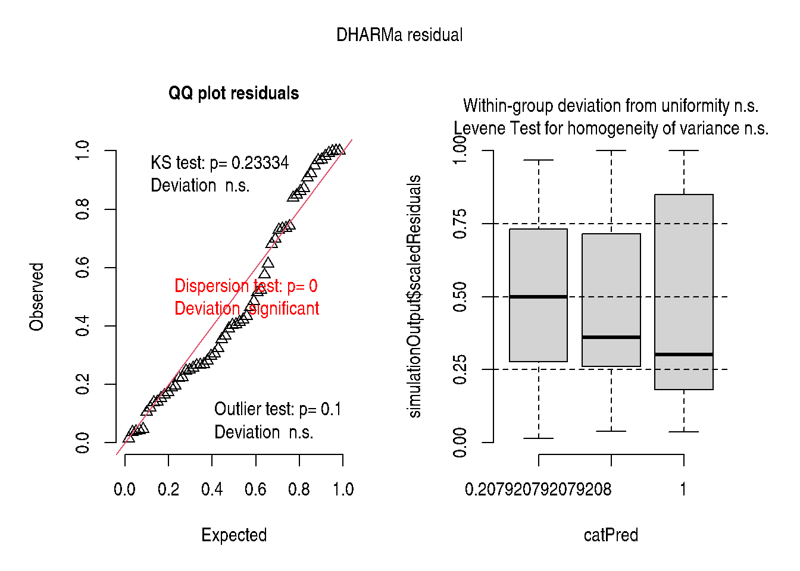
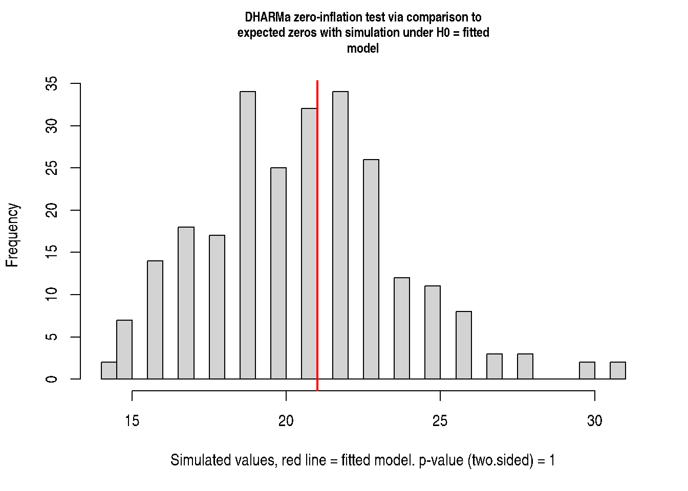

# Chapter 13: Zero-Inflated and Hurdle Models

``` r
library(modernGLMM)
library(emmeans)
```

## 1 Overview

Chapter 13 addresses responses with **excess zeros** — more zeros than a
standard Poisson or binomial model predicts.

Two modelling strategies:

| Model                        | Structure                                 | Interpretation                                         |
|------------------------------|-------------------------------------------|--------------------------------------------------------|
| **Zero-Inflated (ZIP/ZINB)** | Mixture: structural zeros + count process | Some units can **never** have a non-zero count         |
| **Hurdle**                   | Two-part: binary + truncated count        | All non-zero counts come from a separate count process |

The zero-inflated Poisson model:

\\P(Y_i = 0) = \pi_i + (1 - \pi_i)e^{-\lambda_i}\\ \\P(Y_i = y) = (1 -
\pi_i)\frac{e^{-\lambda_i}\lambda_i^y}{y!}, \quad y \> 0\\

## 2 Zero-Inflated Poisson GLMM

``` r
if (requireNamespace("glmmTMB", quietly = TRUE)) {
  simulate_zinb <- function(n, mu, size, zprob) {
    structural_zero <- stats::rbinom(n, size = 1, prob = zprob) == 1
    counts <- stats::rnbinom(n, mu = mu, size = size)
    counts[structural_zero] <- 0L
    counts
  }

  set.seed(123)
  zi_data <- data.frame(
    trt = factor(rep(c("control", "low", "high"), each = 20)),
    block = factor(rep(1:5, times = 12)),
    count = c(
      simulate_zinb(20, mu = 2, size = 2, zprob = 0.5),
      simulate_zinb(20, mu = 5, size = 2, zprob = 0.3),
      simulate_zinb(20, mu = 10, size = 2, zprob = 0.1)
    )
  )

  # Zero-inflated Poisson GLMM
  fit_zip <- glmmTMB::glmmTMB(
    count ~ trt + (1 | block),
    ziformula = ~ trt,
    data   = zi_data,
    family = poisson()
  )
  summary(fit_zip)
}
```

     Family: poisson  ( log )
    Formula:          count ~ trt + (1 | block)
    Zero inflation:         ~trt
    Data: zi_data

          AIC       BIC    logLik -2*log(L)  df.resid
        335.0     349.7    -160.5     321.0        53

    Random effects:

    Conditional model:
     Groups Name        Variance Std.Dev.
     block  (Intercept) 0.02129  0.1459
    Number of obs: 60, groups:  block, 5

    Conditional model:
                Estimate Std. Error z value Pr(>|z|)
    (Intercept)   0.4251     0.3335   1.275 0.202449
    trthigh       1.7656     0.3378   5.226 1.73e-07 ***
    trtlow        1.2931     0.3432   3.768 0.000164 ***
    ---
    Signif. codes:  0 '***' 0.001 '**' 0.01 '*' 0.05 '.' 0.1 ' ' 1

    Zero-inflation model:
                Estimate Std. Error z value Pr(>|z|)
    (Intercept)  -0.0545     0.6292  -0.087    0.931
    trthigh      -1.3324     0.8419  -1.583    0.113
    trtlow       -1.0695     0.8198  -1.305    0.192

## 3 Hurdle Model

``` r
if (requireNamespace("glmmTMB", quietly = TRUE) && exists("zi_data")) {
  fit_hurdle <- glmmTMB::glmmTMB(
    count ~ trt + (1 | block),
    ziformula = ~ trt,
    data   = zi_data,
    family = glmmTMB::truncated_poisson()
  )
  summary(fit_hurdle)
}
```

     Family: truncated_poisson  ( log )
    Formula:          count ~ trt + (1 | block)
    Zero inflation:         ~trt
    Data: zi_data

          AIC       BIC    logLik -2*log(L)  df.resid
        335.3     349.9    -160.6     321.3        53

    Random effects:

    Conditional model:
     Groups Name        Variance Std.Dev.
     block  (Intercept) 0.01856  0.1362
    Number of obs: 60, groups:  block, 5

    Conditional model:
                Estimate Std. Error z value Pr(>|z|)
    (Intercept)   0.4363     0.3316   1.316 0.188299
    trthigh       1.7540     0.3367   5.210 1.89e-07 ***
    trtlow        1.2860     0.3425   3.755 0.000173 ***
    ---
    Signif. codes:  0 '***' 0.001 '**' 0.01 '*' 0.05 '.' 0.1 ' ' 1

    Zero-inflation model:
                Estimate Std. Error z value Pr(>|z|)
    (Intercept)   0.4055     0.4564   0.888   0.3744
    trthigh      -1.7918     0.7217  -2.483   0.0130 *
    trtlow       -1.5041     0.6892  -2.182   0.0291 *
    ---
    Signif. codes:  0 '***' 0.001 '**' 0.01 '*' 0.05 '.' 0.1 ' ' 1

## 4 Diagnostics

``` r
if (requireNamespace("glmmTMB", quietly = TRUE) &&
    requireNamespace("DHARMa", quietly = TRUE) &&
    exists("fit_zip")) {
  sim_r <- DHARMa::simulateResiduals(fit_zip, plot = TRUE)
  DHARMa::testZeroInflation(sim_r)
}
```





        DHARMa zero-inflation test via comparison to expected zeros with
        simulation under H0 = fitted model

    data:  simulationOutput
    ratioObsSim = 1.0114, p-value = 1
    alternative hypothesis: two.sided

## 5 Key Takeaways

- Zero-inflated models are appropriate when zeros arise from two
  mechanisms: structural (always-zero) and sampling (could be non-zero).
- Hurdle models assume all zeros come from the binary part.
- [`glmmTMB::glmmTMB()`](https://rdrr.io/pkg/glmmTMB/man/glmmTMB.html)
  fits both types; use `ziformula` to specify the zero-inflation
  component.
- [`DHARMa::testZeroInflation()`](https://rdrr.io/pkg/DHARMa/man/testZeroInflation.html)
  tests whether residual zeros exceed what the fitted model predicts.

## 6 References

Stroup, W. W., Ptukhina, M., and Garai, S. (2024). *Generalized Linear
Mixed Models: Modern Concepts, Methods and Applications (2nd ed.)*. CRC
Press.
