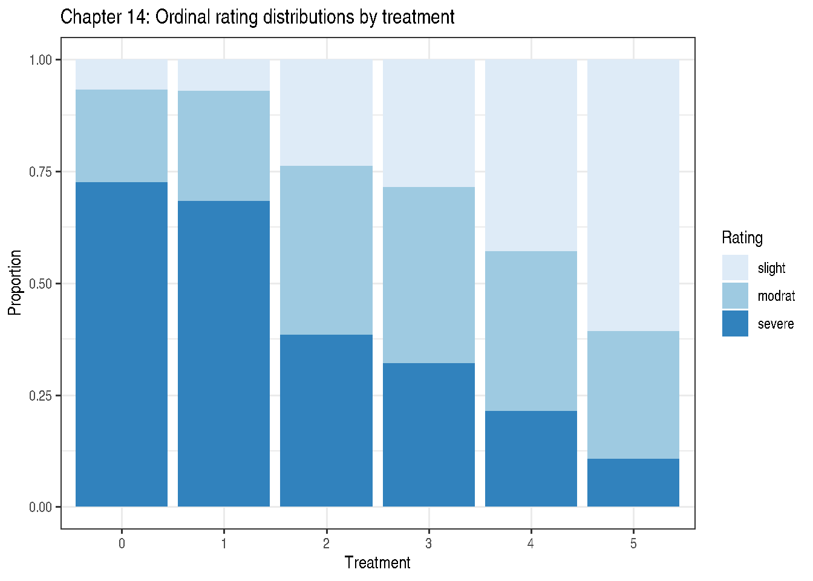
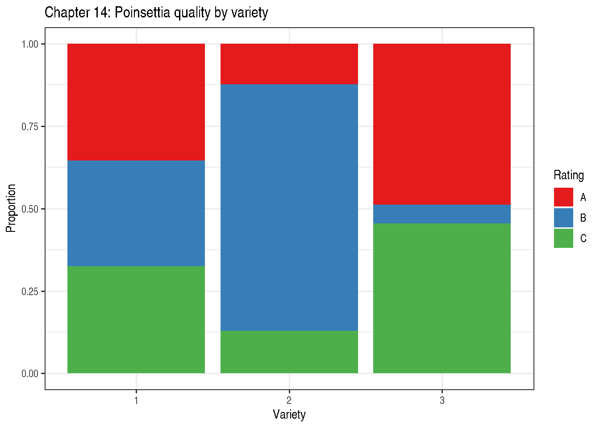

# Chapter 14: Multinomial Data

``` r

library(modernGLMM)
library(emmeans)
library(ggplot2)
```

## 1 Overview

Chapter 14 extends GLMMs to **categorical responses with more than two
categories**. Two cases arise:

1.  **Ordinal** (ordered categories): \\Y \in \\1 \< 2 \< \cdots \<
    J\\\\
2.  **Nominal** (unordered categories): \\Y \in \\1, 2, \ldots, J\\\\

## 2 Ordinal Models

### 2.1 Proportional-Odds Model (Cumulative Logit)

\\\text{logit}\[P(Y \le j \mid x)\] = \theta_j -
\mathbf{x}^\top\boldsymbol{\beta}\\

- \\\theta_1 \< \theta_2 \< \cdots \< \theta\_{J-1}\\: threshold
  intercepts
- \\\boldsymbol{\beta}\\: common slope vector (proportional odds
  assumption)
- The minus sign convention means larger \\\beta\\ → higher probability
  of higher categories

## 3 Example 14.1 — Ordinal GLMM (Section 14.3)

`DataSet14.1`: 10 blocks × 6 treatments × 3 ordered ratings (slight \<
modrat \< severe), stored as frequency counts (`y`).

``` r

data(DataSet14.1)
str(DataSet14.1)
```

    'data.frame':   180 obs. of  4 variables:
     $ blk   : Factor w/ 10 levels "1","2","3","4",..: 1 1 1 1 1 1 1 1 1 1 ...
     $ trt   : Factor w/ 6 levels "0","1","2","3",..: 1 1 1 2 2 2 3 3 3 4 ...
     $ rating: Ord.factor w/ 3 levels "slight"<"modrat"<..: 1 2 3 1 2 3 1 2 3 1 ...
     $ y     : int  1 4 23 2 7 23 4 7 18 8 ...

``` r

## Marginal rating distribution by treatment
with(DataSet14.1, tapply(y, list(trt, rating), sum))
```

      slight modrat severe
    0     19     58    203
    1     20     70    194
    2     67    106    108
    3     80    110     90
    4    120    100     60
    5    170     80     30

``` r

marg14 <- aggregate(y ~ trt + rating, data = DataSet14.1, FUN = sum)
marg14$rating <- factor(marg14$rating,
                        levels = c("slight", "modrat", "severe"),
                        ordered = TRUE)
ggplot(marg14, aes(x = trt, y = y, fill = rating)) +
  geom_col(position = "fill") +
  labs(title = "Chapter 14: Ordinal rating distributions by treatment",
       x = "Treatment", y = "Proportion",
       fill = "Rating") +
  scale_fill_brewer(palette = "Blues") +
  theme_bw()
```



Figure 1: Distribution of ordinal ratings by treatment (marginal counts)

``` r

## Fixed-effects proportional-odds via MASS::polr (no random block effect)
## NOTE: ignores block random effect; for illustration of fixed-effect structure.
## A full proportional-odds GLMM would require ordinal::clmm or glmmTMB >= 1.2.
if (requireNamespace("MASS", quietly = TRUE)) {
  fit_polr <- MASS::polr(
    rating ~ trt,
    weights = y,
    data    = DataSet14.1,
    Hess    = TRUE,
    method  = "logistic"
  )
  summary(fit_polr)

  ## Wald p-values
  coef_tab <- coef(summary(fit_polr))
  pval     <- stats::pnorm(abs(coef_tab[, "t value"]),
                            lower.tail = FALSE) * 2
  cbind(coef_tab, "p value" = round(pval, 4))

  ## Odds ratios for treatments vs reference (trt 5)
  exp(coef(fit_polr)[seq_len(nlevels(DataSet14.1$trt) - 1L)])
}
```

          trt1       trt2       trt3       trt4       trt5
    0.83071257 0.23465974 0.18027153 0.09872323 0.04660907 

## 4 Non-Proportional Odds (Section 14.4)

### 4.1 Baseline-Category Logit

For unordered categories with category \\J\\ as the reference:

\\\log\frac{P(Y = j)}{P(Y = J)} = \alpha_j + \tau\_{ij}, \quad j =
1,\ldots,J-1\\

Each non-reference category has its own intercept and slope vector.

## 5 Example 14.2 — Non-Proportional Odds: Poinsettia Trial

`DataSet14.2`: 12 growers × 3 varieties × 3 quality ratings (poor \<
average \< good), stored as frequency counts (`y`). The
proportional-odds assumption fails; variety effects differ by rating
boundary.

``` r

data(DataSet14.2)
str(DataSet14.2)
```

    'data.frame':   108 obs. of  4 variables:
     $ grower : Factor w/ 12 levels "1","2","3","4",..: 1 1 1 1 1 1 1 1 1 2 ...
     $ variety: Factor w/ 3 levels "1","2","3": 1 1 1 2 2 2 3 3 3 1 ...
     $ rating : Factor w/ 3 levels "A","B","C": 1 2 3 1 2 3 1 2 3 1 ...
     $ y      : int  16 15 15 6 33 6 22 3 21 16 ...

``` r

## Marginal variety × rating totals (match published table p.438)
with(DataSet14.2, tapply(y, list(variety, rating), sum))
```

        A   B   C
    1 192 174 176
    2  65 395  68
    3 262  30 244

``` r

marg14b <- aggregate(y ~ variety + rating, data = DataSet14.2, FUN = sum)
marg14b$rating <- factor(marg14b$rating, levels = c("A", "B", "C"))
ggplot(marg14b, aes(x = variety, y = y, fill = rating)) +
  geom_col(position = "fill") +
  labs(title = "Chapter 14: Poinsettia quality by variety",
       x = "Variety", y = "Proportion",
       fill = "Rating") +
  scale_fill_brewer(palette = "Set1") +
  theme_bw()
```



Figure 2: Quality rating distribution by variety (marginal counts)

``` r

## Proportional-odds (fixed effects only, no grower RE) via MASS::polr
## Expected to show near-zero variety effect (proportional-odds assumption fails).
## Full GLMM with grower random effect requires ordinal::clmm or glmmTMB >= 1.2.
if (requireNamespace("MASS", quietly = TRUE)) {
  fit_polr2 <- MASS::polr(
    rating ~ variety,
    weights = y,
    data    = DataSet14.2,
    Hess    = TRUE,
    method  = "logistic"
  )
  summary(fit_polr2)
}
```

    Call:
    MASS::polr(formula = rating ~ variety, data = DataSet14.2, weights = y,
        Hess = TRUE, method = "logistic")

    Coefficients:
                Value Std. Error t value
    variety2  0.08169     0.1074  0.7607
    variety3 -0.03017     0.1213 -0.2488

    Intercepts:
        Value   Std. Error t value
    A|B -0.7132  0.0849    -8.4029
    B|C  0.8559  0.0858     9.9769

    Residual Deviance: 3515.533
    AIC: 3523.533 

## 6 Choosing Between Ordinal and Nominal Models

| Criterion         | Ordinal                      | Nominal          |
|-------------------|------------------------------|------------------|
| Category ordering | Natural order exists         | No natural order |
| Parsimony         | Fewer parameters             | More parameters  |
| Proportional odds | Must check                   | Not required     |
| Example           | Pain scores, quality ratings | Species, region  |

## 7 Key Takeaways

- Use **ordinal models** when categories have a natural ordering; they
  are more parsimonious under the proportional-odds assumption.
- Use **nominal (multinomial logistic) models** when no ordering exists.
- The **proportional-odds assumption** can be tested with a likelihood
  ratio test comparing the proportional-odds model to a partial
  proportional-odds model.
- `emmeans` provides marginal probability estimates for both model
  types.

## 8 References

Stroup, W. W., Ptukhina, M., and Garai, S. (2024). *Generalized Linear
Mixed Models: Modern Concepts, Methods and Applications* (2nd ed.). CRC
Press.

Agresti, A. (2010). *Analysis of Ordinal Categorical Data*, 2nd
ed. Wiley.
