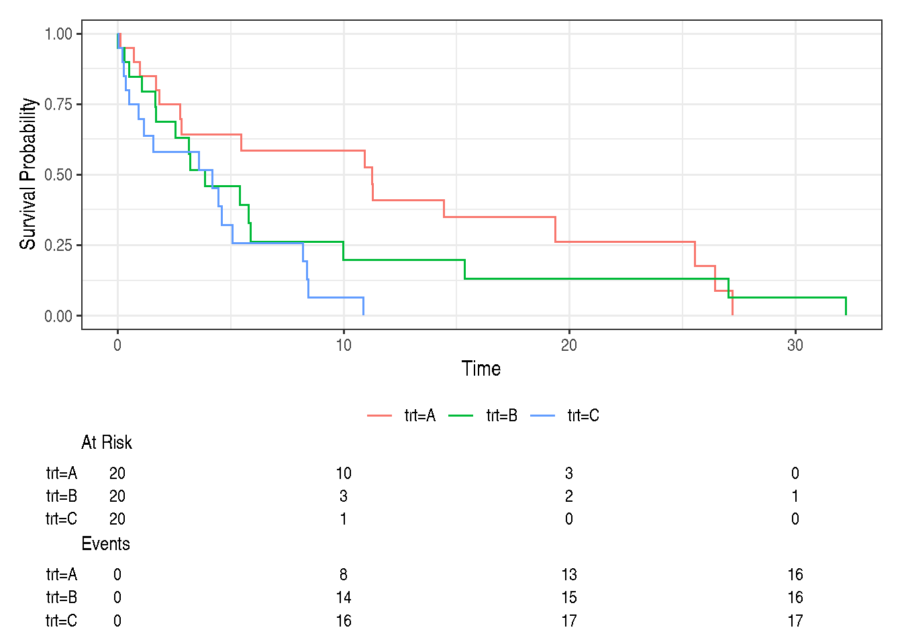

# 

# Chapter 15: Time-to-Event Data

Survival Analysis and Frailty Models

Muhammad Yaseen

May 16, 2026

``` r

library(modernGLMM)
library(ggplot2)
```

### 1 Overview

Chapter 15 covers **time-to-event** (survival) data in the GLMM context.
A key distinction from standard survival analysis is the inclusion of
**random effects (frailty)** to account for clustering.

Core concepts:

- **Survival function**: \\S(t) = P(T \> t)\\
- **Hazard function**: \\h(t) = \lim\_{\Delta t \to 0} P(t \le T \< t +
  \Delta t \mid T \ge t) / \Delta t\\
- **Cox PH model**: \\h(t \mid \mathbf{x}) = h_0(t)
  \exp(\mathbf{x}^\top\boldsymbol{\beta})\\
- **Frailty model**: adds a random effect \\u_i\\ on the log hazard
  scale

\\h(t \mid \mathbf{x}\_i, u_i) = h_0(t)
\exp(\mathbf{x}\_i^\top\boldsymbol{\beta} + u_i), \quad u_i \sim
\mathcal{N}(0, \sigma^2)\\

### 2 Kaplan-Meier Curves

``` r

if (requireNamespace("survival", quietly = TRUE)) {
  # Simulated survival data: 3 treatments, 4 clusters
  set.seed(99)
  n <- 60
  surv_data <- data.frame(
    id      = 1:n,
    time    = rexp(n, rate = c(rep(0.1, 20), rep(0.2, 20), rep(0.3, 20))),
    status  = rbinom(n, 1, 0.8),
    trt     = factor(rep(c("A","B","C"), each = 20)),
    cluster = factor(sample(1:4, n, replace = TRUE))
  )

  km_fit <- survival::survfit(
    survival::Surv(time, status) ~ trt,
    data = surv_data
  )

  if (requireNamespace("ggsurvfit", quietly = TRUE)) {
    ggsurvfit::ggsurvfit(km_fit) +
      ggsurvfit::add_confidence_interval() +
      ggsurvfit::add_risktable()
  } else {
    plot(km_fit, col = 1:3, lwd = 2,
         xlab = "Time", ylab = "Survival probability",
         main = "Kaplan-Meier Curves by Treatment")
    legend("topright", levels(surv_data$trt), col = 1:3, lwd = 2)
  }
}
```



### 3 Cox Proportional Hazards Frailty Model

``` r

if (requireNamespace("survival", quietly = TRUE) && exists("surv_data")) {
  frailty <- survival::frailty
  cox_frailty <- survival::coxph(
    survival::Surv(time, status) ~ trt + frailty(cluster),
    data = surv_data
  )
  stats::coef(cox_frailty)
}
```

             trtB          trtC       gamma:1       gamma:2       gamma:3
     3.995152e-01  1.018660e+00 -9.578088e-07  8.862282e-07  7.948292e-07
          gamma:4
    -7.232501e-07 

### 4 Cox Mixed-Effects Model

``` r

if (requireNamespace("survival", quietly = TRUE) &&
    requireNamespace("coxme", quietly = TRUE) &&
    exists("surv_data")) {
  fit_coxme <- coxme::coxme(
    survival::Surv(time, status) ~ trt + (1 | cluster),
    data = surv_data
  )
  summary(fit_coxme)
}
```

    Mixed effects coxme model
     Formula: survival::Surv(time, status) ~ trt + (1 | cluster)
        Data: surv_data

      events, n = 50, 60

    Random effects:
        group  variable          sd     variance
    1 cluster Intercept 0.009033238 8.159938e-05
                      Chisq df       p AIC   BIC
    Integrated loglik  7.20  3 0.06574 1.2 -4.53
     Penalized loglik  7.21  2 0.02733 3.2 -0.63

    Fixed effects:
           coef exp(coef) se(coef)    z       p
    trtB 0.3994    1.4910   0.3603 1.11 0.26754
    trtC 1.0186    2.7694   0.3799 2.68 0.00733

### 5 Key Takeaways

- Frailty models add cluster-level random effects to the Cox model —
  unobserved heterogeneity inflates the hazard ratio if ignored.
- [`coxme::coxme()`](https://rdrr.io/pkg/coxme/man/coxme.html) fits Cox
  mixed-effects models when a Gaussian frailty term is needed.
- [`survival::survfit()`](https://rdrr.io/pkg/survival/man/survfit.html)
  computes Kaplan-Meier curves; `ggsurvfit` is used when available for
  ggplot2 output.

### 6 References

Stroup, W. W., Ptukhina, M., and Garai, S. (2024). *Generalized Linear
Mixed Models: Modern Concepts, Methods and Applications (2nd ed.)*. CRC
Press.

``` r

library(modernGLMM)
library(ggplot2)
```

### 1 Overview

Chapter 15 covers **time-to-event** (survival) data in the GLMM context.
A key distinction from standard survival analysis is the inclusion of
**random effects (frailty)** to account for clustering.

Core concepts:

- **Survival function**: \\S(t) = P(T \> t)\\
- **Hazard function**: \\h(t) = \lim\_{\Delta t \to 0} P(t \le T \< t +
  \Delta t \mid T \ge t) / \Delta t\\
- **Cox PH model**: \\h(t \mid \mathbf{x}) = h_0(t)
  \exp(\mathbf{x}^\top\boldsymbol{\beta})\\
- **Frailty model**: adds a random effect \\u_i\\ on the log hazard
  scale

\\h(t \mid \mathbf{x}\_i, u_i) = h_0(t)
\exp(\mathbf{x}\_i^\top\boldsymbol{\beta} + u_i), \quad u_i \sim
\mathcal{N}(0, \sigma^2)\\

### 2 Kaplan-Meier Curves

``` r

if (requireNamespace("survival", quietly = TRUE)) {
  # Simulated survival data: 3 treatments, 4 clusters
  set.seed(99)
  n <- 60
  surv_data <- data.frame(
    id      = 1:n,
    time    = rexp(n, rate = c(rep(0.1, 20), rep(0.2, 20), rep(0.3, 20))),
    status  = rbinom(n, 1, 0.8),
    trt     = factor(rep(c("A","B","C"), each = 20)),
    cluster = factor(sample(1:4, n, replace = TRUE))
  )

  km_fit <- survival::survfit(
    survival::Surv(time, status) ~ trt,
    data = surv_data
  )

  if (requireNamespace("ggsurvfit", quietly = TRUE)) {
    ggsurvfit::ggsurvfit(km_fit) +
      ggsurvfit::add_confidence_interval() +
      ggsurvfit::add_risktable()
  } else {
    plot(km_fit, col = 1:3, lwd = 2,
         xlab = "Time", ylab = "Survival probability",
         main = "Kaplan-Meier Curves by Treatment")
    legend("topright", levels(surv_data$trt), col = 1:3, lwd = 2)
  }
}
```


### 3 Cox Proportional Hazards Frailty Model

``` r

if (requireNamespace("survival", quietly = TRUE) && exists("surv_data")) {
  frailty <- survival::frailty
  cox_frailty <- survival::coxph(
    survival::Surv(time, status) ~ trt + frailty(cluster),
    data = surv_data
  )
  stats::coef(cox_frailty)
}
```

             trtB          trtC       gamma:1       gamma:2       gamma:3
     3.995152e-01  1.018660e+00 -9.578088e-07  8.862282e-07  7.948292e-07
          gamma:4
    -7.232501e-07 

### 4 Cox Mixed-Effects Model

``` r

if (requireNamespace("survival", quietly = TRUE) &&
    requireNamespace("coxme", quietly = TRUE) &&
    exists("surv_data")) {
  fit_coxme <- coxme::coxme(
    survival::Surv(time, status) ~ trt + (1 | cluster),
    data = surv_data
  )
  summary(fit_coxme)
}
```

    Mixed effects coxme model
     Formula: survival::Surv(time, status) ~ trt + (1 | cluster)
        Data: surv_data

      events, n = 50, 60

    Random effects:
        group  variable          sd     variance
    1 cluster Intercept 0.009033238 8.159938e-05
                      Chisq df       p AIC   BIC
    Integrated loglik  7.20  3 0.06574 1.2 -4.53
     Penalized loglik  7.21  2 0.02733 3.2 -0.63

    Fixed effects:
           coef exp(coef) se(coef)    z       p
    trtB 0.3994    1.4910   0.3603 1.11 0.26754
    trtC 1.0186    2.7694   0.3799 2.68 0.00733

### 5 Key Takeaways

- Frailty models add cluster-level random effects to the Cox model —
  unobserved heterogeneity inflates the hazard ratio if ignored.
- [`coxme::coxme()`](https://rdrr.io/pkg/coxme/man/coxme.html) fits Cox
  mixed-effects models when a Gaussian frailty term is needed.
- [`survival::survfit()`](https://rdrr.io/pkg/survival/man/survfit.html)
  computes Kaplan-Meier curves; `ggsurvfit` is used when available for
  ggplot2 output.

### 6 References

Stroup, W. W., Ptukhina, M., and Garai, S. (2024). *Generalized Linear
Mixed Models: Modern Concepts, Methods and Applications (2nd ed.)*. CRC
Press.

``` r

library(modernGLMM)
library(ggplot2)
```

### 1 Overview

Chapter 15 covers **time-to-event** (survival) data in the GLMM context.
A key distinction from standard survival analysis is the inclusion of
**random effects (frailty)** to account for clustering.

Core concepts:

- **Survival function**: \\S(t) = P(T \> t)\\
- **Hazard function**: \\h(t) = \lim\_{\Delta t \to 0} P(t \le T \< t +
  \Delta t \mid T \ge t) / \Delta t\\
- **Cox PH model**: \\h(t \mid \mathbf{x}) = h_0(t)
  \exp(\mathbf{x}^\top\boldsymbol{\beta})\\
- **Frailty model**: adds a random effect \\u_i\\ on the log hazard
  scale

\\h(t \mid \mathbf{x}\_i, u_i) = h_0(t)
\exp(\mathbf{x}\_i^\top\boldsymbol{\beta} + u_i), \quad u_i \sim
\mathcal{N}(0, \sigma^2)\\

### 2 Kaplan-Meier Curves

``` r

if (requireNamespace("survival", quietly = TRUE)) {
  # Simulated survival data: 3 treatments, 4 clusters
  set.seed(99)
  n <- 60
  surv_data <- data.frame(
    id      = 1:n,
    time    = rexp(n, rate = c(rep(0.1, 20), rep(0.2, 20), rep(0.3, 20))),
    status  = rbinom(n, 1, 0.8),
    trt     = factor(rep(c("A","B","C"), each = 20)),
    cluster = factor(sample(1:4, n, replace = TRUE))
  )

  km_fit <- survival::survfit(
    survival::Surv(time, status) ~ trt,
    data = surv_data
  )

  if (requireNamespace("ggsurvfit", quietly = TRUE)) {
    ggsurvfit::ggsurvfit(km_fit) +
      ggsurvfit::add_confidence_interval() +
      ggsurvfit::add_risktable()
  } else {
    plot(km_fit, col = 1:3, lwd = 2,
         xlab = "Time", ylab = "Survival probability",
         main = "Kaplan-Meier Curves by Treatment")
    legend("topright", levels(surv_data$trt), col = 1:3, lwd = 2)
  }
}
```


### 3 Cox Proportional Hazards Frailty Model

``` r

if (requireNamespace("survival", quietly = TRUE) && exists("surv_data")) {
  frailty <- survival::frailty
  cox_frailty <- survival::coxph(
    survival::Surv(time, status) ~ trt + frailty(cluster),
    data = surv_data
  )
  stats::coef(cox_frailty)
}
```

             trtB          trtC       gamma:1       gamma:2       gamma:3
     3.995152e-01  1.018660e+00 -9.578088e-07  8.862282e-07  7.948292e-07
          gamma:4
    -7.232501e-07 

### 4 Cox Mixed-Effects Model

``` r

if (requireNamespace("survival", quietly = TRUE) &&
    requireNamespace("coxme", quietly = TRUE) &&
    exists("surv_data")) {
  fit_coxme <- coxme::coxme(
    survival::Surv(time, status) ~ trt + (1 | cluster),
    data = surv_data
  )
  summary(fit_coxme)
}
```

    Mixed effects coxme model
     Formula: survival::Surv(time, status) ~ trt + (1 | cluster)
        Data: surv_data

      events, n = 50, 60

    Random effects:
        group  variable          sd     variance
    1 cluster Intercept 0.009033238 8.159938e-05
                      Chisq df       p AIC   BIC
    Integrated loglik  7.20  3 0.06574 1.2 -4.53
     Penalized loglik  7.21  2 0.02733 3.2 -0.63

    Fixed effects:
           coef exp(coef) se(coef)    z       p
    trtB 0.3994    1.4910   0.3603 1.11 0.26754
    trtC 1.0186    2.7694   0.3799 2.68 0.00733

### 5 Key Takeaways

- Frailty models add cluster-level random effects to the Cox model —
  unobserved heterogeneity inflates the hazard ratio if ignored.
- [`coxme::coxme()`](https://rdrr.io/pkg/coxme/man/coxme.html) fits Cox
  mixed-effects models when a Gaussian frailty term is needed.
- [`survival::survfit()`](https://rdrr.io/pkg/survival/man/survfit.html)
  computes Kaplan-Meier curves; `ggsurvfit` is used when available for
  ggplot2 output.

### 6 References

Stroup, W. W., Ptukhina, M., and Garai, S. (2024). *Generalized Linear
Mixed Models: Modern Concepts, Methods and Applications (2nd ed.)*. CRC
Press.
