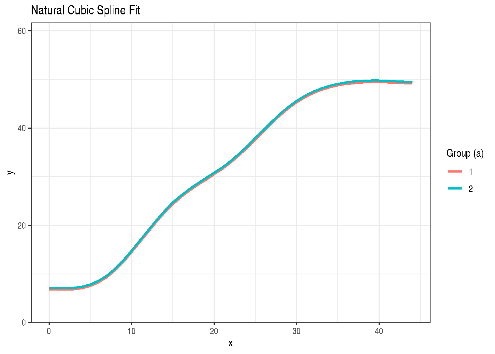
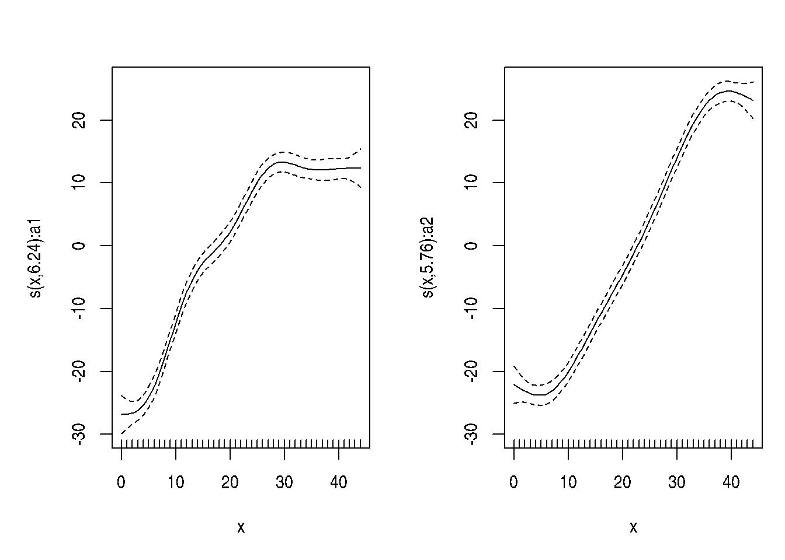

# 

# Chapter 16: Smoothing Splines and Additive Models

Nonparametric Regression and Penalized Spline Models

Muhammad Yaseen

May 17, 2026

``` r
library(modernGLMM)
library(lme4)
library(lmerTest)
library(ggplot2)
library(splines)
```

### 1 Overview

Chapter 16 uses the **mixed model representation of penalized splines**
to fit smooth curves. The key insight is that a penalized spline fit can
be expressed as a LMM:

\\\mathbf{y} = \mathbf{X}\boldsymbol{\beta} + \mathbf{Z}\mathbf{u} +
\boldsymbol{\varepsilon}\\

where: - \\\mathbf{X}\boldsymbol{\beta}\\: polynomial fixed effects
(trend) - \\\mathbf{Z}\mathbf{u}\\: spline basis random effects
(\\\mathbf{u} \sim \mathcal{N}(\mathbf{0}, \sigma^2_u\mathbf{I})\\)

The ratio \\\sigma^2_e / \sigma^2_u\\ controls the smoothing penalty.

### 2 Spline Regression Example (DataSet8.7)

DataSet8.7 contains spline regression data from Chapter 8.

``` r
data(DataSet8.7)
DataSet8.7$a <- factor(DataSet8.7$a)
str(DataSet8.7)
```

    'data.frame':   270 obs. of  3 variables:
     $ a: Factor w/ 2 levels "1","2": 1 1 1 1 1 1 1 1 1 1 ...
     $ x: int  0 0 0 1 1 1 2 2 2 3 ...
     $ y: num  3.5 3 7.3 5.2 5.2 5.5 3.1 7.1 5 6.3 ...

#### 2.1 Truncated power basis spline (mixed model)

``` r
# Create knots at quantiles of x
knots <- quantile(DataSet8.7$x, probs = seq(0.1, 0.9, by = 0.1))

# Truncated power basis
Z_spline <- outer(DataSet8.7$x, knots, FUN = \(x, k) pmax(x - k, 0)^2)
colnames(Z_spline) <- paste0("z", seq_len(ncol(Z_spline)))

spline_data <- cbind(DataSet8.7, as.data.frame(Z_spline))

# Fit via lme4 using the mixed model representation
# Fixed: intercept + linear trend; Random: spline knot effects
spline_form <- as.formula(paste(
  "y ~ x + a +",
  paste(paste0("(0 + ", colnames(Z_spline), " | a)"), collapse = " + ")
))
```

#### 2.2 Natural cubic spline via ns()

``` r
fit_ns <- stats::lm(y ~ splines::ns(x, df = 6) + a, data = DataSet8.7)
summary(fit_ns)
```

    Call:
    stats::lm(formula = y ~ splines::ns(x, df = 6) + a, data = DataSet8.7)

    Residuals:
         Min       1Q   Median       3Q      Max
    -13.2851  -4.3227  -0.0877   4.3116  13.4220

    Coefficients:
                            Estimate Std. Error t value Pr(>|t|)
    (Intercept)               6.8654     1.5869   4.326 2.16e-05 ***
    splines::ns(x, df = 6)1  19.3849     2.1199   9.144  < 2e-16 ***
    splines::ns(x, df = 6)2  24.3583     2.6106   9.330  < 2e-16 ***
    splines::ns(x, df = 6)3  39.8106     2.3702  16.796  < 2e-16 ***
    splines::ns(x, df = 6)4  43.2389     2.0713  20.875  < 2e-16 ***
    splines::ns(x, df = 6)5  41.9543     3.9787  10.545  < 2e-16 ***
    splines::ns(x, df = 6)6  42.6558     1.8203  23.434  < 2e-16 ***
    a2                        0.3163     0.7002   0.452    0.652
    ---
    Signif. codes:  0 '***' 0.001 '**' 0.01 '*' 0.05 '.' 0.1 ' ' 1

    Residual standard error: 5.753 on 262 degrees of freedom
    Multiple R-squared:  0.8865,    Adjusted R-squared:  0.8834
    F-statistic: 292.2 on 7 and 262 DF,  p-value: < 2.2e-16

``` r
pred_data <- DataSet8.7
pred_data$fitted <- stats::fitted(fit_ns)

ggplot2::ggplot(pred_data, ggplot2::aes(x = x, y = y, colour = a, group = a)) +
  ggplot2::geom_point(alpha = 0.5) +
  ggplot2::geom_line(ggplot2::aes(y = fitted), linewidth = 1) +
  ggplot2::labs(
    title  = "Natural Cubic Spline Fit",
    x      = "x",
    y      = "y",
    colour = "Group (a)"
  ) +
  ggplot2::theme_bw()
```



#### 2.3 Penalized spline via mgcv

``` r
if (requireNamespace("mgcv", quietly = TRUE)) {
  s <- mgcv::s
  fit_gam <- mgcv::gam(
    y ~ a + s(x, by = a, k = 8),
    data = DataSet8.7,
    method = "REML"
  )
  summary(fit_gam)

  if (requireNamespace("gratia", quietly = TRUE)) {
    gratia::draw(fit_gam)
  } else {
    plot(fit_gam, pages = 1, shade = TRUE)
  }
}
```



#### 2.4 Additive mixed model via gamm4

``` r
if (requireNamespace("gamm4", quietly = TRUE)) {
  s <- mgcv::s
  fit_gamm4 <- gamm4::gamm4(
    y ~ a + s(x, by = a, k = 8),
    random = ~(1 | a),
    data = DataSet8.7
  )
  summary(fit_gamm4$gam)
  lme4::VarCorr(fit_gamm4$mer)
}
```

     Groups   Name        Std.Dev.
     Xr       s(x):a1     46.00742
     Xr.0     s(x):a2     31.91498
     a        (Intercept)  0.24696
     Residual              4.13690

### 3 Key Takeaways

- Penalized splines are LMMs: fixed polynomial trend + random spline
  deviations; the smoothing parameter is \\\sigma^2_e / \sigma^2_u\\.
- [`splines::ns()`](https://rdrr.io/r/splines/ns.html) in
  [`lm()`](https://rdrr.io/r/stats/lm.html) gives a natural cubic spline
  with \\df\\ knots.
- [`mgcv::gam()`](https://rdrr.io/pkg/mgcv/man/gam.html) estimates the
  smoothing penalty by REML.
- [`gamm4::gamm4()`](https://rdrr.io/pkg/gamm4/man/gamm4.html) exposes
  the mixed-model representation when the optional package is available.

### 4 References

Stroup, W. W., Ptukhina, M., and Garai, S. (2024). *Generalized Linear
Mixed Models: Modern Concepts, Methods and Applications (2nd ed.)*. CRC
Press.

``` r
library(modernGLMM)
library(lme4)
library(lmerTest)
library(ggplot2)
library(splines)
```

### 1 Overview

Chapter 16 uses the **mixed model representation of penalized splines**
to fit smooth curves. The key insight is that a penalized spline fit can
be expressed as a LMM:

\\\mathbf{y} = \mathbf{X}\boldsymbol{\beta} + \mathbf{Z}\mathbf{u} +
\boldsymbol{\varepsilon}\\

where: - \\\mathbf{X}\boldsymbol{\beta}\\: polynomial fixed effects
(trend) - \\\mathbf{Z}\mathbf{u}\\: spline basis random effects
(\\\mathbf{u} \sim \mathcal{N}(\mathbf{0}, \sigma^2_u\mathbf{I})\\)

The ratio \\\sigma^2_e / \sigma^2_u\\ controls the smoothing penalty.

### 2 Spline Regression Example (DataSet8.7)

DataSet8.7 contains spline regression data from Chapter 8.

``` r
data(DataSet8.7)
DataSet8.7$a <- factor(DataSet8.7$a)
str(DataSet8.7)
```

    'data.frame':   270 obs. of  3 variables:
     $ a: Factor w/ 2 levels "1","2": 1 1 1 1 1 1 1 1 1 1 ...
     $ x: int  0 0 0 1 1 1 2 2 2 3 ...
     $ y: num  3.5 3 7.3 5.2 5.2 5.5 3.1 7.1 5 6.3 ...

#### 2.1 Truncated power basis spline (mixed model)

``` r
# Create knots at quantiles of x
knots <- quantile(DataSet8.7$x, probs = seq(0.1, 0.9, by = 0.1))

# Truncated power basis
Z_spline <- outer(DataSet8.7$x, knots, FUN = \(x, k) pmax(x - k, 0)^2)
colnames(Z_spline) <- paste0("z", seq_len(ncol(Z_spline)))

spline_data <- cbind(DataSet8.7, as.data.frame(Z_spline))

# Fit via lme4 using the mixed model representation
# Fixed: intercept + linear trend; Random: spline knot effects
spline_form <- as.formula(paste(
  "y ~ x + a +",
  paste(paste0("(0 + ", colnames(Z_spline), " | a)"), collapse = " + ")
))
```

#### 2.2 Natural cubic spline via ns()

``` r
fit_ns <- stats::lm(y ~ splines::ns(x, df = 6) + a, data = DataSet8.7)
summary(fit_ns)
```

    Call:
    stats::lm(formula = y ~ splines::ns(x, df = 6) + a, data = DataSet8.7)

    Residuals:
         Min       1Q   Median       3Q      Max
    -13.2851  -4.3227  -0.0877   4.3116  13.4220

    Coefficients:
                            Estimate Std. Error t value Pr(>|t|)
    (Intercept)               6.8654     1.5869   4.326 2.16e-05 ***
    splines::ns(x, df = 6)1  19.3849     2.1199   9.144  < 2e-16 ***
    splines::ns(x, df = 6)2  24.3583     2.6106   9.330  < 2e-16 ***
    splines::ns(x, df = 6)3  39.8106     2.3702  16.796  < 2e-16 ***
    splines::ns(x, df = 6)4  43.2389     2.0713  20.875  < 2e-16 ***
    splines::ns(x, df = 6)5  41.9543     3.9787  10.545  < 2e-16 ***
    splines::ns(x, df = 6)6  42.6558     1.8203  23.434  < 2e-16 ***
    a2                        0.3163     0.7002   0.452    0.652
    ---
    Signif. codes:  0 '***' 0.001 '**' 0.01 '*' 0.05 '.' 0.1 ' ' 1

    Residual standard error: 5.753 on 262 degrees of freedom
    Multiple R-squared:  0.8865,    Adjusted R-squared:  0.8834
    F-statistic: 292.2 on 7 and 262 DF,  p-value: < 2.2e-16

``` r
pred_data <- DataSet8.7
pred_data$fitted <- stats::fitted(fit_ns)

ggplot2::ggplot(pred_data, ggplot2::aes(x = x, y = y, colour = a, group = a)) +
  ggplot2::geom_point(alpha = 0.5) +
  ggplot2::geom_line(ggplot2::aes(y = fitted), linewidth = 1) +
  ggplot2::labs(
    title  = "Natural Cubic Spline Fit",
    x      = "x",
    y      = "y",
    colour = "Group (a)"
  ) +
  ggplot2::theme_bw()
```


#### 2.3 Penalized spline via mgcv

``` r
if (requireNamespace("mgcv", quietly = TRUE)) {
  s <- mgcv::s
  fit_gam <- mgcv::gam(
    y ~ a + s(x, by = a, k = 8),
    data = DataSet8.7,
    method = "REML"
  )
  summary(fit_gam)

  if (requireNamespace("gratia", quietly = TRUE)) {
    gratia::draw(fit_gam)
  } else {
    plot(fit_gam, pages = 1, shade = TRUE)
  }
}
```


#### 2.4 Additive mixed model via gamm4

``` r
if (requireNamespace("gamm4", quietly = TRUE)) {
  s <- mgcv::s
  fit_gamm4 <- gamm4::gamm4(
    y ~ a + s(x, by = a, k = 8),
    random = ~(1 | a),
    data = DataSet8.7
  )
  summary(fit_gamm4$gam)
  lme4::VarCorr(fit_gamm4$mer)
}
```

     Groups   Name        Std.Dev.
     Xr       s(x):a1     46.00742
     Xr.0     s(x):a2     31.91498
     a        (Intercept)  0.24696
     Residual              4.13690

### 3 Key Takeaways

- Penalized splines are LMMs: fixed polynomial trend + random spline
  deviations; the smoothing parameter is \\\sigma^2_e / \sigma^2_u\\.
- [`splines::ns()`](https://rdrr.io/r/splines/ns.html) in
  [`lm()`](https://rdrr.io/r/stats/lm.html) gives a natural cubic spline
  with \\df\\ knots.
- [`mgcv::gam()`](https://rdrr.io/pkg/mgcv/man/gam.html) estimates the
  smoothing penalty by REML.
- [`gamm4::gamm4()`](https://rdrr.io/pkg/gamm4/man/gamm4.html) exposes
  the mixed-model representation when the optional package is available.

### 4 References

Stroup, W. W., Ptukhina, M., and Garai, S. (2024). *Generalized Linear
Mixed Models: Modern Concepts, Methods and Applications (2nd ed.)*. CRC
Press.
