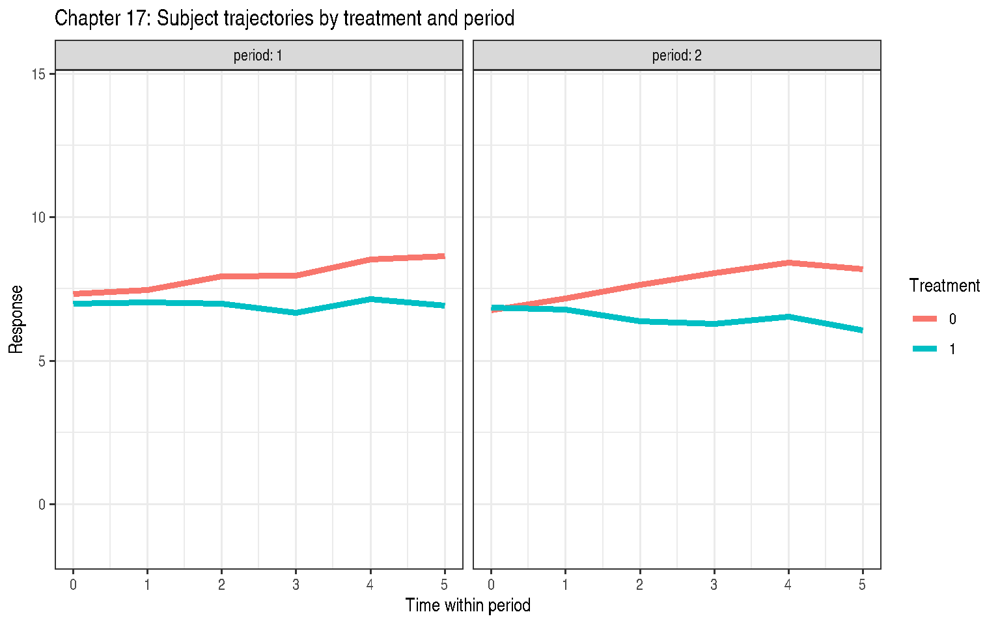
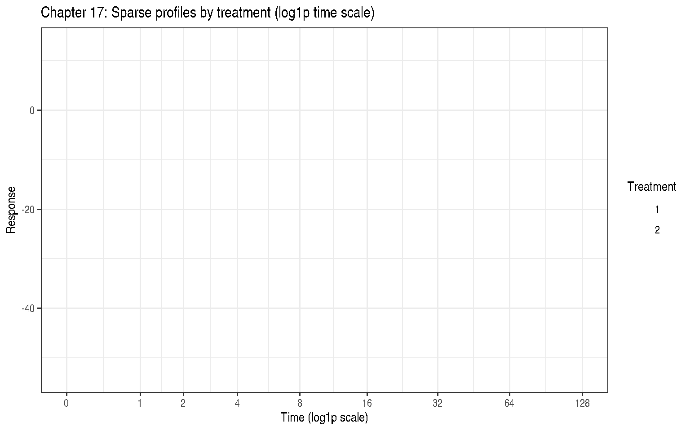

# Chapter 17: Correlated Errors, Part I: Repeated Measures

Code

``` r

library(modernGLMM)
library(nlme)
library(emmeans)
library(ggplot2)
```

## 1 Overview

Chapter 17 addresses **repeated measures designs** where the same
subject is observed multiple times. Key challenges:

- Observations on the same subject are **correlated**
- The correlation structure needs to be specified or estimated
- Standard ANOVA assuming independence is incorrect

### 1.1 Common Covariance Structures

| Name               | Symbol | Description                                     |
|--------------------|--------|-------------------------------------------------|
| Compound Symmetric | CS     | Equal correlation \\\rho\\ between all pairs    |
| AR(1)              | AR1    | Correlation \\\rho^{\\t-t'\\}\\ decays with lag |
| ARH(1)             | ARH1   | AR(1) with heterogeneous variances per time     |
| SP(POW)            | SPPOW  | Power model for unequally-spaced times          |

## 2 Example 17.1 — Crossover with ARH(1) (Section 17.3.1)

`DataSet17.1`: 41 subjects, 2-treatment crossover design, 6
equally-spaced time points per period (2 periods), plus a baseline
covariate. 492 observations total.

Code

``` r

data(DataSet17.1)
str(DataSet17.1)
```

    'data.frame':   492 obs. of  7 variables:
     $ id      : Factor w/ 41 levels "1","2","3","4",..: 1 1 1 1 1 1 1 1 1 1 ...
     $ sequence: Factor w/ 2 levels "01","10": 1 1 1 1 1 1 1 1 1 1 ...
     $ period  : Factor w/ 2 levels "1","2": 1 1 1 1 1 1 2 2 2 2 ...
     $ trt     : Factor w/ 2 levels "0","1": 1 1 1 1 1 1 2 2 2 2 ...
     $ t       : int  0 1 2 3 4 5 0 1 2 3 ...
     $ baseline: num  2.5 2.5 2.5 2.5 2.5 ...
     $ y       : num  6.83 4.74 6.1 7.01 7.26 ...

Code

``` r

cat("Subjects per sequence:\n")
```

    Subjects per sequence:

Code

``` r

print(table(unique(DataSet17.1[, c("id", "sequence")])$sequence))
```


    01 10
    17 24 

Code

``` r

ggplot(DataSet17.1,
       aes(x = t, y = y, group = id, colour = trt)) +
  geom_line(alpha = 0.4) +
  stat_summary(aes(group = trt), fun = mean, geom = "line",
               linewidth = 1.5) +
  facet_wrap(~ period, labeller = label_both) +
  labs(title = "Chapter 17: Subject trajectories by treatment and period",
       x = "Time within period", y = "Response",
       colour = "Treatment") +
  theme_bw()
```



Figure 1: Individual trajectories by treatment and period

### 2.1 Covariance model comparison: CS, AR(1), ARH(1)

Code

``` r

## CS: compound symmetry via random subject intercept
fit_cs <- nlme::lme(
  fixed   = y ~ period + trt / t + baseline,
  random  = ~ 1 | id,
  data    = DataSet17.1,
  method  = "REML"
)

## AR(1)
fit_ar1 <- nlme::lme(
  fixed       = y ~ period + trt / t + baseline,
  random      = list(id = nlme::pdDiag(~ t)),
  correlation = nlme::corAR1(form = ~ t | id / period),
  data        = DataSet17.1,
  method      = "REML"
)

## ARH(1): heterogeneous variances per time + AR(1)
fit_arh1 <- nlme::lme(
  fixed       = y ~ period + trt / t + baseline,
  random      = list(id = nlme::pdDiag(~ t)),
  correlation = nlme::corAR1(form = ~ t | id / period),
  weights     = nlme::varIdent(form = ~ 1 | t),
  data        = DataSet17.1,
  method      = "REML"
)

stats::AIC(fit_cs, fit_ar1, fit_arh1)
```

|          |  df |      AIC |
|:---------|----:|---------:|
| fit_cs   |   8 | 1788.320 |
| fit_ar1  |  10 | 1604.486 |
| fit_arh1 |  15 | 1610.620 |

### 2.2 Treatment contrasts (equal intercepts, equal slopes)

Code

``` r

emm_int <- emmeans::emmeans(fit_arh1, ~ trt, at = list(t = 0))
emmeans::contrast(emm_int, method = "pairwise")
```

     contrast    estimate    SE  df t.ratio p.value
     trt0 - trt1    0.229 0.217 447   1.051  0.2936

    Results are averaged over the levels of: period
    Degrees-of-freedom method: containment 

Code

``` r

emm_slp <- emmeans::emtrends(fit_arh1, ~ trt, var = "t")
emmeans::contrast(emm_slp, method = "pairwise")
```

     contrast    estimate     SE  df t.ratio p.value
     trt0 - trt1    0.351 0.0626 447   5.616 <0.0001

    Results are averaged over the levels of: period
    Degrees-of-freedom method: containment 

## 3 Example 17.2 — Sparse Longitudinal with SP(POW) (Section 17.3.2)

`DataSet17.2`: 41 subjects (17 on trt=1, 24 on trt=2) observed at up to
9 unequally-spaced times (0, 1, 2, 4, 8, 16, 32, 64, 128). Only 101 of
369 possible observations are present (sparse).

Code

``` r

data(DataSet17.2)
str(DataSet17.2)
```

    'data.frame':   101 obs. of  4 variables:
     $ subject: Factor w/ 41 levels "1","2","3","4",..: 1 1 2 2 2 3 3 3 3 4 ...
     $ trt    : Factor w/ 2 levels "1","2": 1 1 1 1 1 1 1 1 1 1 ...
     $ time   : num  32 128 2 4 128 0 4 8 16 0 ...
     $ y      : num  -0.123 -19.122 6.697 8.426 -36.56 ...

Code

``` r

cat("Observations per treatment:\n")
```

    Observations per treatment:

Code

``` r

print(table(DataSet17.2$trt))
```


     1  2
    48 53 

Code

``` r

cat("Unique times:", sort(unique(DataSet17.2$time)), "\n")
```

    Unique times: 0 1 2 4 8 16 32 64 128 

Code

``` r

ggplot(DataSet17.2,
       aes(x = time, y = y, group = subject, colour = trt)) +
  geom_line(alpha = 0.4) +
  scale_x_continuous(trans = "log1p",
                     breaks = c(0, 1, 2, 4, 8, 16, 32, 64, 128)) +
  labs(title = "Chapter 17: Sparse profiles by treatment (log1p time scale)",
       x = "Time (log1p scale)", y = "Response",
       colour = "Treatment") +
  theme_bw()
```



Figure 2: Sparse longitudinal profiles by treatment

### 3.1 SP(POW) model: spatial-power covariance for unequal times

Code

``` r

## SP(POW) approximated via corExp (exponential = continuous AR(1))
fit_sppow <- nlme::lme(
  fixed       = y ~ trt + time + trt:time,
  random      = ~ 1 + time | subject,
  correlation = nlme::corExp(form = ~ time | subject, nugget = FALSE),
  data        = DataSet17.2,
  method      = "REML",
  control     = nlme::lmeControl(opt = "optim", maxIter = 200)
)
summary(fit_sppow)
```

    Linear mixed-effects model fit by REML
      Data: DataSet17.2
           AIC     BIC    logLik
      526.4956 549.668 -254.2478

    Random effects:
     Formula: ~1 + time | subject
     Structure: General positive-definite, Log-Cholesky parametrization
                StdDev    Corr
    (Intercept) 2.3129212 (Intr)
    time        0.1190164 -0.467
    Residual    1.3392364

    Correlation Structure: Exponential spatial correlation
     Formula: ~time | subject
     Parameter estimate(s):
        range
    0.1284258
    Fixed effects:  y ~ trt + time + trt:time
                    Value Std.Error DF   t-value p-value
    (Intercept)  8.084794 0.6230263 58 12.976649  0.0000
    trt2        -0.072656 0.8513536 39 -0.085342  0.9324
    time        -0.331930 0.0357610 58 -9.281910  0.0000
    trt2:time    0.053389 0.0471164 58  1.133127  0.2618
     Correlation:
              (Intr) trt2   time
    trt2      -0.732
    time      -0.459  0.336
    trt2:time  0.349 -0.491 -0.759

    Standardized Within-Group Residuals:
            Min          Q1         Med          Q3         Max
    -1.86393033 -0.33928173 -0.01363081  0.35505940  2.11251302

    Number of Observations: 101
    Number of Groups: 41 

Code

``` r

emm_trt <- emmeans::emmeans(fit_sppow, ~ trt,
                              at = list(time = c(0, 1, 4, 16, 64)))
print(emm_trt)
```

     trt emmean    SE df lower.CL upper.CL
     1     2.44 0.640 40     1.15     3.74
     2     3.28 0.536 39     2.19     4.36

    Results are averaged over the levels of: time
    Degrees-of-freedom method: containment
    Confidence level used: 0.95 

## 4 Key Takeaways

- Repeated measures require a covariance model; CS is often adequate but
  ARH(1) better represents decaying and heterogeneous correlation.
- SP(POW) generalises AR(1) to unequally-spaced and incomplete time
  grids.
- Use `AIC` to select among covariance structures (fit with REML for
  final model, ML for covariance comparison if needed).
- `nlme` offers greater flexibility for covariance structures than
  `lme4`.

## 5 References

Stroup, W. W., Ptukhina, M., and Garai, S. (2024). *Generalized Linear
Mixed Models: Modern Concepts, Methods and Applications* (2nd ed.). CRC
Press.

Verbeke, G., & Molenberghs, G. (2000). *Linear Mixed Models for
Longitudinal Data*. Springer.
