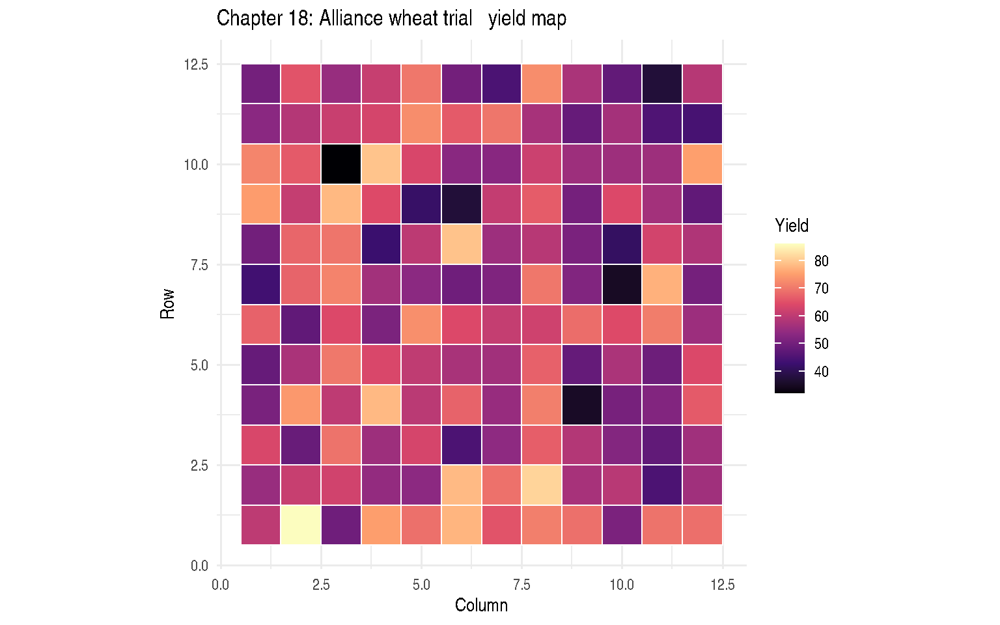
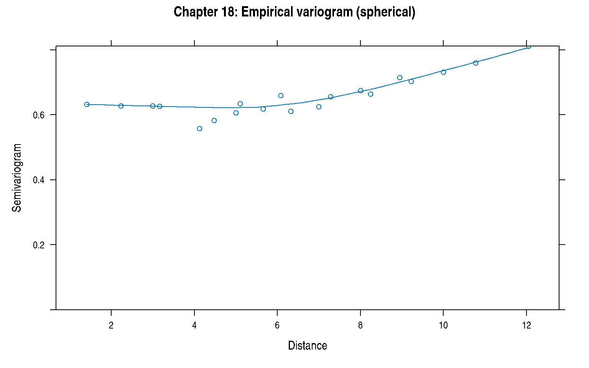
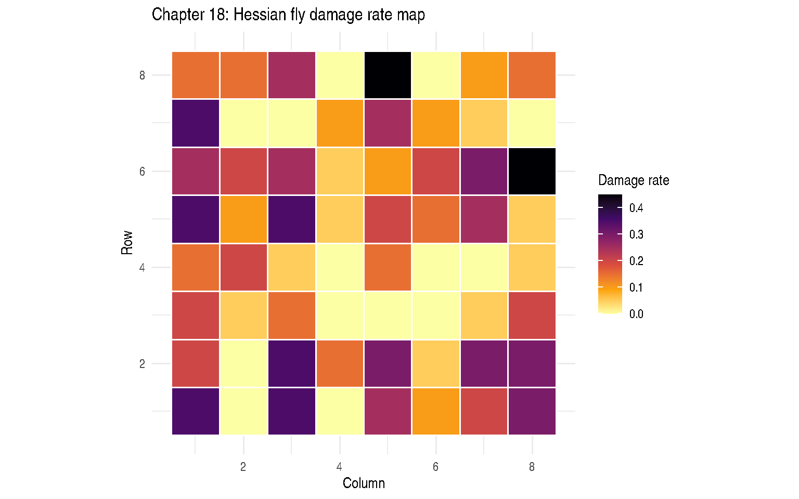

# Chapter 18: Correlated Errors, Part II: Spatial Variability

``` r
library(modernGLMM)
library(nlme)
library(lme4)
library(emmeans)
library(ggplot2)
```

## 1 Overview

Chapter 18 addresses **spatial variability** where residual errors are
correlated as a function of distance between plots on a field.

### 1.1 Spatial Covariance Functions

The spherical model (SP(SPH)): \\C(d) = \sigma^2 \left\[1 -
\frac{3d}{2r} + \frac{d^3}{2r^3}\right\] \mathbf{1}(d \le r)\\

The exponential model: \\C(d) = \sigma^2
\exp\left(-\frac{d}{\phi}\right)\\

where \\r\\ or \\\phi\\ is the range parameter and \\\sigma^2\\ is the
sill.

## 2 Example 18.1 — Alliance Wheat Trial: Gaussian Spatial (Section 18.3)

`DataSet18.1`: 12×12 field grid, 48 wheat variety treatments, 3 complete
column blocks (columns 1–4, 5–8, 9–12). 144 plots total.

``` r
data(DataSet18.1)
str(DataSet18.1)
```

    'data.frame':   144 obs. of  5 variables:
     $ row  : int  1 1 1 1 1 1 1 1 1 1 ...
     $ col  : int  1 2 3 4 5 6 7 8 9 10 ...
     $ block: Factor w/ 3 levels "1","2","3": 1 1 1 1 2 2 2 2 3 3 ...
     $ trt  : Factor w/ 48 levels "1","2","3","4",..: 2 42 24 38 6 33 40 18 4 34 ...
     $ y    : num  60.1 86.2 49.6 75.2 69.2 ...

``` r
with(DataSet18.1, table(block))
```

    block
     1  2  3
    48 48 48 

``` r
ggplot(DataSet18.1, aes(x = col, y = row, fill = y)) +
  geom_tile(colour = "white", linewidth = 0.3) +
  scale_fill_viridis_c(option = "magma") +
  labs(title = "Chapter 18: Alliance wheat trial — yield map",
       x = "Column", y = "Row", fill = "Yield") +
  coord_equal() +
  theme_minimal()
```



Figure 1: Spatial yield map (12×12 grid)

### 2.1 Baseline: complete block model (no spatial covariance)

``` r
fit_rcb <- stats::lm(y ~ trt + block, data = DataSet18.1)
cat("RCB AIC:", stats::AIC(fit_rcb), "\n")
```

    RCB AIC: 836.6678 

### 2.2 Spatial models via nlme::gls

``` r
## Spherical covariance (SP(SPH) — best model in book)
fit_sph <- nlme::gls(
  model       = y ~ trt + block,
  correlation = nlme::corSpher(form = ~ row + col, nugget = FALSE),
  data        = DataSet18.1,
  method      = "REML"
)

## Exponential covariance
fit_exp <- nlme::gls(
  model       = y ~ trt + block,
  correlation = nlme::corExp(form = ~ row + col, nugget = FALSE),
  data        = DataSet18.1,
  method      = "REML"
)

## AICC comparison (smallest = best)
stats::AIC(fit_sph, fit_exp)
```

|         |  df |      AIC |
|:--------|----:|---------:|
| fit_sph |  52 | 683.0447 |
| fit_exp |  52 | 683.0447 |

### 2.3 Spatial range and sill from best model

``` r
tryCatch(
  nlme::intervals(fit_sph, which = "var-cov"),
  error = function(e) {
    cat("Intervals not available (non-PD Hessian on reconstructed data):",
        conditionMessage(e), "\n")
    cat("Range estimate (corSpher range parameter):\n")
    print(stats::coef(fit_sph$modelStruct$corStruct, unconstrained = FALSE))
  }
)
```

    Intervals not available (non-PD Hessian on reconstructed data): cannot get confidence intervals on var-cov components: Non-positive definite approximate variance-covariance
    Range estimate (corSpher range parameter):
       range
    1.000041 

### 2.4 Empirical variogram

``` r
vario <- nlme::Variogram(fit_sph, form = ~ row + col, resType = "normalized")
plot(vario, smooth = TRUE, main = "Chapter 18: Empirical variogram (spherical)")
```



Figure 2: Empirical variogram from spherical model

## 3 Example 18.2 — Hessian Fly Trial: Binomial Spatial (Section 18.4)

`DataSet18.2`: 16 wheat varieties in a 4×4 lattice design (4 complete
blocks), 64 plots. Response is number of Hessian fly-damaged plants out
of total (`y / n`).

``` r
data(DataSet18.2)
str(DataSet18.2)
```

    'data.frame':   64 obs. of  6 variables:
     $ block  : Factor w/ 4 levels "1","2","3","4": 1 1 2 2 3 3 4 4 1 1 ...
     $ variety: Factor w/ 16 levels "1","2","3","4",..: 1 9 1 3 1 3 1 3 2 10 ...
     $ row    : int  1 1 1 1 1 1 1 1 2 2 ...
     $ col    : int  1 2 3 4 5 6 7 8 1 2 ...
     $ y      : int  7 0 7 0 5 2 4 6 4 0 ...
     $ n      : int  20 20 20 20 20 20 20 20 20 20 ...

``` r
## Observed resistance rates by variety
with(DataSet18.2, tapply(y / n, variety, mean))
```

         1      2      3      4      5      6      7      8      9     10     11
    0.2875 0.2500 0.1500 0.1000 0.3000 0.3125 0.2250 0.1375 0.0500 0.0375 0.0125
        12     13     14     15     16
    0.1875 0.1875 0.1250 0.0000 0.1000 

``` r
ggplot(DataSet18.2, aes(x = col, y = row, fill = y / n)) +
  geom_tile(colour = "white", linewidth = 0.5) +
  scale_fill_viridis_c(option = "inferno", direction = -1) +
  labs(title = "Chapter 18: Hessian fly damage rate map",
       x = "Column", y = "Row", fill = "Damage rate") +
  coord_equal() +
  theme_minimal()
```



Figure 3: Hessian fly damage map (spatial layout)

### 3.1 RCB model (baseline)

``` r
fit_rcb18 <- lme4::glmer(
  cbind(y, n - y) ~ variety + (1 | block),
  family  = stats::binomial(link = "logit"),
  data    = DataSet18.2,
  control = lme4::glmerControl(optimizer = "bobyqa")
)
summary(fit_rcb18)
```

    Generalized linear mixed model fit by maximum likelihood (Laplace
      Approximation) [glmerMod]
     Family: binomial  ( logit )
    Formula: cbind(y, n - y) ~ variety + (1 | block)
       Data: DataSet18.2
    Control: lme4::glmerControl(optimizer = "bobyqa")

          AIC       BIC    logLik -2*log(L)  df.resid
        251.0     287.7    -108.5     217.0        47

    Scaled residuals:
         Min       1Q   Median       3Q      Max
    -1.87867 -0.81856 -0.00014  0.72343  3.00768

    Random effects:
     Groups Name        Variance Std.Dev.
     block  (Intercept) 0        0
    Number of obs: 64, groups:  block, 4

    Fixed effects:
                  Estimate Std. Error z value Pr(>|z|)
    (Intercept)   -0.90756    0.24703  -3.674 0.000239 ***
    variety2      -0.19106    0.35734  -0.535 0.592881
    variety3      -0.82704    0.39882  -2.074 0.038107 *
    variety4      -1.28967    0.44711  -2.884 0.003921 **
    variety5       0.06026    0.34720   0.174 0.862212
    variety6       0.11910    0.34526   0.345 0.730126
    variety7      -0.32921    0.36429  -0.904 0.366158
    variety8      -0.92865    0.40795  -2.276 0.022823 *
    variety9      -2.03688    0.56937  -3.577 0.000347 ***
    variety10     -2.33764    0.63823  -3.663 0.000250 ***
    variety11     -3.46189    1.03619  -3.341 0.000835 ***
    variety12     -0.55878    0.37825  -1.477 0.139602
    variety13     -0.55878    0.37825  -1.477 0.139602
    variety14     -1.03835    0.41870  -2.480 0.013140 *
    variety15    -19.83000 3560.88102  -0.006 0.995557
    variety16     -1.28967    0.44711  -2.884 0.003921 **
    ---
    Signif. codes:  0 '***' 0.001 '**' 0.01 '*' 0.05 '.' 0.1 ' ' 1

    optimizer (bobyqa) convergence code: 0 (OK)
    boundary (singular) fit: see help('isSingular')

### 3.2 G-side spherical spatial GLMM via glmmTMB

``` r
if (requireNamespace("glmmTMB", quietly = TRUE)) {
  DataSet18.2$pos <- glmmTMB::numFactor(DataSet18.2$row, DataSet18.2$col)

  fit_sp18 <- glmmTMB::glmmTMB(
    cbind(y, n - y) ~ variety + (1 | block) +
      exp(pos + 0 | block),
    family = stats::binomial(link = "logit"),
    data   = DataSet18.2
  )
  summary(fit_sp18)

  emm_sp18 <- emmeans::emmeans(fit_sp18, ~ variety, type = "response")
  print(emm_sp18)
}
```

     variety   prob  SE  df asymp.LCL asymp.UCL
     1       0.2865 NaN Inf       NaN       NaN
     2       0.2489 NaN Inf       NaN       NaN
     3       0.1488 NaN Inf       NaN       NaN
     4       0.0991 NaN Inf       NaN       NaN
     5       0.2990 NaN Inf       NaN       NaN
     6       0.3115 NaN Inf       NaN       NaN
     7       0.2238 NaN Inf       NaN       NaN
     8       0.1364 NaN Inf       NaN       NaN
     9       0.0495 NaN Inf       NaN       NaN
     10      0.0371 NaN Inf       NaN       NaN
     11      0.0124 NaN Inf       NaN       NaN
     12      0.1864 NaN Inf       NaN       NaN
     13      0.1862 NaN Inf       NaN       NaN
     14      0.1239 NaN Inf       NaN       NaN
     15      0.0000 NaN Inf       NaN       NaN
     16      0.0991 NaN Inf       NaN       NaN

    Confidence level used: 0.95
    Intervals are back-transformed from the logit scale 

## 4 Key Takeaways

- Ignoring spatial correlation leads to underestimated standard errors
  and inflated Type I error for treatment comparisons.
- [`nlme::gls()`](https://rdrr.io/pkg/nlme/man/gls.html) provides
  spherical, exponential, and Gaussian spatial covariance for Gaussian
  responses; select the best model by AICC.
- For non-Gaussian spatial GLMMs (e.g., binomial), use `glmmTMB` with
  spatial random effects.
- The variogram is the primary diagnostic for spatial dependence.

## 5 References

Stroup, W. W., Ptukhina, M., and Garai, S. (2024). *Generalized Linear
Mixed Models: Modern Concepts, Methods and Applications* (2nd ed.). CRC
Press.

Pinheiro, J., & Bates, D. (2000). *Mixed-Effects Models in S and
S-PLUS*. Springer.
