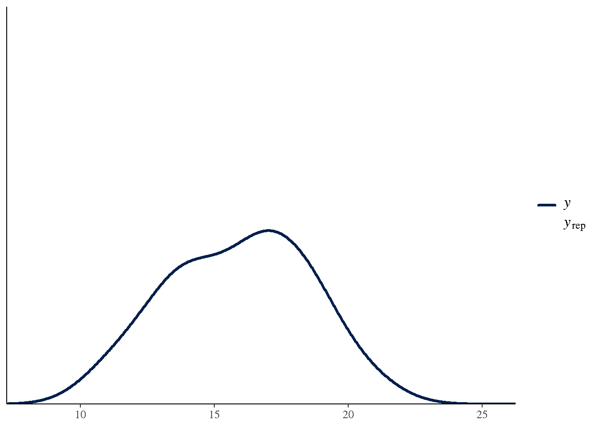
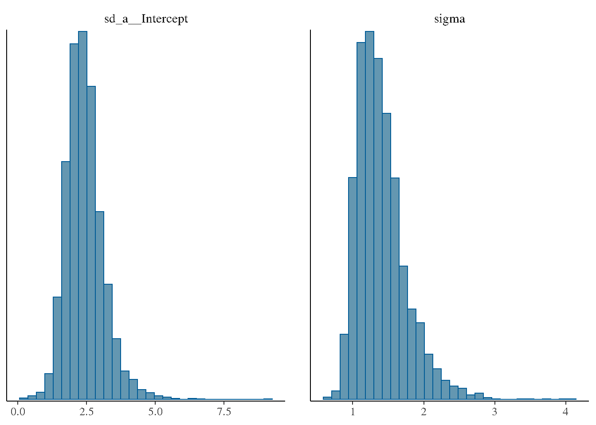

# Chapter 19: Bayesian Implementation of GLMM

Code

``` r

library(modernGLMM)
library(lme4)
library(emmeans)
```

## 1 Overview

Chapter 19 introduces the **Bayesian approach** to GLMMs. The Bayesian
framework treats all unknowns

- fixed effects \\\pmb{\beta}\\,random effects \\\mathbf{b}\\, and
  variance components \\\pmb{\theta}\\
- as random variables with prior distributions.

**Bayes’ Theorem** for mixed models:

\\p(\pmb{\beta}, \mathbf{b}, \pmb{\theta} \mid \mathbf{y}) \propto
p(\mathbf{y} \mid \pmb{\beta}, \mathbf{b}, \pmb{\theta}) \cdot
p(\pmb{\beta}) \cdot p(\mathbf{b} \mid \pmb{\theta}) \cdot
p(\pmb{\theta})\\

Key advantages over REML/ML:

- Full posterior distributions for all parameters (not just point
  estimates)
- Exact small-sample inference (no asymptotic approximations)
- Natural propagation of uncertainty to predictions
- Handles complex variance structures and non-standard models

## 2 Prior Specification

Typical weakly informative priors for GLMMs:

Code

``` r

# Using brms (requires Stan backend)
if (requireNamespace("brms", quietly = TRUE)) {
  priors <- brms::prior(normal(0, 10), class = b) +
            brms::prior(normal(0, 10), class = Intercept) +
            brms::prior(cauchy(0, 2.5), class = sd)
}
```

## 3 Bayesian One-Way Random Effects Model

Code

``` r

if (requireNamespace("brms", quietly = TRUE)) {
  data(DataSet10.1)
  DataSet10.1$a <- factor(DataSet10.1$a)

  # Frequentist reference
  fit_freq <- lme4::lmer(y ~ 1 + (1 | a), data = DataSet10.1)
  cat("REML estimates:\n")
  print(as.data.frame(lme4::VarCorr(fit_freq)))

  # Bayesian equivalent
  fit_bayes <- brms::brm(
    y ~ 1 + (1 | a),
    data   = DataSet10.1,
    prior  = brms::prior(normal(0, 10), class = Intercept) +
             brms::prior(cauchy(0, 2.5), class = sd),
    chains = 4,
    iter   = 2000,
    seed   = 42,
    silent = 2
  )
  summary(fit_bayes)
}
```

    REML estimates:
           grp        var1 var2     vcov    sdcor
    1        a (Intercept) <NA> 5.511402 2.347638
    2 Residual        <NA> <NA> 1.530833 1.237268

    SAMPLING FOR MODEL 'anon_model' NOW (CHAIN 1).
    Chain 1:
    Chain 1: Gradient evaluation took 1.3e-05 seconds
    Chain 1: 1000 transitions using 10 leapfrog steps per transition would take 0.13 seconds.
    Chain 1: Adjust your expectations accordingly!
    Chain 1:
    Chain 1:
    Chain 1: Iteration:    1 / 2000 [  0%]  (Warmup)
    Chain 1: Iteration:  200 / 2000 [ 10%]  (Warmup)
    Chain 1: Iteration:  400 / 2000 [ 20%]  (Warmup)
    Chain 1: Iteration:  600 / 2000 [ 30%]  (Warmup)
    Chain 1: Iteration:  800 / 2000 [ 40%]  (Warmup)
    Chain 1: Iteration: 1000 / 2000 [ 50%]  (Warmup)
    Chain 1: Iteration: 1001 / 2000 [ 50%]  (Sampling)
    Chain 1: Iteration: 1200 / 2000 [ 60%]  (Sampling)
    Chain 1: Iteration: 1400 / 2000 [ 70%]  (Sampling)
    Chain 1: Iteration: 1600 / 2000 [ 80%]  (Sampling)
    Chain 1: Iteration: 1800 / 2000 [ 90%]  (Sampling)
    Chain 1: Iteration: 2000 / 2000 [100%]  (Sampling)
    Chain 1:
    Chain 1:  Elapsed Time: 0.037 seconds (Warm-up)
    Chain 1:                0.038 seconds (Sampling)
    Chain 1:                0.075 seconds (Total)
    Chain 1:

    SAMPLING FOR MODEL 'anon_model' NOW (CHAIN 2).
    Chain 2:
    Chain 2: Gradient evaluation took 8e-06 seconds
    Chain 2: 1000 transitions using 10 leapfrog steps per transition would take 0.08 seconds.
    Chain 2: Adjust your expectations accordingly!
    Chain 2:
    Chain 2:
    Chain 2: Iteration:    1 / 2000 [  0%]  (Warmup)
    Chain 2: Iteration:  200 / 2000 [ 10%]  (Warmup)
    Chain 2: Iteration:  400 / 2000 [ 20%]  (Warmup)
    Chain 2: Iteration:  600 / 2000 [ 30%]  (Warmup)
    Chain 2: Iteration:  800 / 2000 [ 40%]  (Warmup)
    Chain 2: Iteration: 1000 / 2000 [ 50%]  (Warmup)
    Chain 2: Iteration: 1001 / 2000 [ 50%]  (Sampling)
    Chain 2: Iteration: 1200 / 2000 [ 60%]  (Sampling)
    Chain 2: Iteration: 1400 / 2000 [ 70%]  (Sampling)
    Chain 2: Iteration: 1600 / 2000 [ 80%]  (Sampling)
    Chain 2: Iteration: 1800 / 2000 [ 90%]  (Sampling)
    Chain 2: Iteration: 2000 / 2000 [100%]  (Sampling)
    Chain 2:
    Chain 2:  Elapsed Time: 0.039 seconds (Warm-up)
    Chain 2:                0.038 seconds (Sampling)
    Chain 2:                0.077 seconds (Total)
    Chain 2:

    SAMPLING FOR MODEL 'anon_model' NOW (CHAIN 3).
    Chain 3:
    Chain 3: Gradient evaluation took 8e-06 seconds
    Chain 3: 1000 transitions using 10 leapfrog steps per transition would take 0.08 seconds.
    Chain 3: Adjust your expectations accordingly!
    Chain 3:
    Chain 3:
    Chain 3: Iteration:    1 / 2000 [  0%]  (Warmup)
    Chain 3: Iteration:  200 / 2000 [ 10%]  (Warmup)
    Chain 3: Iteration:  400 / 2000 [ 20%]  (Warmup)
    Chain 3: Iteration:  600 / 2000 [ 30%]  (Warmup)
    Chain 3: Iteration:  800 / 2000 [ 40%]  (Warmup)
    Chain 3: Iteration: 1000 / 2000 [ 50%]  (Warmup)
    Chain 3: Iteration: 1001 / 2000 [ 50%]  (Sampling)
    Chain 3: Iteration: 1200 / 2000 [ 60%]  (Sampling)
    Chain 3: Iteration: 1400 / 2000 [ 70%]  (Sampling)
    Chain 3: Iteration: 1600 / 2000 [ 80%]  (Sampling)
    Chain 3: Iteration: 1800 / 2000 [ 90%]  (Sampling)
    Chain 3: Iteration: 2000 / 2000 [100%]  (Sampling)
    Chain 3:
    Chain 3:  Elapsed Time: 0.039 seconds (Warm-up)
    Chain 3:                0.033 seconds (Sampling)
    Chain 3:                0.072 seconds (Total)
    Chain 3:

    SAMPLING FOR MODEL 'anon_model' NOW (CHAIN 4).
    Chain 4:
    Chain 4: Gradient evaluation took 9e-06 seconds
    Chain 4: 1000 transitions using 10 leapfrog steps per transition would take 0.09 seconds.
    Chain 4: Adjust your expectations accordingly!
    Chain 4:
    Chain 4:
    Chain 4: Iteration:    1 / 2000 [  0%]  (Warmup)
    Chain 4: Iteration:  200 / 2000 [ 10%]  (Warmup)
    Chain 4: Iteration:  400 / 2000 [ 20%]  (Warmup)
    Chain 4: Iteration:  600 / 2000 [ 30%]  (Warmup)
    Chain 4: Iteration:  800 / 2000 [ 40%]  (Warmup)
    Chain 4: Iteration: 1000 / 2000 [ 50%]  (Warmup)
    Chain 4: Iteration: 1001 / 2000 [ 50%]  (Sampling)
    Chain 4: Iteration: 1200 / 2000 [ 60%]  (Sampling)
    Chain 4: Iteration: 1400 / 2000 [ 70%]  (Sampling)
    Chain 4: Iteration: 1600 / 2000 [ 80%]  (Sampling)
    Chain 4: Iteration: 1800 / 2000 [ 90%]  (Sampling)
    Chain 4: Iteration: 2000 / 2000 [100%]  (Sampling)
    Chain 4:
    Chain 4:  Elapsed Time: 0.04 seconds (Warm-up)
    Chain 4:                0.042 seconds (Sampling)
    Chain 4:                0.082 seconds (Total)
    Chain 4: 

     Family: gaussian
      Links: mu = identity
    Formula: y ~ 1 + (1 | a)
       Data: DataSet10.1 (Number of observations: 24)
      Draws: 4 chains, each with iter = 2000; warmup = 1000; thin = 1;
             total post-warmup draws = 4000

    Multilevel Hyperparameters:
    ~a (Number of levels: 12)
                  Estimate Est.Error l-95% CI u-95% CI Rhat Bulk_ESS Tail_ESS
    sd(Intercept)     2.43      0.68     1.34     3.99 1.00      903     1190

    Regression Coefficients:
              Estimate Est.Error l-95% CI u-95% CI Rhat Bulk_ESS Tail_ESS
    Intercept    15.78      0.79    14.23    17.35 1.00      922     1169

    Further Distributional Parameters:
          Estimate Est.Error l-95% CI u-95% CI Rhat Bulk_ESS Tail_ESS
    sigma     1.40      0.35     0.92     2.26 1.00      968     1233

    Draws were sampled using sampling(NUTS). For each parameter, Bulk_ESS
    and Tail_ESS are effective sample size measures, and Rhat is the potential
    scale reduction factor on split chains (at convergence, Rhat = 1).

## 4 Posterior Predictive Check

Code

``` r

if (requireNamespace("brms", quietly = TRUE)) {
  brms::pp_check(fit_bayes, ndraws = 50)
}
```



## 5 Posterior for Variance Components

Code

``` r

if (requireNamespace("brms", quietly = TRUE)) {
  brms::mcmc_plot(fit_bayes, variable = c("sd_a__Intercept", "sigma"),
                  type = "hist")
}
```



## 6 Key Takeaways

- [`brms::brm()`](https://paulbuerkner.com/brms/reference/brm.html) fits
  Bayesian GLMMs with the same formula syntax as `lme4`.
- Posterior distributions replace point estimates + standard errors.
- [`brms::pp_check()`](https://mc-stan.org/bayesplot/reference/pp_check.html)
  provides graphical posterior predictive checks.
- Weakly informative priors (`normal(0, 10)`, `cauchy(0, 2.5)`)
  stabilise estimation without strongly influencing the posterior when
  data are informative.

## 7 References

Stroup, W. W., Ptukhina, M., and Garai, S. (2024). *Generalized Linear
Mixed Models: Modern Concepts, Methods and Applications (2nd ed.)*. CRC
Press.
