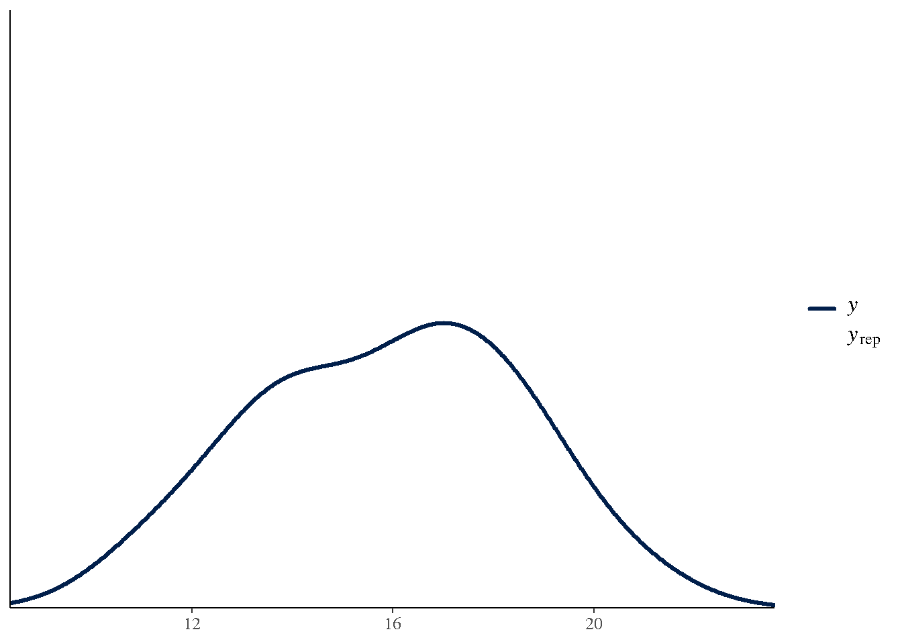

# 

# Chapter 20: Five Bayesian GLMM Examples

Five Applied Bayesian GLMM Analyses

Muhammad Yaseen

May 16, 2026

``` r

library(modernGLMM)
library(lme4)
library(emmeans)
library(ggplot2)
```

### 1 Overview

Chapter 20 presents five applied Bayesian GLMM analyses that parallel
the frequentist examples from earlier chapters. The analyses
demonstrate:

1.  **Gaussian LMM** (BLUP, Chapter 10) — Bayesian one-way random
    effects
2.  **Poisson GLMM** (Count data, Chapter 11) — Bayesian insect count
    model
3.  **Binomial GLMM** — Bayesian proportion analysis
4.  **Ordinal GLMM** (Multinomial, Chapter 14) — Bayesian cumulative
    link model
5.  **Repeated measures LMM** (Chapter 17) — Bayesian CS covariance
    structure

All examples use `brms` with weakly informative priors.

### 2 Example 20.1 — Bayesian One-Way Random Effects (Gaussian)

``` r

if (requireNamespace("brms", quietly = TRUE)) {
  data(DataSet10.1)
  DataSet10.1$a <- factor(DataSet10.1$a)

  fit20.1 <- brms::brm(
    y ~ 1 + (1 | a),
    data   = DataSet10.1,
    prior  = brms::prior(normal(0, 10), class = Intercept) +
             brms::prior(cauchy(0, 2.5), class = sd) +
             brms::prior(exponential(1), class = sigma),
    chains = 4, iter = 2000, seed = 20,
    silent = 2
  )
  print(summary(fit20.1))
  brms::pp_check(fit20.1, ndraws = 100)
}
```


    SAMPLING FOR MODEL 'anon_model' NOW (CHAIN 1).
    Chain 1:
    Chain 1: Gradient evaluation took 2.7e-05 seconds
    Chain 1: 1000 transitions using 10 leapfrog steps per transition would take 0.27 seconds.
    Chain 1: Adjust your expectations accordingly!
    Chain 1:
    Chain 1:
    Chain 1: Iteration:    1 / 2000 [  0%]  (Warmup)
    Chain 1: Iteration:  200 / 2000 [ 10%]  (Warmup)
    Chain 1: Iteration:  400 / 2000 [ 20%]  (Warmup)
    Chain 1: Iteration:  600 / 2000 [ 30%]  (Warmup)
    Chain 1: Iteration:  800 / 2000 [ 40%]  (Warmup)
    Chain 1: Iteration: 1000 / 2000 [ 50%]  (Warmup)
    Chain 1: Iteration: 1001 / 2000 [ 50%]  (Sampling)
    Chain 1: Iteration: 1200 / 2000 [ 60%]  (Sampling)
    Chain 1: Iteration: 1400 / 2000 [ 70%]  (Sampling)
    Chain 1: Iteration: 1600 / 2000 [ 80%]  (Sampling)
    Chain 1: Iteration: 1800 / 2000 [ 90%]  (Sampling)
    Chain 1: Iteration: 2000 / 2000 [100%]  (Sampling)
    Chain 1:
    Chain 1:  Elapsed Time: 0.059 seconds (Warm-up)
    Chain 1:                0.053 seconds (Sampling)
    Chain 1:                0.112 seconds (Total)
    Chain 1:

    SAMPLING FOR MODEL 'anon_model' NOW (CHAIN 2).
    Chain 2:
    Chain 2: Gradient evaluation took 1.3e-05 seconds
    Chain 2: 1000 transitions using 10 leapfrog steps per transition would take 0.13 seconds.
    Chain 2: Adjust your expectations accordingly!
    Chain 2:
    Chain 2:
    Chain 2: Iteration:    1 / 2000 [  0%]  (Warmup)
    Chain 2: Iteration:  200 / 2000 [ 10%]  (Warmup)
    Chain 2: Iteration:  400 / 2000 [ 20%]  (Warmup)
    Chain 2: Iteration:  600 / 2000 [ 30%]  (Warmup)
    Chain 2: Iteration:  800 / 2000 [ 40%]  (Warmup)
    Chain 2: Iteration: 1000 / 2000 [ 50%]  (Warmup)
    Chain 2: Iteration: 1001 / 2000 [ 50%]  (Sampling)
    Chain 2: Iteration: 1200 / 2000 [ 60%]  (Sampling)
    Chain 2: Iteration: 1400 / 2000 [ 70%]  (Sampling)
    Chain 2: Iteration: 1600 / 2000 [ 80%]  (Sampling)
    Chain 2: Iteration: 1800 / 2000 [ 90%]  (Sampling)
    Chain 2: Iteration: 2000 / 2000 [100%]  (Sampling)
    Chain 2:
    Chain 2:  Elapsed Time: 0.057 seconds (Warm-up)
    Chain 2:                0.049 seconds (Sampling)
    Chain 2:                0.106 seconds (Total)
    Chain 2:

    SAMPLING FOR MODEL 'anon_model' NOW (CHAIN 3).
    Chain 3:
    Chain 3: Gradient evaluation took 1e-05 seconds
    Chain 3: 1000 transitions using 10 leapfrog steps per transition would take 0.1 seconds.
    Chain 3: Adjust your expectations accordingly!
    Chain 3:
    Chain 3:
    Chain 3: Iteration:    1 / 2000 [  0%]  (Warmup)
    Chain 3: Iteration:  200 / 2000 [ 10%]  (Warmup)
    Chain 3: Iteration:  400 / 2000 [ 20%]  (Warmup)
    Chain 3: Iteration:  600 / 2000 [ 30%]  (Warmup)
    Chain 3: Iteration:  800 / 2000 [ 40%]  (Warmup)
    Chain 3: Iteration: 1000 / 2000 [ 50%]  (Warmup)
    Chain 3: Iteration: 1001 / 2000 [ 50%]  (Sampling)
    Chain 3: Iteration: 1200 / 2000 [ 60%]  (Sampling)
    Chain 3: Iteration: 1400 / 2000 [ 70%]  (Sampling)
    Chain 3: Iteration: 1600 / 2000 [ 80%]  (Sampling)
    Chain 3: Iteration: 1800 / 2000 [ 90%]  (Sampling)
    Chain 3: Iteration: 2000 / 2000 [100%]  (Sampling)
    Chain 3:
    Chain 3:  Elapsed Time: 0.096 seconds (Warm-up)
    Chain 3:                0.11 seconds (Sampling)
    Chain 3:                0.206 seconds (Total)
    Chain 3:

    SAMPLING FOR MODEL 'anon_model' NOW (CHAIN 4).
    Chain 4:
    Chain 4: Gradient evaluation took 1.7e-05 seconds
    Chain 4: 1000 transitions using 10 leapfrog steps per transition would take 0.17 seconds.
    Chain 4: Adjust your expectations accordingly!
    Chain 4:
    Chain 4:
    Chain 4: Iteration:    1 / 2000 [  0%]  (Warmup)
    Chain 4: Iteration:  200 / 2000 [ 10%]  (Warmup)
    Chain 4: Iteration:  400 / 2000 [ 20%]  (Warmup)
    Chain 4: Iteration:  600 / 2000 [ 30%]  (Warmup)
    Chain 4: Iteration:  800 / 2000 [ 40%]  (Warmup)
    Chain 4: Iteration: 1000 / 2000 [ 50%]  (Warmup)
    Chain 4: Iteration: 1001 / 2000 [ 50%]  (Sampling)
    Chain 4: Iteration: 1200 / 2000 [ 60%]  (Sampling)
    Chain 4: Iteration: 1400 / 2000 [ 70%]  (Sampling)
    Chain 4: Iteration: 1600 / 2000 [ 80%]  (Sampling)
    Chain 4: Iteration: 1800 / 2000 [ 90%]  (Sampling)
    Chain 4: Iteration: 2000 / 2000 [100%]  (Sampling)
    Chain 4:
    Chain 4:  Elapsed Time: 0.121 seconds (Warm-up)
    Chain 4:                0.09 seconds (Sampling)
    Chain 4:                0.211 seconds (Total)
    Chain 4:
     Family: gaussian
      Links: mu = identity
    Formula: y ~ 1 + (1 | a)
       Data: DataSet10.1 (Number of observations: 24)
      Draws: 4 chains, each with iter = 2000; warmup = 1000; thin = 1;
             total post-warmup draws = 4000

    Multilevel Hyperparameters:
    ~a (Number of levels: 12)
                  Estimate Est.Error l-95% CI u-95% CI Rhat Bulk_ESS Tail_ESS
    sd(Intercept)     2.45      0.66     1.42     4.07 1.01      844     1336

    Regression Coefficients:
              Estimate Est.Error l-95% CI u-95% CI Rhat Bulk_ESS Tail_ESS
    Intercept    15.88      0.77    14.37    17.46 1.00      970     1101

    Further Distributional Parameters:
          Estimate Est.Error l-95% CI u-95% CI Rhat Bulk_ESS Tail_ESS
    sigma     1.32      0.28     0.89     2.02 1.00     1525     2224

    Draws were sampled using sampling(NUTS). For each parameter, Bulk_ESS
    and Tail_ESS are effective sample size measures, and Rhat is the potential
    scale reduction factor on split chains (at convergence, Rhat = 1).



### 3 Example 20.2 — Bayesian Poisson GLMM (Count Data)

``` r

if (requireNamespace("brms", quietly = TRUE)) {
  # Simulated count data
  set.seed(20)
  count_ex <- data.frame(
    trt   = factor(rep(c("A","B","C"), each = 12)),
    block = factor(rep(1:4, 9)),
    count = c(rpois(12, 5), rpois(12, 10), rpois(12, 15))
  )

  fit20.2 <- brms::brm(
    count ~ trt + (1 | block),
    data   = count_ex,
    family = poisson(),
    prior  = brms::prior(normal(0, 2), class = b) +
             brms::prior(normal(2, 1), class = Intercept) +
             brms::prior(cauchy(0, 1), class = sd),
    chains = 4, iter = 2000, seed = 20,
    silent = 2
  )
  print(emmeans::emmeans(fit20.2, ~ trt, type = "response"))
}
```


    SAMPLING FOR MODEL 'anon_model' NOW (CHAIN 1).
    Chain 1:
    Chain 1: Gradient evaluation took 2.4e-05 seconds
    Chain 1: 1000 transitions using 10 leapfrog steps per transition would take 0.24 seconds.
    Chain 1: Adjust your expectations accordingly!
    Chain 1:
    Chain 1:
    Chain 1: Iteration:    1 / 2000 [  0%]  (Warmup)
    Chain 1: Iteration:  200 / 2000 [ 10%]  (Warmup)
    Chain 1: Iteration:  400 / 2000 [ 20%]  (Warmup)
    Chain 1: Iteration:  600 / 2000 [ 30%]  (Warmup)
    Chain 1: Iteration:  800 / 2000 [ 40%]  (Warmup)
    Chain 1: Iteration: 1000 / 2000 [ 50%]  (Warmup)
    Chain 1: Iteration: 1001 / 2000 [ 50%]  (Sampling)
    Chain 1: Iteration: 1200 / 2000 [ 60%]  (Sampling)
    Chain 1: Iteration: 1400 / 2000 [ 70%]  (Sampling)
    Chain 1: Iteration: 1600 / 2000 [ 80%]  (Sampling)
    Chain 1: Iteration: 1800 / 2000 [ 90%]  (Sampling)
    Chain 1: Iteration: 2000 / 2000 [100%]  (Sampling)
    Chain 1:
    Chain 1:  Elapsed Time: 0.101 seconds (Warm-up)
    Chain 1:                0.053 seconds (Sampling)
    Chain 1:                0.154 seconds (Total)
    Chain 1:

    SAMPLING FOR MODEL 'anon_model' NOW (CHAIN 2).
    Chain 2:
    Chain 2: Gradient evaluation took 1.1e-05 seconds
    Chain 2: 1000 transitions using 10 leapfrog steps per transition would take 0.11 seconds.
    Chain 2: Adjust your expectations accordingly!
    Chain 2:
    Chain 2:
    Chain 2: Iteration:    1 / 2000 [  0%]  (Warmup)
    Chain 2: Iteration:  200 / 2000 [ 10%]  (Warmup)
    Chain 2: Iteration:  400 / 2000 [ 20%]  (Warmup)
    Chain 2: Iteration:  600 / 2000 [ 30%]  (Warmup)
    Chain 2: Iteration:  800 / 2000 [ 40%]  (Warmup)
    Chain 2: Iteration: 1000 / 2000 [ 50%]  (Warmup)
    Chain 2: Iteration: 1001 / 2000 [ 50%]  (Sampling)
    Chain 2: Iteration: 1200 / 2000 [ 60%]  (Sampling)
    Chain 2: Iteration: 1400 / 2000 [ 70%]  (Sampling)
    Chain 2: Iteration: 1600 / 2000 [ 80%]  (Sampling)
    Chain 2: Iteration: 1800 / 2000 [ 90%]  (Sampling)
    Chain 2: Iteration: 2000 / 2000 [100%]  (Sampling)
    Chain 2:
    Chain 2:  Elapsed Time: 0.084 seconds (Warm-up)
    Chain 2:                0.052 seconds (Sampling)
    Chain 2:                0.136 seconds (Total)
    Chain 2:

    SAMPLING FOR MODEL 'anon_model' NOW (CHAIN 3).
    Chain 3:
    Chain 3: Gradient evaluation took 1.3e-05 seconds
    Chain 3: 1000 transitions using 10 leapfrog steps per transition would take 0.13 seconds.
    Chain 3: Adjust your expectations accordingly!
    Chain 3:
    Chain 3:
    Chain 3: Iteration:    1 / 2000 [  0%]  (Warmup)
    Chain 3: Iteration:  200 / 2000 [ 10%]  (Warmup)
    Chain 3: Iteration:  400 / 2000 [ 20%]  (Warmup)
    Chain 3: Iteration:  600 / 2000 [ 30%]  (Warmup)
    Chain 3: Iteration:  800 / 2000 [ 40%]  (Warmup)
    Chain 3: Iteration: 1000 / 2000 [ 50%]  (Warmup)
    Chain 3: Iteration: 1001 / 2000 [ 50%]  (Sampling)
    Chain 3: Iteration: 1200 / 2000 [ 60%]  (Sampling)
    Chain 3: Iteration: 1400 / 2000 [ 70%]  (Sampling)
    Chain 3: Iteration: 1600 / 2000 [ 80%]  (Sampling)
    Chain 3: Iteration: 1800 / 2000 [ 90%]  (Sampling)
    Chain 3: Iteration: 2000 / 2000 [100%]  (Sampling)
    Chain 3:
    Chain 3:  Elapsed Time: 0.09 seconds (Warm-up)
    Chain 3:                0.059 seconds (Sampling)
    Chain 3:                0.149 seconds (Total)
    Chain 3:

    SAMPLING FOR MODEL 'anon_model' NOW (CHAIN 4).
    Chain 4:
    Chain 4: Gradient evaluation took 6.2e-05 seconds
    Chain 4: 1000 transitions using 10 leapfrog steps per transition would take 0.62 seconds.
    Chain 4: Adjust your expectations accordingly!
    Chain 4:
    Chain 4:
    Chain 4: Iteration:    1 / 2000 [  0%]  (Warmup)
    Chain 4: Iteration:  200 / 2000 [ 10%]  (Warmup)
    Chain 4: Iteration:  400 / 2000 [ 20%]  (Warmup)
    Chain 4: Iteration:  600 / 2000 [ 30%]  (Warmup)
    Chain 4: Iteration:  800 / 2000 [ 40%]  (Warmup)
    Chain 4: Iteration: 1000 / 2000 [ 50%]  (Warmup)
    Chain 4: Iteration: 1001 / 2000 [ 50%]  (Sampling)
    Chain 4: Iteration: 1200 / 2000 [ 60%]  (Sampling)
    Chain 4: Iteration: 1400 / 2000 [ 70%]  (Sampling)
    Chain 4: Iteration: 1600 / 2000 [ 80%]  (Sampling)
    Chain 4: Iteration: 1800 / 2000 [ 90%]  (Sampling)
    Chain 4: Iteration: 2000 / 2000 [100%]  (Sampling)
    Chain 4:
    Chain 4:  Elapsed Time: 0.106 seconds (Warm-up)
    Chain 4:                0.096 seconds (Sampling)
    Chain 4:                0.202 seconds (Total)
    Chain 4: 

     trt  rate lower.HPD upper.HPD
     A    6.05      4.03      9.36
     B   10.94      8.12     18.73
     C   16.31     12.78     26.80

    Point estimate displayed: median
    Results are back-transformed from the log scale
    HPD interval probability: 0.95 

### 4 Example 20.3 — Bayesian Binomial GLMM (Proportions)

``` r

if (requireNamespace("brms", quietly = TRUE)) {
  data(DataSet12.2)
  DataSet12.2$a     <- factor(DataSet12.2$a)
  DataSet12.2$b     <- factor(DataSet12.2$b)
  DataSet12.2$block <- factor(DataSet12.2$block)

  fit20.3 <- brms::brm(
    f | trials(n) ~ a * b + (1 | block),
    data   = DataSet12.2,
    family = binomial(),
    prior  = brms::prior(normal(0, 5), class = b) +
             brms::prior(cauchy(0, 2), class = sd),
    chains = 4, iter = 2000, seed = 20,
    silent = 2
  )
  summary(fit20.3)
}
```


    SAMPLING FOR MODEL 'anon_model' NOW (CHAIN 1).
    Chain 1:
    Chain 1: Gradient evaluation took 3.1e-05 seconds
    Chain 1: 1000 transitions using 10 leapfrog steps per transition would take 0.31 seconds.
    Chain 1: Adjust your expectations accordingly!
    Chain 1:
    Chain 1:
    Chain 1: Iteration:    1 / 2000 [  0%]  (Warmup)
    Chain 1: Iteration:  200 / 2000 [ 10%]  (Warmup)
    Chain 1: Iteration:  400 / 2000 [ 20%]  (Warmup)
    Chain 1: Iteration:  600 / 2000 [ 30%]  (Warmup)
    Chain 1: Iteration:  800 / 2000 [ 40%]  (Warmup)
    Chain 1: Iteration: 1000 / 2000 [ 50%]  (Warmup)
    Chain 1: Iteration: 1001 / 2000 [ 50%]  (Sampling)
    Chain 1: Iteration: 1200 / 2000 [ 60%]  (Sampling)
    Chain 1: Iteration: 1400 / 2000 [ 70%]  (Sampling)
    Chain 1: Iteration: 1600 / 2000 [ 80%]  (Sampling)
    Chain 1: Iteration: 1800 / 2000 [ 90%]  (Sampling)
    Chain 1: Iteration: 2000 / 2000 [100%]  (Sampling)
    Chain 1:
    Chain 1:  Elapsed Time: 0.172 seconds (Warm-up)
    Chain 1:                0.17 seconds (Sampling)
    Chain 1:                0.342 seconds (Total)
    Chain 1:

    SAMPLING FOR MODEL 'anon_model' NOW (CHAIN 2).
    Chain 2:
    Chain 2: Gradient evaluation took 1.6e-05 seconds
    Chain 2: 1000 transitions using 10 leapfrog steps per transition would take 0.16 seconds.
    Chain 2: Adjust your expectations accordingly!
    Chain 2:
    Chain 2:
    Chain 2: Iteration:    1 / 2000 [  0%]  (Warmup)
    Chain 2: Iteration:  200 / 2000 [ 10%]  (Warmup)
    Chain 2: Iteration:  400 / 2000 [ 20%]  (Warmup)
    Chain 2: Iteration:  600 / 2000 [ 30%]  (Warmup)
    Chain 2: Iteration:  800 / 2000 [ 40%]  (Warmup)
    Chain 2: Iteration: 1000 / 2000 [ 50%]  (Warmup)
    Chain 2: Iteration: 1001 / 2000 [ 50%]  (Sampling)
    Chain 2: Iteration: 1200 / 2000 [ 60%]  (Sampling)
    Chain 2: Iteration: 1400 / 2000 [ 70%]  (Sampling)
    Chain 2: Iteration: 1600 / 2000 [ 80%]  (Sampling)
    Chain 2: Iteration: 1800 / 2000 [ 90%]  (Sampling)
    Chain 2: Iteration: 2000 / 2000 [100%]  (Sampling)
    Chain 2:
    Chain 2:  Elapsed Time: 0.184 seconds (Warm-up)
    Chain 2:                0.158 seconds (Sampling)
    Chain 2:                0.342 seconds (Total)
    Chain 2:

    SAMPLING FOR MODEL 'anon_model' NOW (CHAIN 3).
    Chain 3:
    Chain 3: Gradient evaluation took 1.9e-05 seconds
    Chain 3: 1000 transitions using 10 leapfrog steps per transition would take 0.19 seconds.
    Chain 3: Adjust your expectations accordingly!
    Chain 3:
    Chain 3:
    Chain 3: Iteration:    1 / 2000 [  0%]  (Warmup)
    Chain 3: Iteration:  200 / 2000 [ 10%]  (Warmup)
    Chain 3: Iteration:  400 / 2000 [ 20%]  (Warmup)
    Chain 3: Iteration:  600 / 2000 [ 30%]  (Warmup)
    Chain 3: Iteration:  800 / 2000 [ 40%]  (Warmup)
    Chain 3: Iteration: 1000 / 2000 [ 50%]  (Warmup)
    Chain 3: Iteration: 1001 / 2000 [ 50%]  (Sampling)
    Chain 3: Iteration: 1200 / 2000 [ 60%]  (Sampling)
    Chain 3: Iteration: 1400 / 2000 [ 70%]  (Sampling)
    Chain 3: Iteration: 1600 / 2000 [ 80%]  (Sampling)
    Chain 3: Iteration: 1800 / 2000 [ 90%]  (Sampling)
    Chain 3: Iteration: 2000 / 2000 [100%]  (Sampling)
    Chain 3:
    Chain 3:  Elapsed Time: 0.163 seconds (Warm-up)
    Chain 3:                0.15 seconds (Sampling)
    Chain 3:                0.313 seconds (Total)
    Chain 3:

    SAMPLING FOR MODEL 'anon_model' NOW (CHAIN 4).
    Chain 4:
    Chain 4: Gradient evaluation took 1.5e-05 seconds
    Chain 4: 1000 transitions using 10 leapfrog steps per transition would take 0.15 seconds.
    Chain 4: Adjust your expectations accordingly!
    Chain 4:
    Chain 4:
    Chain 4: Iteration:    1 / 2000 [  0%]  (Warmup)
    Chain 4: Iteration:  200 / 2000 [ 10%]  (Warmup)
    Chain 4: Iteration:  400 / 2000 [ 20%]  (Warmup)
    Chain 4: Iteration:  600 / 2000 [ 30%]  (Warmup)
    Chain 4: Iteration:  800 / 2000 [ 40%]  (Warmup)
    Chain 4: Iteration: 1000 / 2000 [ 50%]  (Warmup)
    Chain 4: Iteration: 1001 / 2000 [ 50%]  (Sampling)
    Chain 4: Iteration: 1200 / 2000 [ 60%]  (Sampling)
    Chain 4: Iteration: 1400 / 2000 [ 70%]  (Sampling)
    Chain 4: Iteration: 1600 / 2000 [ 80%]  (Sampling)
    Chain 4: Iteration: 1800 / 2000 [ 90%]  (Sampling)
    Chain 4: Iteration: 2000 / 2000 [100%]  (Sampling)
    Chain 4:
    Chain 4:  Elapsed Time: 0.173 seconds (Warm-up)
    Chain 4:                0.165 seconds (Sampling)
    Chain 4:                0.338 seconds (Total)
    Chain 4: 

     Family: binomial
      Links: mu = logit
    Formula: f | trials(n) ~ a * b + (1 | block)
       Data: DataSet12.2 (Number of observations: 30)
      Draws: 4 chains, each with iter = 2000; warmup = 1000; thin = 1;
             total post-warmup draws = 4000

    Multilevel Hyperparameters:
    ~block (Number of levels: 10)
                  Estimate Est.Error l-95% CI u-95% CI Rhat Bulk_ESS Tail_ESS
    sd(Intercept)     0.83      0.27     0.44     1.48 1.00     1116     1616

    Regression Coefficients:
              Estimate Est.Error l-95% CI u-95% CI Rhat Bulk_ESS Tail_ESS
    Intercept     0.08      0.44    -0.82     0.96 1.00     1440     1792
    asetB        -1.12      0.65    -2.41     0.15 1.00     1361     1620
    bB1           0.29      0.29    -0.29     0.86 1.00     2759     2718
    bB2          -0.08      0.29    -0.65     0.48 1.00     2551     2874
    asetB:bB1    -0.03      0.44    -0.87     0.86 1.00     2482     2733
    asetB:bB2     1.07      0.43     0.24     1.94 1.00     2352     2971

    Draws were sampled using sampling(NUTS). For each parameter, Bulk_ESS
    and Tail_ESS are effective sample size measures, and Rhat is the potential
    scale reduction factor on split chains (at convergence, Rhat = 1).

### 5 Example 20.4 — Bayesian Ordinal GLMM

``` r

if (requireNamespace("brms", quietly = TRUE)) {
  data(DataSet14.1)
  DataSet14.1$trt    <- factor(DataSet14.1$trt)
  DataSet14.1$blk    <- factor(DataSet14.1$blk)
  DataSet14.1$rating <- ordered(DataSet14.1$rating,
                                levels = c("slight", "modrat", "severe"))

  fit20.4 <- brms::brm(
    rating ~ trt + (1 | blk),
    data   = DataSet14.1,
    family = brms::cumulative("probit"),
    prior  = brms::prior(normal(0, 5), class = b) +
             brms::prior(cauchy(0, 2), class = sd),
    chains = 4, iter = 2000, seed = 20,
    silent = 2
  )
  summary(fit20.4)
}
```


    SAMPLING FOR MODEL 'anon_model' NOW (CHAIN 1).
    Chain 1:
    Chain 1: Gradient evaluation took 0.000163 seconds
    Chain 1: 1000 transitions using 10 leapfrog steps per transition would take 1.63 seconds.
    Chain 1: Adjust your expectations accordingly!
    Chain 1:
    Chain 1:
    Chain 1: Iteration:    1 / 2000 [  0%]  (Warmup)
    Chain 1: Iteration:  200 / 2000 [ 10%]  (Warmup)
    Chain 1: Iteration:  400 / 2000 [ 20%]  (Warmup)
    Chain 1: Iteration:  600 / 2000 [ 30%]  (Warmup)
    Chain 1: Iteration:  800 / 2000 [ 40%]  (Warmup)
    Chain 1: Iteration: 1000 / 2000 [ 50%]  (Warmup)
    Chain 1: Iteration: 1001 / 2000 [ 50%]  (Sampling)
    Chain 1: Iteration: 1200 / 2000 [ 60%]  (Sampling)
    Chain 1: Iteration: 1400 / 2000 [ 70%]  (Sampling)
    Chain 1: Iteration: 1600 / 2000 [ 80%]  (Sampling)
    Chain 1: Iteration: 1800 / 2000 [ 90%]  (Sampling)
    Chain 1: Iteration: 2000 / 2000 [100%]  (Sampling)
    Chain 1:
    Chain 1:  Elapsed Time: 0.907 seconds (Warm-up)
    Chain 1:                0.376 seconds (Sampling)
    Chain 1:                1.283 seconds (Total)
    Chain 1:

    SAMPLING FOR MODEL 'anon_model' NOW (CHAIN 2).
    Chain 2:
    Chain 2: Gradient evaluation took 6.5e-05 seconds
    Chain 2: 1000 transitions using 10 leapfrog steps per transition would take 0.65 seconds.
    Chain 2: Adjust your expectations accordingly!
    Chain 2:
    Chain 2:
    Chain 2: Iteration:    1 / 2000 [  0%]  (Warmup)
    Chain 2: Iteration:  200 / 2000 [ 10%]  (Warmup)
    Chain 2: Iteration:  400 / 2000 [ 20%]  (Warmup)
    Chain 2: Iteration:  600 / 2000 [ 30%]  (Warmup)
    Chain 2: Iteration:  800 / 2000 [ 40%]  (Warmup)
    Chain 2: Iteration: 1000 / 2000 [ 50%]  (Warmup)
    Chain 2: Iteration: 1001 / 2000 [ 50%]  (Sampling)
    Chain 2: Iteration: 1200 / 2000 [ 60%]  (Sampling)
    Chain 2: Iteration: 1400 / 2000 [ 70%]  (Sampling)
    Chain 2: Iteration: 1600 / 2000 [ 80%]  (Sampling)
    Chain 2: Iteration: 1800 / 2000 [ 90%]  (Sampling)
    Chain 2: Iteration: 2000 / 2000 [100%]  (Sampling)
    Chain 2:
    Chain 2:  Elapsed Time: 0.712 seconds (Warm-up)
    Chain 2:                0.577 seconds (Sampling)
    Chain 2:                1.289 seconds (Total)
    Chain 2:

    SAMPLING FOR MODEL 'anon_model' NOW (CHAIN 3).
    Chain 3:
    Chain 3: Gradient evaluation took 6e-05 seconds
    Chain 3: 1000 transitions using 10 leapfrog steps per transition would take 0.6 seconds.
    Chain 3: Adjust your expectations accordingly!
    Chain 3:
    Chain 3:
    Chain 3: Iteration:    1 / 2000 [  0%]  (Warmup)
    Chain 3: Iteration:  200 / 2000 [ 10%]  (Warmup)
    Chain 3: Iteration:  400 / 2000 [ 20%]  (Warmup)
    Chain 3: Iteration:  600 / 2000 [ 30%]  (Warmup)
    Chain 3: Iteration:  800 / 2000 [ 40%]  (Warmup)
    Chain 3: Iteration: 1000 / 2000 [ 50%]  (Warmup)
    Chain 3: Iteration: 1001 / 2000 [ 50%]  (Sampling)
    Chain 3: Iteration: 1200 / 2000 [ 60%]  (Sampling)
    Chain 3: Iteration: 1400 / 2000 [ 70%]  (Sampling)
    Chain 3: Iteration: 1600 / 2000 [ 80%]  (Sampling)
    Chain 3: Iteration: 1800 / 2000 [ 90%]  (Sampling)
    Chain 3: Iteration: 2000 / 2000 [100%]  (Sampling)
    Chain 3:
    Chain 3:  Elapsed Time: 0.673 seconds (Warm-up)
    Chain 3:                0.536 seconds (Sampling)
    Chain 3:                1.209 seconds (Total)
    Chain 3:

    SAMPLING FOR MODEL 'anon_model' NOW (CHAIN 4).
    Chain 4:
    Chain 4: Gradient evaluation took 9.5e-05 seconds
    Chain 4: 1000 transitions using 10 leapfrog steps per transition would take 0.95 seconds.
    Chain 4: Adjust your expectations accordingly!
    Chain 4:
    Chain 4:
    Chain 4: Iteration:    1 / 2000 [  0%]  (Warmup)
    Chain 4: Iteration:  200 / 2000 [ 10%]  (Warmup)
    Chain 4: Iteration:  400 / 2000 [ 20%]  (Warmup)
    Chain 4: Iteration:  600 / 2000 [ 30%]  (Warmup)
    Chain 4: Iteration:  800 / 2000 [ 40%]  (Warmup)
    Chain 4: Iteration: 1000 / 2000 [ 50%]  (Warmup)
    Chain 4: Iteration: 1001 / 2000 [ 50%]  (Sampling)
    Chain 4: Iteration: 1200 / 2000 [ 60%]  (Sampling)
    Chain 4: Iteration: 1400 / 2000 [ 70%]  (Sampling)
    Chain 4: Iteration: 1600 / 2000 [ 80%]  (Sampling)
    Chain 4: Iteration: 1800 / 2000 [ 90%]  (Sampling)
    Chain 4: Iteration: 2000 / 2000 [100%]  (Sampling)
    Chain 4:
    Chain 4:  Elapsed Time: 0.691 seconds (Warm-up)
    Chain 4:                0.499 seconds (Sampling)
    Chain 4:                1.19 seconds (Total)
    Chain 4: 

     Family: cumulative
      Links: mu = probit
    Formula: rating ~ trt + (1 | blk)
       Data: DataSet14.1 (Number of observations: 180)
      Draws: 4 chains, each with iter = 2000; warmup = 1000; thin = 1;
             total post-warmup draws = 4000

    Multilevel Hyperparameters:
    ~blk (Number of levels: 10)
                  Estimate Est.Error l-95% CI u-95% CI Rhat Bulk_ESS Tail_ESS
    sd(Intercept)     0.08      0.07     0.00     0.26 1.00     2152     1624

    Regression Coefficients:
                 Estimate Est.Error l-95% CI u-95% CI Rhat Bulk_ESS Tail_ESS
    Intercept[1]    -0.44      0.21    -0.85    -0.02 1.00     1510     2016
    Intercept[2]     0.43      0.22     0.01     0.85 1.00     1698     2288
    trt1            -0.00      0.29    -0.57     0.56 1.00     2024     2587
    trt2            -0.00      0.29    -0.57     0.57 1.00     1983     2675
    trt3            -0.00      0.29    -0.58     0.57 1.01     2030     2416
    trt4            -0.01      0.29    -0.59     0.56 1.00     2078     2730
    trt5            -0.00      0.29    -0.59     0.58 1.00     2097     2690

    Further Distributional Parameters:
         Estimate Est.Error l-95% CI u-95% CI Rhat Bulk_ESS Tail_ESS
    disc     1.00      0.00     1.00     1.00   NA       NA       NA

    Draws were sampled using sampling(NUTS). For each parameter, Bulk_ESS
    and Tail_ESS are effective sample size measures, and Rhat is the potential
    scale reduction factor on split chains (at convergence, Rhat = 1).

### 6 Example 20.5 — Bayesian Repeated Measures LMM

``` r

if (requireNamespace("brms", quietly = TRUE)) {
  data(DataSet17.1)
  DataSet17.1$id  <- factor(DataSet17.1$id)
  DataSet17.1$trt <- factor(DataSet17.1$trt)
  DataSet17.1$t   <- factor(DataSet17.1$t)

  fit20.5 <- brms::brm(
    y ~ trt * t + (1 | id),
    data   = DataSet17.1,
    prior  = brms::prior(normal(0, 10), class = b) +
             brms::prior(cauchy(0, 5), class = sd) +
             brms::prior(exponential(1), class = sigma),
    chains = 4, iter = 2000, seed = 20,
    silent = 2
  )
  summary(fit20.5)
  emmeans::emmeans(fit20.5, ~ trt | t)
}
```


    SAMPLING FOR MODEL 'anon_model' NOW (CHAIN 1).
    Chain 1:
    Chain 1: Gradient evaluation took 8.1e-05 seconds
    Chain 1: 1000 transitions using 10 leapfrog steps per transition would take 0.81 seconds.
    Chain 1: Adjust your expectations accordingly!
    Chain 1:
    Chain 1:
    Chain 1: Iteration:    1 / 2000 [  0%]  (Warmup)
    Chain 1: Iteration:  200 / 2000 [ 10%]  (Warmup)
    Chain 1: Iteration:  400 / 2000 [ 20%]  (Warmup)
    Chain 1: Iteration:  600 / 2000 [ 30%]  (Warmup)
    Chain 1: Iteration:  800 / 2000 [ 40%]  (Warmup)
    Chain 1: Iteration: 1000 / 2000 [ 50%]  (Warmup)
    Chain 1: Iteration: 1001 / 2000 [ 50%]  (Sampling)
    Chain 1: Iteration: 1200 / 2000 [ 60%]  (Sampling)
    Chain 1: Iteration: 1400 / 2000 [ 70%]  (Sampling)
    Chain 1: Iteration: 1600 / 2000 [ 80%]  (Sampling)
    Chain 1: Iteration: 1800 / 2000 [ 90%]  (Sampling)
    Chain 1: Iteration: 2000 / 2000 [100%]  (Sampling)
    Chain 1:
    Chain 1:  Elapsed Time: 0.694 seconds (Warm-up)
    Chain 1:                0.442 seconds (Sampling)
    Chain 1:                1.136 seconds (Total)
    Chain 1:

    SAMPLING FOR MODEL 'anon_model' NOW (CHAIN 2).
    Chain 2:
    Chain 2: Gradient evaluation took 3.1e-05 seconds
    Chain 2: 1000 transitions using 10 leapfrog steps per transition would take 0.31 seconds.
    Chain 2: Adjust your expectations accordingly!
    Chain 2:
    Chain 2:
    Chain 2: Iteration:    1 / 2000 [  0%]  (Warmup)
    Chain 2: Iteration:  200 / 2000 [ 10%]  (Warmup)
    Chain 2: Iteration:  400 / 2000 [ 20%]  (Warmup)
    Chain 2: Iteration:  600 / 2000 [ 30%]  (Warmup)
    Chain 2: Iteration:  800 / 2000 [ 40%]  (Warmup)
    Chain 2: Iteration: 1000 / 2000 [ 50%]  (Warmup)
    Chain 2: Iteration: 1001 / 2000 [ 50%]  (Sampling)
    Chain 2: Iteration: 1200 / 2000 [ 60%]  (Sampling)
    Chain 2: Iteration: 1400 / 2000 [ 70%]  (Sampling)
    Chain 2: Iteration: 1600 / 2000 [ 80%]  (Sampling)
    Chain 2: Iteration: 1800 / 2000 [ 90%]  (Sampling)
    Chain 2: Iteration: 2000 / 2000 [100%]  (Sampling)
    Chain 2:
    Chain 2:  Elapsed Time: 0.55 seconds (Warm-up)
    Chain 2:                0.4 seconds (Sampling)
    Chain 2:                0.95 seconds (Total)
    Chain 2:

    SAMPLING FOR MODEL 'anon_model' NOW (CHAIN 3).
    Chain 3:
    Chain 3: Gradient evaluation took 3.5e-05 seconds
    Chain 3: 1000 transitions using 10 leapfrog steps per transition would take 0.35 seconds.
    Chain 3: Adjust your expectations accordingly!
    Chain 3:
    Chain 3:
    Chain 3: Iteration:    1 / 2000 [  0%]  (Warmup)
    Chain 3: Iteration:  200 / 2000 [ 10%]  (Warmup)
    Chain 3: Iteration:  400 / 2000 [ 20%]  (Warmup)
    Chain 3: Iteration:  600 / 2000 [ 30%]  (Warmup)
    Chain 3: Iteration:  800 / 2000 [ 40%]  (Warmup)
    Chain 3: Iteration: 1000 / 2000 [ 50%]  (Warmup)
    Chain 3: Iteration: 1001 / 2000 [ 50%]  (Sampling)
    Chain 3: Iteration: 1200 / 2000 [ 60%]  (Sampling)
    Chain 3: Iteration: 1400 / 2000 [ 70%]  (Sampling)
    Chain 3: Iteration: 1600 / 2000 [ 80%]  (Sampling)
    Chain 3: Iteration: 1800 / 2000 [ 90%]  (Sampling)
    Chain 3: Iteration: 2000 / 2000 [100%]  (Sampling)
    Chain 3:
    Chain 3:  Elapsed Time: 0.549 seconds (Warm-up)
    Chain 3:                0.388 seconds (Sampling)
    Chain 3:                0.937 seconds (Total)
    Chain 3:

    SAMPLING FOR MODEL 'anon_model' NOW (CHAIN 4).
    Chain 4:
    Chain 4: Gradient evaluation took 3.7e-05 seconds
    Chain 4: 1000 transitions using 10 leapfrog steps per transition would take 0.37 seconds.
    Chain 4: Adjust your expectations accordingly!
    Chain 4:
    Chain 4:
    Chain 4: Iteration:    1 / 2000 [  0%]  (Warmup)
    Chain 4: Iteration:  200 / 2000 [ 10%]  (Warmup)
    Chain 4: Iteration:  400 / 2000 [ 20%]  (Warmup)
    Chain 4: Iteration:  600 / 2000 [ 30%]  (Warmup)
    Chain 4: Iteration:  800 / 2000 [ 40%]  (Warmup)
    Chain 4: Iteration: 1000 / 2000 [ 50%]  (Warmup)
    Chain 4: Iteration: 1001 / 2000 [ 50%]  (Sampling)
    Chain 4: Iteration: 1200 / 2000 [ 60%]  (Sampling)
    Chain 4: Iteration: 1400 / 2000 [ 70%]  (Sampling)
    Chain 4: Iteration: 1600 / 2000 [ 80%]  (Sampling)
    Chain 4: Iteration: 1800 / 2000 [ 90%]  (Sampling)
    Chain 4: Iteration: 2000 / 2000 [100%]  (Sampling)
    Chain 4:
    Chain 4:  Elapsed Time: 0.521 seconds (Warm-up)
    Chain 4:                0.395 seconds (Sampling)
    Chain 4:                0.916 seconds (Total)
    Chain 4: 

    t = 0:
     trt emmean lower.HPD upper.HPD
     0     6.99      6.32      7.69
     1     6.90      6.21      7.59

    t = 1:
     trt emmean lower.HPD upper.HPD
     0     7.27      6.57      7.93
     1     6.90      6.24      7.60

    t = 2:
     trt emmean lower.HPD upper.HPD
     0     7.74      7.08      8.48
     1     6.71      6.01      7.39

    t = 3:
     trt emmean lower.HPD upper.HPD
     0     8.00      7.28      8.67
     1     6.49      5.84      7.20

    t = 4:
     trt emmean lower.HPD upper.HPD
     0     8.44      7.76      9.14
     1     6.88      6.22      7.61

    t = 5:
     trt emmean lower.HPD upper.HPD
     0     8.36      7.65      9.04
     1     6.55      5.82      7.21

    Point estimate displayed: median
    HPD interval probability: 0.95 

### 7 Key Takeaways

- The `brms` formula syntax mirrors `lme4`, making Bayesian conversion
  straightforward.
- Prior specification should reflect domain knowledge; weakly
  informative defaults are safe starting points.
- `emmeans` works with `brms` objects for posterior marginal means.
- Posterior predictive checks
  ([`brms::pp_check`](https://mc-stan.org/bayesplot/reference/pp_check.html))
  verify model fit.

### 8 References

Stroup, W. W., Ptukhina, M., and Garai, S. (2024). *Generalized Linear
Mixed Models: Modern Concepts, Methods and Applications (2nd ed.)*. CRC
Press.

``` r

library(modernGLMM)
library(lme4)
library(emmeans)
library(ggplot2)
```

### 1 Overview

Chapter 20 presents five applied Bayesian GLMM analyses that parallel
the frequentist examples from earlier chapters. The analyses
demonstrate:

1.  **Gaussian LMM** (BLUP, Chapter 10) — Bayesian one-way random
    effects
2.  **Poisson GLMM** (Count data, Chapter 11) — Bayesian insect count
    model
3.  **Binomial GLMM** — Bayesian proportion analysis
4.  **Ordinal GLMM** (Multinomial, Chapter 14) — Bayesian cumulative
    link model
5.  **Repeated measures LMM** (Chapter 17) — Bayesian CS covariance
    structure

All examples use `brms` with weakly informative priors.

### 2 Example 20.1 — Bayesian One-Way Random Effects (Gaussian)

``` r

if (requireNamespace("brms", quietly = TRUE)) {
  data(DataSet10.1)
  DataSet10.1$a <- factor(DataSet10.1$a)

  fit20.1 <- brms::brm(
    y ~ 1 + (1 | a),
    data   = DataSet10.1,
    prior  = brms::prior(normal(0, 10), class = Intercept) +
             brms::prior(cauchy(0, 2.5), class = sd) +
             brms::prior(exponential(1), class = sigma),
    chains = 4, iter = 2000, seed = 20,
    silent = 2
  )
  print(summary(fit20.1))
  brms::pp_check(fit20.1, ndraws = 100)
}
```


    SAMPLING FOR MODEL 'anon_model' NOW (CHAIN 1).
    Chain 1:
    Chain 1: Gradient evaluation took 2.7e-05 seconds
    Chain 1: 1000 transitions using 10 leapfrog steps per transition would take 0.27 seconds.
    Chain 1: Adjust your expectations accordingly!
    Chain 1:
    Chain 1:
    Chain 1: Iteration:    1 / 2000 [  0%]  (Warmup)
    Chain 1: Iteration:  200 / 2000 [ 10%]  (Warmup)
    Chain 1: Iteration:  400 / 2000 [ 20%]  (Warmup)
    Chain 1: Iteration:  600 / 2000 [ 30%]  (Warmup)
    Chain 1: Iteration:  800 / 2000 [ 40%]  (Warmup)
    Chain 1: Iteration: 1000 / 2000 [ 50%]  (Warmup)
    Chain 1: Iteration: 1001 / 2000 [ 50%]  (Sampling)
    Chain 1: Iteration: 1200 / 2000 [ 60%]  (Sampling)
    Chain 1: Iteration: 1400 / 2000 [ 70%]  (Sampling)
    Chain 1: Iteration: 1600 / 2000 [ 80%]  (Sampling)
    Chain 1: Iteration: 1800 / 2000 [ 90%]  (Sampling)
    Chain 1: Iteration: 2000 / 2000 [100%]  (Sampling)
    Chain 1:
    Chain 1:  Elapsed Time: 0.059 seconds (Warm-up)
    Chain 1:                0.053 seconds (Sampling)
    Chain 1:                0.112 seconds (Total)
    Chain 1:

    SAMPLING FOR MODEL 'anon_model' NOW (CHAIN 2).
    Chain 2:
    Chain 2: Gradient evaluation took 1.3e-05 seconds
    Chain 2: 1000 transitions using 10 leapfrog steps per transition would take 0.13 seconds.
    Chain 2: Adjust your expectations accordingly!
    Chain 2:
    Chain 2:
    Chain 2: Iteration:    1 / 2000 [  0%]  (Warmup)
    Chain 2: Iteration:  200 / 2000 [ 10%]  (Warmup)
    Chain 2: Iteration:  400 / 2000 [ 20%]  (Warmup)
    Chain 2: Iteration:  600 / 2000 [ 30%]  (Warmup)
    Chain 2: Iteration:  800 / 2000 [ 40%]  (Warmup)
    Chain 2: Iteration: 1000 / 2000 [ 50%]  (Warmup)
    Chain 2: Iteration: 1001 / 2000 [ 50%]  (Sampling)
    Chain 2: Iteration: 1200 / 2000 [ 60%]  (Sampling)
    Chain 2: Iteration: 1400 / 2000 [ 70%]  (Sampling)
    Chain 2: Iteration: 1600 / 2000 [ 80%]  (Sampling)
    Chain 2: Iteration: 1800 / 2000 [ 90%]  (Sampling)
    Chain 2: Iteration: 2000 / 2000 [100%]  (Sampling)
    Chain 2:
    Chain 2:  Elapsed Time: 0.057 seconds (Warm-up)
    Chain 2:                0.049 seconds (Sampling)
    Chain 2:                0.106 seconds (Total)
    Chain 2:

    SAMPLING FOR MODEL 'anon_model' NOW (CHAIN 3).
    Chain 3:
    Chain 3: Gradient evaluation took 1e-05 seconds
    Chain 3: 1000 transitions using 10 leapfrog steps per transition would take 0.1 seconds.
    Chain 3: Adjust your expectations accordingly!
    Chain 3:
    Chain 3:
    Chain 3: Iteration:    1 / 2000 [  0%]  (Warmup)
    Chain 3: Iteration:  200 / 2000 [ 10%]  (Warmup)
    Chain 3: Iteration:  400 / 2000 [ 20%]  (Warmup)
    Chain 3: Iteration:  600 / 2000 [ 30%]  (Warmup)
    Chain 3: Iteration:  800 / 2000 [ 40%]  (Warmup)
    Chain 3: Iteration: 1000 / 2000 [ 50%]  (Warmup)
    Chain 3: Iteration: 1001 / 2000 [ 50%]  (Sampling)
    Chain 3: Iteration: 1200 / 2000 [ 60%]  (Sampling)
    Chain 3: Iteration: 1400 / 2000 [ 70%]  (Sampling)
    Chain 3: Iteration: 1600 / 2000 [ 80%]  (Sampling)
    Chain 3: Iteration: 1800 / 2000 [ 90%]  (Sampling)
    Chain 3: Iteration: 2000 / 2000 [100%]  (Sampling)
    Chain 3:
    Chain 3:  Elapsed Time: 0.096 seconds (Warm-up)
    Chain 3:                0.11 seconds (Sampling)
    Chain 3:                0.206 seconds (Total)
    Chain 3:

    SAMPLING FOR MODEL 'anon_model' NOW (CHAIN 4).
    Chain 4:
    Chain 4: Gradient evaluation took 1.7e-05 seconds
    Chain 4: 1000 transitions using 10 leapfrog steps per transition would take 0.17 seconds.
    Chain 4: Adjust your expectations accordingly!
    Chain 4:
    Chain 4:
    Chain 4: Iteration:    1 / 2000 [  0%]  (Warmup)
    Chain 4: Iteration:  200 / 2000 [ 10%]  (Warmup)
    Chain 4: Iteration:  400 / 2000 [ 20%]  (Warmup)
    Chain 4: Iteration:  600 / 2000 [ 30%]  (Warmup)
    Chain 4: Iteration:  800 / 2000 [ 40%]  (Warmup)
    Chain 4: Iteration: 1000 / 2000 [ 50%]  (Warmup)
    Chain 4: Iteration: 1001 / 2000 [ 50%]  (Sampling)
    Chain 4: Iteration: 1200 / 2000 [ 60%]  (Sampling)
    Chain 4: Iteration: 1400 / 2000 [ 70%]  (Sampling)
    Chain 4: Iteration: 1600 / 2000 [ 80%]  (Sampling)
    Chain 4: Iteration: 1800 / 2000 [ 90%]  (Sampling)
    Chain 4: Iteration: 2000 / 2000 [100%]  (Sampling)
    Chain 4:
    Chain 4:  Elapsed Time: 0.121 seconds (Warm-up)
    Chain 4:                0.09 seconds (Sampling)
    Chain 4:                0.211 seconds (Total)
    Chain 4:
     Family: gaussian
      Links: mu = identity
    Formula: y ~ 1 + (1 | a)
       Data: DataSet10.1 (Number of observations: 24)
      Draws: 4 chains, each with iter = 2000; warmup = 1000; thin = 1;
             total post-warmup draws = 4000

    Multilevel Hyperparameters:
    ~a (Number of levels: 12)
                  Estimate Est.Error l-95% CI u-95% CI Rhat Bulk_ESS Tail_ESS
    sd(Intercept)     2.45      0.66     1.42     4.07 1.01      844     1336

    Regression Coefficients:
              Estimate Est.Error l-95% CI u-95% CI Rhat Bulk_ESS Tail_ESS
    Intercept    15.88      0.77    14.37    17.46 1.00      970     1101

    Further Distributional Parameters:
          Estimate Est.Error l-95% CI u-95% CI Rhat Bulk_ESS Tail_ESS
    sigma     1.32      0.28     0.89     2.02 1.00     1525     2224

    Draws were sampled using sampling(NUTS). For each parameter, Bulk_ESS
    and Tail_ESS are effective sample size measures, and Rhat is the potential
    scale reduction factor on split chains (at convergence, Rhat = 1).


### 3 Example 20.2 — Bayesian Poisson GLMM (Count Data)

``` r

if (requireNamespace("brms", quietly = TRUE)) {
  # Simulated count data
  set.seed(20)
  count_ex <- data.frame(
    trt   = factor(rep(c("A","B","C"), each = 12)),
    block = factor(rep(1:4, 9)),
    count = c(rpois(12, 5), rpois(12, 10), rpois(12, 15))
  )

  fit20.2 <- brms::brm(
    count ~ trt + (1 | block),
    data   = count_ex,
    family = poisson(),
    prior  = brms::prior(normal(0, 2), class = b) +
             brms::prior(normal(2, 1), class = Intercept) +
             brms::prior(cauchy(0, 1), class = sd),
    chains = 4, iter = 2000, seed = 20,
    silent = 2
  )
  print(emmeans::emmeans(fit20.2, ~ trt, type = "response"))
}
```


    SAMPLING FOR MODEL 'anon_model' NOW (CHAIN 1).
    Chain 1:
    Chain 1: Gradient evaluation took 2.4e-05 seconds
    Chain 1: 1000 transitions using 10 leapfrog steps per transition would take 0.24 seconds.
    Chain 1: Adjust your expectations accordingly!
    Chain 1:
    Chain 1:
    Chain 1: Iteration:    1 / 2000 [  0%]  (Warmup)
    Chain 1: Iteration:  200 / 2000 [ 10%]  (Warmup)
    Chain 1: Iteration:  400 / 2000 [ 20%]  (Warmup)
    Chain 1: Iteration:  600 / 2000 [ 30%]  (Warmup)
    Chain 1: Iteration:  800 / 2000 [ 40%]  (Warmup)
    Chain 1: Iteration: 1000 / 2000 [ 50%]  (Warmup)
    Chain 1: Iteration: 1001 / 2000 [ 50%]  (Sampling)
    Chain 1: Iteration: 1200 / 2000 [ 60%]  (Sampling)
    Chain 1: Iteration: 1400 / 2000 [ 70%]  (Sampling)
    Chain 1: Iteration: 1600 / 2000 [ 80%]  (Sampling)
    Chain 1: Iteration: 1800 / 2000 [ 90%]  (Sampling)
    Chain 1: Iteration: 2000 / 2000 [100%]  (Sampling)
    Chain 1:
    Chain 1:  Elapsed Time: 0.101 seconds (Warm-up)
    Chain 1:                0.053 seconds (Sampling)
    Chain 1:                0.154 seconds (Total)
    Chain 1:

    SAMPLING FOR MODEL 'anon_model' NOW (CHAIN 2).
    Chain 2:
    Chain 2: Gradient evaluation took 1.1e-05 seconds
    Chain 2: 1000 transitions using 10 leapfrog steps per transition would take 0.11 seconds.
    Chain 2: Adjust your expectations accordingly!
    Chain 2:
    Chain 2:
    Chain 2: Iteration:    1 / 2000 [  0%]  (Warmup)
    Chain 2: Iteration:  200 / 2000 [ 10%]  (Warmup)
    Chain 2: Iteration:  400 / 2000 [ 20%]  (Warmup)
    Chain 2: Iteration:  600 / 2000 [ 30%]  (Warmup)
    Chain 2: Iteration:  800 / 2000 [ 40%]  (Warmup)
    Chain 2: Iteration: 1000 / 2000 [ 50%]  (Warmup)
    Chain 2: Iteration: 1001 / 2000 [ 50%]  (Sampling)
    Chain 2: Iteration: 1200 / 2000 [ 60%]  (Sampling)
    Chain 2: Iteration: 1400 / 2000 [ 70%]  (Sampling)
    Chain 2: Iteration: 1600 / 2000 [ 80%]  (Sampling)
    Chain 2: Iteration: 1800 / 2000 [ 90%]  (Sampling)
    Chain 2: Iteration: 2000 / 2000 [100%]  (Sampling)
    Chain 2:
    Chain 2:  Elapsed Time: 0.084 seconds (Warm-up)
    Chain 2:                0.052 seconds (Sampling)
    Chain 2:                0.136 seconds (Total)
    Chain 2:

    SAMPLING FOR MODEL 'anon_model' NOW (CHAIN 3).
    Chain 3:
    Chain 3: Gradient evaluation took 1.3e-05 seconds
    Chain 3: 1000 transitions using 10 leapfrog steps per transition would take 0.13 seconds.
    Chain 3: Adjust your expectations accordingly!
    Chain 3:
    Chain 3:
    Chain 3: Iteration:    1 / 2000 [  0%]  (Warmup)
    Chain 3: Iteration:  200 / 2000 [ 10%]  (Warmup)
    Chain 3: Iteration:  400 / 2000 [ 20%]  (Warmup)
    Chain 3: Iteration:  600 / 2000 [ 30%]  (Warmup)
    Chain 3: Iteration:  800 / 2000 [ 40%]  (Warmup)
    Chain 3: Iteration: 1000 / 2000 [ 50%]  (Warmup)
    Chain 3: Iteration: 1001 / 2000 [ 50%]  (Sampling)
    Chain 3: Iteration: 1200 / 2000 [ 60%]  (Sampling)
    Chain 3: Iteration: 1400 / 2000 [ 70%]  (Sampling)
    Chain 3: Iteration: 1600 / 2000 [ 80%]  (Sampling)
    Chain 3: Iteration: 1800 / 2000 [ 90%]  (Sampling)
    Chain 3: Iteration: 2000 / 2000 [100%]  (Sampling)
    Chain 3:
    Chain 3:  Elapsed Time: 0.09 seconds (Warm-up)
    Chain 3:                0.059 seconds (Sampling)
    Chain 3:                0.149 seconds (Total)
    Chain 3:

    SAMPLING FOR MODEL 'anon_model' NOW (CHAIN 4).
    Chain 4:
    Chain 4: Gradient evaluation took 6.2e-05 seconds
    Chain 4: 1000 transitions using 10 leapfrog steps per transition would take 0.62 seconds.
    Chain 4: Adjust your expectations accordingly!
    Chain 4:
    Chain 4:
    Chain 4: Iteration:    1 / 2000 [  0%]  (Warmup)
    Chain 4: Iteration:  200 / 2000 [ 10%]  (Warmup)
    Chain 4: Iteration:  400 / 2000 [ 20%]  (Warmup)
    Chain 4: Iteration:  600 / 2000 [ 30%]  (Warmup)
    Chain 4: Iteration:  800 / 2000 [ 40%]  (Warmup)
    Chain 4: Iteration: 1000 / 2000 [ 50%]  (Warmup)
    Chain 4: Iteration: 1001 / 2000 [ 50%]  (Sampling)
    Chain 4: Iteration: 1200 / 2000 [ 60%]  (Sampling)
    Chain 4: Iteration: 1400 / 2000 [ 70%]  (Sampling)
    Chain 4: Iteration: 1600 / 2000 [ 80%]  (Sampling)
    Chain 4: Iteration: 1800 / 2000 [ 90%]  (Sampling)
    Chain 4: Iteration: 2000 / 2000 [100%]  (Sampling)
    Chain 4:
    Chain 4:  Elapsed Time: 0.106 seconds (Warm-up)
    Chain 4:                0.096 seconds (Sampling)
    Chain 4:                0.202 seconds (Total)
    Chain 4: 

     trt  rate lower.HPD upper.HPD
     A    6.05      4.03      9.36
     B   10.94      8.12     18.73
     C   16.31     12.78     26.80

    Point estimate displayed: median
    Results are back-transformed from the log scale
    HPD interval probability: 0.95 

### 4 Example 20.3 — Bayesian Binomial GLMM (Proportions)

``` r

if (requireNamespace("brms", quietly = TRUE)) {
  data(DataSet12.2)
  DataSet12.2$a     <- factor(DataSet12.2$a)
  DataSet12.2$b     <- factor(DataSet12.2$b)
  DataSet12.2$block <- factor(DataSet12.2$block)

  fit20.3 <- brms::brm(
    f | trials(n) ~ a * b + (1 | block),
    data   = DataSet12.2,
    family = binomial(),
    prior  = brms::prior(normal(0, 5), class = b) +
             brms::prior(cauchy(0, 2), class = sd),
    chains = 4, iter = 2000, seed = 20,
    silent = 2
  )
  summary(fit20.3)
}
```


    SAMPLING FOR MODEL 'anon_model' NOW (CHAIN 1).
    Chain 1:
    Chain 1: Gradient evaluation took 3.1e-05 seconds
    Chain 1: 1000 transitions using 10 leapfrog steps per transition would take 0.31 seconds.
    Chain 1: Adjust your expectations accordingly!
    Chain 1:
    Chain 1:
    Chain 1: Iteration:    1 / 2000 [  0%]  (Warmup)
    Chain 1: Iteration:  200 / 2000 [ 10%]  (Warmup)
    Chain 1: Iteration:  400 / 2000 [ 20%]  (Warmup)
    Chain 1: Iteration:  600 / 2000 [ 30%]  (Warmup)
    Chain 1: Iteration:  800 / 2000 [ 40%]  (Warmup)
    Chain 1: Iteration: 1000 / 2000 [ 50%]  (Warmup)
    Chain 1: Iteration: 1001 / 2000 [ 50%]  (Sampling)
    Chain 1: Iteration: 1200 / 2000 [ 60%]  (Sampling)
    Chain 1: Iteration: 1400 / 2000 [ 70%]  (Sampling)
    Chain 1: Iteration: 1600 / 2000 [ 80%]  (Sampling)
    Chain 1: Iteration: 1800 / 2000 [ 90%]  (Sampling)
    Chain 1: Iteration: 2000 / 2000 [100%]  (Sampling)
    Chain 1:
    Chain 1:  Elapsed Time: 0.172 seconds (Warm-up)
    Chain 1:                0.17 seconds (Sampling)
    Chain 1:                0.342 seconds (Total)
    Chain 1:

    SAMPLING FOR MODEL 'anon_model' NOW (CHAIN 2).
    Chain 2:
    Chain 2: Gradient evaluation took 1.6e-05 seconds
    Chain 2: 1000 transitions using 10 leapfrog steps per transition would take 0.16 seconds.
    Chain 2: Adjust your expectations accordingly!
    Chain 2:
    Chain 2:
    Chain 2: Iteration:    1 / 2000 [  0%]  (Warmup)
    Chain 2: Iteration:  200 / 2000 [ 10%]  (Warmup)
    Chain 2: Iteration:  400 / 2000 [ 20%]  (Warmup)
    Chain 2: Iteration:  600 / 2000 [ 30%]  (Warmup)
    Chain 2: Iteration:  800 / 2000 [ 40%]  (Warmup)
    Chain 2: Iteration: 1000 / 2000 [ 50%]  (Warmup)
    Chain 2: Iteration: 1001 / 2000 [ 50%]  (Sampling)
    Chain 2: Iteration: 1200 / 2000 [ 60%]  (Sampling)
    Chain 2: Iteration: 1400 / 2000 [ 70%]  (Sampling)
    Chain 2: Iteration: 1600 / 2000 [ 80%]  (Sampling)
    Chain 2: Iteration: 1800 / 2000 [ 90%]  (Sampling)
    Chain 2: Iteration: 2000 / 2000 [100%]  (Sampling)
    Chain 2:
    Chain 2:  Elapsed Time: 0.184 seconds (Warm-up)
    Chain 2:                0.158 seconds (Sampling)
    Chain 2:                0.342 seconds (Total)
    Chain 2:

    SAMPLING FOR MODEL 'anon_model' NOW (CHAIN 3).
    Chain 3:
    Chain 3: Gradient evaluation took 1.9e-05 seconds
    Chain 3: 1000 transitions using 10 leapfrog steps per transition would take 0.19 seconds.
    Chain 3: Adjust your expectations accordingly!
    Chain 3:
    Chain 3:
    Chain 3: Iteration:    1 / 2000 [  0%]  (Warmup)
    Chain 3: Iteration:  200 / 2000 [ 10%]  (Warmup)
    Chain 3: Iteration:  400 / 2000 [ 20%]  (Warmup)
    Chain 3: Iteration:  600 / 2000 [ 30%]  (Warmup)
    Chain 3: Iteration:  800 / 2000 [ 40%]  (Warmup)
    Chain 3: Iteration: 1000 / 2000 [ 50%]  (Warmup)
    Chain 3: Iteration: 1001 / 2000 [ 50%]  (Sampling)
    Chain 3: Iteration: 1200 / 2000 [ 60%]  (Sampling)
    Chain 3: Iteration: 1400 / 2000 [ 70%]  (Sampling)
    Chain 3: Iteration: 1600 / 2000 [ 80%]  (Sampling)
    Chain 3: Iteration: 1800 / 2000 [ 90%]  (Sampling)
    Chain 3: Iteration: 2000 / 2000 [100%]  (Sampling)
    Chain 3:
    Chain 3:  Elapsed Time: 0.163 seconds (Warm-up)
    Chain 3:                0.15 seconds (Sampling)
    Chain 3:                0.313 seconds (Total)
    Chain 3:

    SAMPLING FOR MODEL 'anon_model' NOW (CHAIN 4).
    Chain 4:
    Chain 4: Gradient evaluation took 1.5e-05 seconds
    Chain 4: 1000 transitions using 10 leapfrog steps per transition would take 0.15 seconds.
    Chain 4: Adjust your expectations accordingly!
    Chain 4:
    Chain 4:
    Chain 4: Iteration:    1 / 2000 [  0%]  (Warmup)
    Chain 4: Iteration:  200 / 2000 [ 10%]  (Warmup)
    Chain 4: Iteration:  400 / 2000 [ 20%]  (Warmup)
    Chain 4: Iteration:  600 / 2000 [ 30%]  (Warmup)
    Chain 4: Iteration:  800 / 2000 [ 40%]  (Warmup)
    Chain 4: Iteration: 1000 / 2000 [ 50%]  (Warmup)
    Chain 4: Iteration: 1001 / 2000 [ 50%]  (Sampling)
    Chain 4: Iteration: 1200 / 2000 [ 60%]  (Sampling)
    Chain 4: Iteration: 1400 / 2000 [ 70%]  (Sampling)
    Chain 4: Iteration: 1600 / 2000 [ 80%]  (Sampling)
    Chain 4: Iteration: 1800 / 2000 [ 90%]  (Sampling)
    Chain 4: Iteration: 2000 / 2000 [100%]  (Sampling)
    Chain 4:
    Chain 4:  Elapsed Time: 0.173 seconds (Warm-up)
    Chain 4:                0.165 seconds (Sampling)
    Chain 4:                0.338 seconds (Total)
    Chain 4: 

     Family: binomial
      Links: mu = logit
    Formula: f | trials(n) ~ a * b + (1 | block)
       Data: DataSet12.2 (Number of observations: 30)
      Draws: 4 chains, each with iter = 2000; warmup = 1000; thin = 1;
             total post-warmup draws = 4000

    Multilevel Hyperparameters:
    ~block (Number of levels: 10)
                  Estimate Est.Error l-95% CI u-95% CI Rhat Bulk_ESS Tail_ESS
    sd(Intercept)     0.83      0.27     0.44     1.48 1.00     1116     1616

    Regression Coefficients:
              Estimate Est.Error l-95% CI u-95% CI Rhat Bulk_ESS Tail_ESS
    Intercept     0.08      0.44    -0.82     0.96 1.00     1440     1792
    asetB        -1.12      0.65    -2.41     0.15 1.00     1361     1620
    bB1           0.29      0.29    -0.29     0.86 1.00     2759     2718
    bB2          -0.08      0.29    -0.65     0.48 1.00     2551     2874
    asetB:bB1    -0.03      0.44    -0.87     0.86 1.00     2482     2733
    asetB:bB2     1.07      0.43     0.24     1.94 1.00     2352     2971

    Draws were sampled using sampling(NUTS). For each parameter, Bulk_ESS
    and Tail_ESS are effective sample size measures, and Rhat is the potential
    scale reduction factor on split chains (at convergence, Rhat = 1).

### 5 Example 20.4 — Bayesian Ordinal GLMM

``` r

if (requireNamespace("brms", quietly = TRUE)) {
  data(DataSet14.1)
  DataSet14.1$trt    <- factor(DataSet14.1$trt)
  DataSet14.1$blk    <- factor(DataSet14.1$blk)
  DataSet14.1$rating <- ordered(DataSet14.1$rating,
                                levels = c("slight", "modrat", "severe"))

  fit20.4 <- brms::brm(
    rating ~ trt + (1 | blk),
    data   = DataSet14.1,
    family = brms::cumulative("probit"),
    prior  = brms::prior(normal(0, 5), class = b) +
             brms::prior(cauchy(0, 2), class = sd),
    chains = 4, iter = 2000, seed = 20,
    silent = 2
  )
  summary(fit20.4)
}
```


    SAMPLING FOR MODEL 'anon_model' NOW (CHAIN 1).
    Chain 1:
    Chain 1: Gradient evaluation took 0.000163 seconds
    Chain 1: 1000 transitions using 10 leapfrog steps per transition would take 1.63 seconds.
    Chain 1: Adjust your expectations accordingly!
    Chain 1:
    Chain 1:
    Chain 1: Iteration:    1 / 2000 [  0%]  (Warmup)
    Chain 1: Iteration:  200 / 2000 [ 10%]  (Warmup)
    Chain 1: Iteration:  400 / 2000 [ 20%]  (Warmup)
    Chain 1: Iteration:  600 / 2000 [ 30%]  (Warmup)
    Chain 1: Iteration:  800 / 2000 [ 40%]  (Warmup)
    Chain 1: Iteration: 1000 / 2000 [ 50%]  (Warmup)
    Chain 1: Iteration: 1001 / 2000 [ 50%]  (Sampling)
    Chain 1: Iteration: 1200 / 2000 [ 60%]  (Sampling)
    Chain 1: Iteration: 1400 / 2000 [ 70%]  (Sampling)
    Chain 1: Iteration: 1600 / 2000 [ 80%]  (Sampling)
    Chain 1: Iteration: 1800 / 2000 [ 90%]  (Sampling)
    Chain 1: Iteration: 2000 / 2000 [100%]  (Sampling)
    Chain 1:
    Chain 1:  Elapsed Time: 0.907 seconds (Warm-up)
    Chain 1:                0.376 seconds (Sampling)
    Chain 1:                1.283 seconds (Total)
    Chain 1:

    SAMPLING FOR MODEL 'anon_model' NOW (CHAIN 2).
    Chain 2:
    Chain 2: Gradient evaluation took 6.5e-05 seconds
    Chain 2: 1000 transitions using 10 leapfrog steps per transition would take 0.65 seconds.
    Chain 2: Adjust your expectations accordingly!
    Chain 2:
    Chain 2:
    Chain 2: Iteration:    1 / 2000 [  0%]  (Warmup)
    Chain 2: Iteration:  200 / 2000 [ 10%]  (Warmup)
    Chain 2: Iteration:  400 / 2000 [ 20%]  (Warmup)
    Chain 2: Iteration:  600 / 2000 [ 30%]  (Warmup)
    Chain 2: Iteration:  800 / 2000 [ 40%]  (Warmup)
    Chain 2: Iteration: 1000 / 2000 [ 50%]  (Warmup)
    Chain 2: Iteration: 1001 / 2000 [ 50%]  (Sampling)
    Chain 2: Iteration: 1200 / 2000 [ 60%]  (Sampling)
    Chain 2: Iteration: 1400 / 2000 [ 70%]  (Sampling)
    Chain 2: Iteration: 1600 / 2000 [ 80%]  (Sampling)
    Chain 2: Iteration: 1800 / 2000 [ 90%]  (Sampling)
    Chain 2: Iteration: 2000 / 2000 [100%]  (Sampling)
    Chain 2:
    Chain 2:  Elapsed Time: 0.712 seconds (Warm-up)
    Chain 2:                0.577 seconds (Sampling)
    Chain 2:                1.289 seconds (Total)
    Chain 2:

    SAMPLING FOR MODEL 'anon_model' NOW (CHAIN 3).
    Chain 3:
    Chain 3: Gradient evaluation took 6e-05 seconds
    Chain 3: 1000 transitions using 10 leapfrog steps per transition would take 0.6 seconds.
    Chain 3: Adjust your expectations accordingly!
    Chain 3:
    Chain 3:
    Chain 3: Iteration:    1 / 2000 [  0%]  (Warmup)
    Chain 3: Iteration:  200 / 2000 [ 10%]  (Warmup)
    Chain 3: Iteration:  400 / 2000 [ 20%]  (Warmup)
    Chain 3: Iteration:  600 / 2000 [ 30%]  (Warmup)
    Chain 3: Iteration:  800 / 2000 [ 40%]  (Warmup)
    Chain 3: Iteration: 1000 / 2000 [ 50%]  (Warmup)
    Chain 3: Iteration: 1001 / 2000 [ 50%]  (Sampling)
    Chain 3: Iteration: 1200 / 2000 [ 60%]  (Sampling)
    Chain 3: Iteration: 1400 / 2000 [ 70%]  (Sampling)
    Chain 3: Iteration: 1600 / 2000 [ 80%]  (Sampling)
    Chain 3: Iteration: 1800 / 2000 [ 90%]  (Sampling)
    Chain 3: Iteration: 2000 / 2000 [100%]  (Sampling)
    Chain 3:
    Chain 3:  Elapsed Time: 0.673 seconds (Warm-up)
    Chain 3:                0.536 seconds (Sampling)
    Chain 3:                1.209 seconds (Total)
    Chain 3:

    SAMPLING FOR MODEL 'anon_model' NOW (CHAIN 4).
    Chain 4:
    Chain 4: Gradient evaluation took 9.5e-05 seconds
    Chain 4: 1000 transitions using 10 leapfrog steps per transition would take 0.95 seconds.
    Chain 4: Adjust your expectations accordingly!
    Chain 4:
    Chain 4:
    Chain 4: Iteration:    1 / 2000 [  0%]  (Warmup)
    Chain 4: Iteration:  200 / 2000 [ 10%]  (Warmup)
    Chain 4: Iteration:  400 / 2000 [ 20%]  (Warmup)
    Chain 4: Iteration:  600 / 2000 [ 30%]  (Warmup)
    Chain 4: Iteration:  800 / 2000 [ 40%]  (Warmup)
    Chain 4: Iteration: 1000 / 2000 [ 50%]  (Warmup)
    Chain 4: Iteration: 1001 / 2000 [ 50%]  (Sampling)
    Chain 4: Iteration: 1200 / 2000 [ 60%]  (Sampling)
    Chain 4: Iteration: 1400 / 2000 [ 70%]  (Sampling)
    Chain 4: Iteration: 1600 / 2000 [ 80%]  (Sampling)
    Chain 4: Iteration: 1800 / 2000 [ 90%]  (Sampling)
    Chain 4: Iteration: 2000 / 2000 [100%]  (Sampling)
    Chain 4:
    Chain 4:  Elapsed Time: 0.691 seconds (Warm-up)
    Chain 4:                0.499 seconds (Sampling)
    Chain 4:                1.19 seconds (Total)
    Chain 4: 

     Family: cumulative
      Links: mu = probit
    Formula: rating ~ trt + (1 | blk)
       Data: DataSet14.1 (Number of observations: 180)
      Draws: 4 chains, each with iter = 2000; warmup = 1000; thin = 1;
             total post-warmup draws = 4000

    Multilevel Hyperparameters:
    ~blk (Number of levels: 10)
                  Estimate Est.Error l-95% CI u-95% CI Rhat Bulk_ESS Tail_ESS
    sd(Intercept)     0.08      0.07     0.00     0.26 1.00     2152     1624

    Regression Coefficients:
                 Estimate Est.Error l-95% CI u-95% CI Rhat Bulk_ESS Tail_ESS
    Intercept[1]    -0.44      0.21    -0.85    -0.02 1.00     1510     2016
    Intercept[2]     0.43      0.22     0.01     0.85 1.00     1698     2288
    trt1            -0.00      0.29    -0.57     0.56 1.00     2024     2587
    trt2            -0.00      0.29    -0.57     0.57 1.00     1983     2675
    trt3            -0.00      0.29    -0.58     0.57 1.01     2030     2416
    trt4            -0.01      0.29    -0.59     0.56 1.00     2078     2730
    trt5            -0.00      0.29    -0.59     0.58 1.00     2097     2690

    Further Distributional Parameters:
         Estimate Est.Error l-95% CI u-95% CI Rhat Bulk_ESS Tail_ESS
    disc     1.00      0.00     1.00     1.00   NA       NA       NA

    Draws were sampled using sampling(NUTS). For each parameter, Bulk_ESS
    and Tail_ESS are effective sample size measures, and Rhat is the potential
    scale reduction factor on split chains (at convergence, Rhat = 1).

### 6 Example 20.5 — Bayesian Repeated Measures LMM

``` r

if (requireNamespace("brms", quietly = TRUE)) {
  data(DataSet17.1)
  DataSet17.1$id  <- factor(DataSet17.1$id)
  DataSet17.1$trt <- factor(DataSet17.1$trt)
  DataSet17.1$t   <- factor(DataSet17.1$t)

  fit20.5 <- brms::brm(
    y ~ trt * t + (1 | id),
    data   = DataSet17.1,
    prior  = brms::prior(normal(0, 10), class = b) +
             brms::prior(cauchy(0, 5), class = sd) +
             brms::prior(exponential(1), class = sigma),
    chains = 4, iter = 2000, seed = 20,
    silent = 2
  )
  summary(fit20.5)
  emmeans::emmeans(fit20.5, ~ trt | t)
}
```


    SAMPLING FOR MODEL 'anon_model' NOW (CHAIN 1).
    Chain 1:
    Chain 1: Gradient evaluation took 8.1e-05 seconds
    Chain 1: 1000 transitions using 10 leapfrog steps per transition would take 0.81 seconds.
    Chain 1: Adjust your expectations accordingly!
    Chain 1:
    Chain 1:
    Chain 1: Iteration:    1 / 2000 [  0%]  (Warmup)
    Chain 1: Iteration:  200 / 2000 [ 10%]  (Warmup)
    Chain 1: Iteration:  400 / 2000 [ 20%]  (Warmup)
    Chain 1: Iteration:  600 / 2000 [ 30%]  (Warmup)
    Chain 1: Iteration:  800 / 2000 [ 40%]  (Warmup)
    Chain 1: Iteration: 1000 / 2000 [ 50%]  (Warmup)
    Chain 1: Iteration: 1001 / 2000 [ 50%]  (Sampling)
    Chain 1: Iteration: 1200 / 2000 [ 60%]  (Sampling)
    Chain 1: Iteration: 1400 / 2000 [ 70%]  (Sampling)
    Chain 1: Iteration: 1600 / 2000 [ 80%]  (Sampling)
    Chain 1: Iteration: 1800 / 2000 [ 90%]  (Sampling)
    Chain 1: Iteration: 2000 / 2000 [100%]  (Sampling)
    Chain 1:
    Chain 1:  Elapsed Time: 0.694 seconds (Warm-up)
    Chain 1:                0.442 seconds (Sampling)
    Chain 1:                1.136 seconds (Total)
    Chain 1:

    SAMPLING FOR MODEL 'anon_model' NOW (CHAIN 2).
    Chain 2:
    Chain 2: Gradient evaluation took 3.1e-05 seconds
    Chain 2: 1000 transitions using 10 leapfrog steps per transition would take 0.31 seconds.
    Chain 2: Adjust your expectations accordingly!
    Chain 2:
    Chain 2:
    Chain 2: Iteration:    1 / 2000 [  0%]  (Warmup)
    Chain 2: Iteration:  200 / 2000 [ 10%]  (Warmup)
    Chain 2: Iteration:  400 / 2000 [ 20%]  (Warmup)
    Chain 2: Iteration:  600 / 2000 [ 30%]  (Warmup)
    Chain 2: Iteration:  800 / 2000 [ 40%]  (Warmup)
    Chain 2: Iteration: 1000 / 2000 [ 50%]  (Warmup)
    Chain 2: Iteration: 1001 / 2000 [ 50%]  (Sampling)
    Chain 2: Iteration: 1200 / 2000 [ 60%]  (Sampling)
    Chain 2: Iteration: 1400 / 2000 [ 70%]  (Sampling)
    Chain 2: Iteration: 1600 / 2000 [ 80%]  (Sampling)
    Chain 2: Iteration: 1800 / 2000 [ 90%]  (Sampling)
    Chain 2: Iteration: 2000 / 2000 [100%]  (Sampling)
    Chain 2:
    Chain 2:  Elapsed Time: 0.55 seconds (Warm-up)
    Chain 2:                0.4 seconds (Sampling)
    Chain 2:                0.95 seconds (Total)
    Chain 2:

    SAMPLING FOR MODEL 'anon_model' NOW (CHAIN 3).
    Chain 3:
    Chain 3: Gradient evaluation took 3.5e-05 seconds
    Chain 3: 1000 transitions using 10 leapfrog steps per transition would take 0.35 seconds.
    Chain 3: Adjust your expectations accordingly!
    Chain 3:
    Chain 3:
    Chain 3: Iteration:    1 / 2000 [  0%]  (Warmup)
    Chain 3: Iteration:  200 / 2000 [ 10%]  (Warmup)
    Chain 3: Iteration:  400 / 2000 [ 20%]  (Warmup)
    Chain 3: Iteration:  600 / 2000 [ 30%]  (Warmup)
    Chain 3: Iteration:  800 / 2000 [ 40%]  (Warmup)
    Chain 3: Iteration: 1000 / 2000 [ 50%]  (Warmup)
    Chain 3: Iteration: 1001 / 2000 [ 50%]  (Sampling)
    Chain 3: Iteration: 1200 / 2000 [ 60%]  (Sampling)
    Chain 3: Iteration: 1400 / 2000 [ 70%]  (Sampling)
    Chain 3: Iteration: 1600 / 2000 [ 80%]  (Sampling)
    Chain 3: Iteration: 1800 / 2000 [ 90%]  (Sampling)
    Chain 3: Iteration: 2000 / 2000 [100%]  (Sampling)
    Chain 3:
    Chain 3:  Elapsed Time: 0.549 seconds (Warm-up)
    Chain 3:                0.388 seconds (Sampling)
    Chain 3:                0.937 seconds (Total)
    Chain 3:

    SAMPLING FOR MODEL 'anon_model' NOW (CHAIN 4).
    Chain 4:
    Chain 4: Gradient evaluation took 3.7e-05 seconds
    Chain 4: 1000 transitions using 10 leapfrog steps per transition would take 0.37 seconds.
    Chain 4: Adjust your expectations accordingly!
    Chain 4:
    Chain 4:
    Chain 4: Iteration:    1 / 2000 [  0%]  (Warmup)
    Chain 4: Iteration:  200 / 2000 [ 10%]  (Warmup)
    Chain 4: Iteration:  400 / 2000 [ 20%]  (Warmup)
    Chain 4: Iteration:  600 / 2000 [ 30%]  (Warmup)
    Chain 4: Iteration:  800 / 2000 [ 40%]  (Warmup)
    Chain 4: Iteration: 1000 / 2000 [ 50%]  (Warmup)
    Chain 4: Iteration: 1001 / 2000 [ 50%]  (Sampling)
    Chain 4: Iteration: 1200 / 2000 [ 60%]  (Sampling)
    Chain 4: Iteration: 1400 / 2000 [ 70%]  (Sampling)
    Chain 4: Iteration: 1600 / 2000 [ 80%]  (Sampling)
    Chain 4: Iteration: 1800 / 2000 [ 90%]  (Sampling)
    Chain 4: Iteration: 2000 / 2000 [100%]  (Sampling)
    Chain 4:
    Chain 4:  Elapsed Time: 0.521 seconds (Warm-up)
    Chain 4:                0.395 seconds (Sampling)
    Chain 4:                0.916 seconds (Total)
    Chain 4: 

    t = 0:
     trt emmean lower.HPD upper.HPD
     0     6.99      6.32      7.69
     1     6.90      6.21      7.59

    t = 1:
     trt emmean lower.HPD upper.HPD
     0     7.27      6.57      7.93
     1     6.90      6.24      7.60

    t = 2:
     trt emmean lower.HPD upper.HPD
     0     7.74      7.08      8.48
     1     6.71      6.01      7.39

    t = 3:
     trt emmean lower.HPD upper.HPD
     0     8.00      7.28      8.67
     1     6.49      5.84      7.20

    t = 4:
     trt emmean lower.HPD upper.HPD
     0     8.44      7.76      9.14
     1     6.88      6.22      7.61

    t = 5:
     trt emmean lower.HPD upper.HPD
     0     8.36      7.65      9.04
     1     6.55      5.82      7.21

    Point estimate displayed: median
    HPD interval probability: 0.95 

### 7 Key Takeaways

- The `brms` formula syntax mirrors `lme4`, making Bayesian conversion
  straightforward.
- Prior specification should reflect domain knowledge; weakly
  informative defaults are safe starting points.
- `emmeans` works with `brms` objects for posterior marginal means.
- Posterior predictive checks
  ([`brms::pp_check`](https://mc-stan.org/bayesplot/reference/pp_check.html))
  verify model fit.

### 8 References

Stroup, W. W., Ptukhina, M., and Garai, S. (2024). *Generalized Linear
Mixed Models: Modern Concepts, Methods and Applications (2nd ed.)*. CRC
Press.

``` r

library(modernGLMM)
library(lme4)
library(emmeans)
library(ggplot2)
```

### 1 Overview

Chapter 20 presents five applied Bayesian GLMM analyses that parallel
the frequentist examples from earlier chapters. The analyses
demonstrate:

1.  **Gaussian LMM** (BLUP, Chapter 10) — Bayesian one-way random
    effects
2.  **Poisson GLMM** (Count data, Chapter 11) — Bayesian insect count
    model
3.  **Binomial GLMM** — Bayesian proportion analysis
4.  **Ordinal GLMM** (Multinomial, Chapter 14) — Bayesian cumulative
    link model
5.  **Repeated measures LMM** (Chapter 17) — Bayesian CS covariance
    structure

All examples use `brms` with weakly informative priors.

### 2 Example 20.1 — Bayesian One-Way Random Effects (Gaussian)

``` r

if (requireNamespace("brms", quietly = TRUE)) {
  data(DataSet10.1)
  DataSet10.1$a <- factor(DataSet10.1$a)

  fit20.1 <- brms::brm(
    y ~ 1 + (1 | a),
    data   = DataSet10.1,
    prior  = brms::prior(normal(0, 10), class = Intercept) +
             brms::prior(cauchy(0, 2.5), class = sd) +
             brms::prior(exponential(1), class = sigma),
    chains = 4, iter = 2000, seed = 20,
    silent = 2
  )
  print(summary(fit20.1))
  brms::pp_check(fit20.1, ndraws = 100)
}
```


    SAMPLING FOR MODEL 'anon_model' NOW (CHAIN 1).
    Chain 1:
    Chain 1: Gradient evaluation took 2.7e-05 seconds
    Chain 1: 1000 transitions using 10 leapfrog steps per transition would take 0.27 seconds.
    Chain 1: Adjust your expectations accordingly!
    Chain 1:
    Chain 1:
    Chain 1: Iteration:    1 / 2000 [  0%]  (Warmup)
    Chain 1: Iteration:  200 / 2000 [ 10%]  (Warmup)
    Chain 1: Iteration:  400 / 2000 [ 20%]  (Warmup)
    Chain 1: Iteration:  600 / 2000 [ 30%]  (Warmup)
    Chain 1: Iteration:  800 / 2000 [ 40%]  (Warmup)
    Chain 1: Iteration: 1000 / 2000 [ 50%]  (Warmup)
    Chain 1: Iteration: 1001 / 2000 [ 50%]  (Sampling)
    Chain 1: Iteration: 1200 / 2000 [ 60%]  (Sampling)
    Chain 1: Iteration: 1400 / 2000 [ 70%]  (Sampling)
    Chain 1: Iteration: 1600 / 2000 [ 80%]  (Sampling)
    Chain 1: Iteration: 1800 / 2000 [ 90%]  (Sampling)
    Chain 1: Iteration: 2000 / 2000 [100%]  (Sampling)
    Chain 1:
    Chain 1:  Elapsed Time: 0.059 seconds (Warm-up)
    Chain 1:                0.053 seconds (Sampling)
    Chain 1:                0.112 seconds (Total)
    Chain 1:

    SAMPLING FOR MODEL 'anon_model' NOW (CHAIN 2).
    Chain 2:
    Chain 2: Gradient evaluation took 1.3e-05 seconds
    Chain 2: 1000 transitions using 10 leapfrog steps per transition would take 0.13 seconds.
    Chain 2: Adjust your expectations accordingly!
    Chain 2:
    Chain 2:
    Chain 2: Iteration:    1 / 2000 [  0%]  (Warmup)
    Chain 2: Iteration:  200 / 2000 [ 10%]  (Warmup)
    Chain 2: Iteration:  400 / 2000 [ 20%]  (Warmup)
    Chain 2: Iteration:  600 / 2000 [ 30%]  (Warmup)
    Chain 2: Iteration:  800 / 2000 [ 40%]  (Warmup)
    Chain 2: Iteration: 1000 / 2000 [ 50%]  (Warmup)
    Chain 2: Iteration: 1001 / 2000 [ 50%]  (Sampling)
    Chain 2: Iteration: 1200 / 2000 [ 60%]  (Sampling)
    Chain 2: Iteration: 1400 / 2000 [ 70%]  (Sampling)
    Chain 2: Iteration: 1600 / 2000 [ 80%]  (Sampling)
    Chain 2: Iteration: 1800 / 2000 [ 90%]  (Sampling)
    Chain 2: Iteration: 2000 / 2000 [100%]  (Sampling)
    Chain 2:
    Chain 2:  Elapsed Time: 0.057 seconds (Warm-up)
    Chain 2:                0.049 seconds (Sampling)
    Chain 2:                0.106 seconds (Total)
    Chain 2:

    SAMPLING FOR MODEL 'anon_model' NOW (CHAIN 3).
    Chain 3:
    Chain 3: Gradient evaluation took 1e-05 seconds
    Chain 3: 1000 transitions using 10 leapfrog steps per transition would take 0.1 seconds.
    Chain 3: Adjust your expectations accordingly!
    Chain 3:
    Chain 3:
    Chain 3: Iteration:    1 / 2000 [  0%]  (Warmup)
    Chain 3: Iteration:  200 / 2000 [ 10%]  (Warmup)
    Chain 3: Iteration:  400 / 2000 [ 20%]  (Warmup)
    Chain 3: Iteration:  600 / 2000 [ 30%]  (Warmup)
    Chain 3: Iteration:  800 / 2000 [ 40%]  (Warmup)
    Chain 3: Iteration: 1000 / 2000 [ 50%]  (Warmup)
    Chain 3: Iteration: 1001 / 2000 [ 50%]  (Sampling)
    Chain 3: Iteration: 1200 / 2000 [ 60%]  (Sampling)
    Chain 3: Iteration: 1400 / 2000 [ 70%]  (Sampling)
    Chain 3: Iteration: 1600 / 2000 [ 80%]  (Sampling)
    Chain 3: Iteration: 1800 / 2000 [ 90%]  (Sampling)
    Chain 3: Iteration: 2000 / 2000 [100%]  (Sampling)
    Chain 3:
    Chain 3:  Elapsed Time: 0.096 seconds (Warm-up)
    Chain 3:                0.11 seconds (Sampling)
    Chain 3:                0.206 seconds (Total)
    Chain 3:

    SAMPLING FOR MODEL 'anon_model' NOW (CHAIN 4).
    Chain 4:
    Chain 4: Gradient evaluation took 1.7e-05 seconds
    Chain 4: 1000 transitions using 10 leapfrog steps per transition would take 0.17 seconds.
    Chain 4: Adjust your expectations accordingly!
    Chain 4:
    Chain 4:
    Chain 4: Iteration:    1 / 2000 [  0%]  (Warmup)
    Chain 4: Iteration:  200 / 2000 [ 10%]  (Warmup)
    Chain 4: Iteration:  400 / 2000 [ 20%]  (Warmup)
    Chain 4: Iteration:  600 / 2000 [ 30%]  (Warmup)
    Chain 4: Iteration:  800 / 2000 [ 40%]  (Warmup)
    Chain 4: Iteration: 1000 / 2000 [ 50%]  (Warmup)
    Chain 4: Iteration: 1001 / 2000 [ 50%]  (Sampling)
    Chain 4: Iteration: 1200 / 2000 [ 60%]  (Sampling)
    Chain 4: Iteration: 1400 / 2000 [ 70%]  (Sampling)
    Chain 4: Iteration: 1600 / 2000 [ 80%]  (Sampling)
    Chain 4: Iteration: 1800 / 2000 [ 90%]  (Sampling)
    Chain 4: Iteration: 2000 / 2000 [100%]  (Sampling)
    Chain 4:
    Chain 4:  Elapsed Time: 0.121 seconds (Warm-up)
    Chain 4:                0.09 seconds (Sampling)
    Chain 4:                0.211 seconds (Total)
    Chain 4:
     Family: gaussian
      Links: mu = identity
    Formula: y ~ 1 + (1 | a)
       Data: DataSet10.1 (Number of observations: 24)
      Draws: 4 chains, each with iter = 2000; warmup = 1000; thin = 1;
             total post-warmup draws = 4000

    Multilevel Hyperparameters:
    ~a (Number of levels: 12)
                  Estimate Est.Error l-95% CI u-95% CI Rhat Bulk_ESS Tail_ESS
    sd(Intercept)     2.45      0.66     1.42     4.07 1.01      844     1336

    Regression Coefficients:
              Estimate Est.Error l-95% CI u-95% CI Rhat Bulk_ESS Tail_ESS
    Intercept    15.88      0.77    14.37    17.46 1.00      970     1101

    Further Distributional Parameters:
          Estimate Est.Error l-95% CI u-95% CI Rhat Bulk_ESS Tail_ESS
    sigma     1.32      0.28     0.89     2.02 1.00     1525     2224

    Draws were sampled using sampling(NUTS). For each parameter, Bulk_ESS
    and Tail_ESS are effective sample size measures, and Rhat is the potential
    scale reduction factor on split chains (at convergence, Rhat = 1).


### 3 Example 20.2 — Bayesian Poisson GLMM (Count Data)

``` r

if (requireNamespace("brms", quietly = TRUE)) {
  # Simulated count data
  set.seed(20)
  count_ex <- data.frame(
    trt   = factor(rep(c("A","B","C"), each = 12)),
    block = factor(rep(1:4, 9)),
    count = c(rpois(12, 5), rpois(12, 10), rpois(12, 15))
  )

  fit20.2 <- brms::brm(
    count ~ trt + (1 | block),
    data   = count_ex,
    family = poisson(),
    prior  = brms::prior(normal(0, 2), class = b) +
             brms::prior(normal(2, 1), class = Intercept) +
             brms::prior(cauchy(0, 1), class = sd),
    chains = 4, iter = 2000, seed = 20,
    silent = 2
  )
  print(emmeans::emmeans(fit20.2, ~ trt, type = "response"))
}
```


    SAMPLING FOR MODEL 'anon_model' NOW (CHAIN 1).
    Chain 1:
    Chain 1: Gradient evaluation took 2.4e-05 seconds
    Chain 1: 1000 transitions using 10 leapfrog steps per transition would take 0.24 seconds.
    Chain 1: Adjust your expectations accordingly!
    Chain 1:
    Chain 1:
    Chain 1: Iteration:    1 / 2000 [  0%]  (Warmup)
    Chain 1: Iteration:  200 / 2000 [ 10%]  (Warmup)
    Chain 1: Iteration:  400 / 2000 [ 20%]  (Warmup)
    Chain 1: Iteration:  600 / 2000 [ 30%]  (Warmup)
    Chain 1: Iteration:  800 / 2000 [ 40%]  (Warmup)
    Chain 1: Iteration: 1000 / 2000 [ 50%]  (Warmup)
    Chain 1: Iteration: 1001 / 2000 [ 50%]  (Sampling)
    Chain 1: Iteration: 1200 / 2000 [ 60%]  (Sampling)
    Chain 1: Iteration: 1400 / 2000 [ 70%]  (Sampling)
    Chain 1: Iteration: 1600 / 2000 [ 80%]  (Sampling)
    Chain 1: Iteration: 1800 / 2000 [ 90%]  (Sampling)
    Chain 1: Iteration: 2000 / 2000 [100%]  (Sampling)
    Chain 1:
    Chain 1:  Elapsed Time: 0.101 seconds (Warm-up)
    Chain 1:                0.053 seconds (Sampling)
    Chain 1:                0.154 seconds (Total)
    Chain 1:

    SAMPLING FOR MODEL 'anon_model' NOW (CHAIN 2).
    Chain 2:
    Chain 2: Gradient evaluation took 1.1e-05 seconds
    Chain 2: 1000 transitions using 10 leapfrog steps per transition would take 0.11 seconds.
    Chain 2: Adjust your expectations accordingly!
    Chain 2:
    Chain 2:
    Chain 2: Iteration:    1 / 2000 [  0%]  (Warmup)
    Chain 2: Iteration:  200 / 2000 [ 10%]  (Warmup)
    Chain 2: Iteration:  400 / 2000 [ 20%]  (Warmup)
    Chain 2: Iteration:  600 / 2000 [ 30%]  (Warmup)
    Chain 2: Iteration:  800 / 2000 [ 40%]  (Warmup)
    Chain 2: Iteration: 1000 / 2000 [ 50%]  (Warmup)
    Chain 2: Iteration: 1001 / 2000 [ 50%]  (Sampling)
    Chain 2: Iteration: 1200 / 2000 [ 60%]  (Sampling)
    Chain 2: Iteration: 1400 / 2000 [ 70%]  (Sampling)
    Chain 2: Iteration: 1600 / 2000 [ 80%]  (Sampling)
    Chain 2: Iteration: 1800 / 2000 [ 90%]  (Sampling)
    Chain 2: Iteration: 2000 / 2000 [100%]  (Sampling)
    Chain 2:
    Chain 2:  Elapsed Time: 0.084 seconds (Warm-up)
    Chain 2:                0.052 seconds (Sampling)
    Chain 2:                0.136 seconds (Total)
    Chain 2:

    SAMPLING FOR MODEL 'anon_model' NOW (CHAIN 3).
    Chain 3:
    Chain 3: Gradient evaluation took 1.3e-05 seconds
    Chain 3: 1000 transitions using 10 leapfrog steps per transition would take 0.13 seconds.
    Chain 3: Adjust your expectations accordingly!
    Chain 3:
    Chain 3:
    Chain 3: Iteration:    1 / 2000 [  0%]  (Warmup)
    Chain 3: Iteration:  200 / 2000 [ 10%]  (Warmup)
    Chain 3: Iteration:  400 / 2000 [ 20%]  (Warmup)
    Chain 3: Iteration:  600 / 2000 [ 30%]  (Warmup)
    Chain 3: Iteration:  800 / 2000 [ 40%]  (Warmup)
    Chain 3: Iteration: 1000 / 2000 [ 50%]  (Warmup)
    Chain 3: Iteration: 1001 / 2000 [ 50%]  (Sampling)
    Chain 3: Iteration: 1200 / 2000 [ 60%]  (Sampling)
    Chain 3: Iteration: 1400 / 2000 [ 70%]  (Sampling)
    Chain 3: Iteration: 1600 / 2000 [ 80%]  (Sampling)
    Chain 3: Iteration: 1800 / 2000 [ 90%]  (Sampling)
    Chain 3: Iteration: 2000 / 2000 [100%]  (Sampling)
    Chain 3:
    Chain 3:  Elapsed Time: 0.09 seconds (Warm-up)
    Chain 3:                0.059 seconds (Sampling)
    Chain 3:                0.149 seconds (Total)
    Chain 3:

    SAMPLING FOR MODEL 'anon_model' NOW (CHAIN 4).
    Chain 4:
    Chain 4: Gradient evaluation took 6.2e-05 seconds
    Chain 4: 1000 transitions using 10 leapfrog steps per transition would take 0.62 seconds.
    Chain 4: Adjust your expectations accordingly!
    Chain 4:
    Chain 4:
    Chain 4: Iteration:    1 / 2000 [  0%]  (Warmup)
    Chain 4: Iteration:  200 / 2000 [ 10%]  (Warmup)
    Chain 4: Iteration:  400 / 2000 [ 20%]  (Warmup)
    Chain 4: Iteration:  600 / 2000 [ 30%]  (Warmup)
    Chain 4: Iteration:  800 / 2000 [ 40%]  (Warmup)
    Chain 4: Iteration: 1000 / 2000 [ 50%]  (Warmup)
    Chain 4: Iteration: 1001 / 2000 [ 50%]  (Sampling)
    Chain 4: Iteration: 1200 / 2000 [ 60%]  (Sampling)
    Chain 4: Iteration: 1400 / 2000 [ 70%]  (Sampling)
    Chain 4: Iteration: 1600 / 2000 [ 80%]  (Sampling)
    Chain 4: Iteration: 1800 / 2000 [ 90%]  (Sampling)
    Chain 4: Iteration: 2000 / 2000 [100%]  (Sampling)
    Chain 4:
    Chain 4:  Elapsed Time: 0.106 seconds (Warm-up)
    Chain 4:                0.096 seconds (Sampling)
    Chain 4:                0.202 seconds (Total)
    Chain 4: 

     trt  rate lower.HPD upper.HPD
     A    6.05      4.03      9.36
     B   10.94      8.12     18.73
     C   16.31     12.78     26.80

    Point estimate displayed: median
    Results are back-transformed from the log scale
    HPD interval probability: 0.95 

### 4 Example 20.3 — Bayesian Binomial GLMM (Proportions)

``` r

if (requireNamespace("brms", quietly = TRUE)) {
  data(DataSet12.2)
  DataSet12.2$a     <- factor(DataSet12.2$a)
  DataSet12.2$b     <- factor(DataSet12.2$b)
  DataSet12.2$block <- factor(DataSet12.2$block)

  fit20.3 <- brms::brm(
    f | trials(n) ~ a * b + (1 | block),
    data   = DataSet12.2,
    family = binomial(),
    prior  = brms::prior(normal(0, 5), class = b) +
             brms::prior(cauchy(0, 2), class = sd),
    chains = 4, iter = 2000, seed = 20,
    silent = 2
  )
  summary(fit20.3)
}
```


    SAMPLING FOR MODEL 'anon_model' NOW (CHAIN 1).
    Chain 1:
    Chain 1: Gradient evaluation took 3.1e-05 seconds
    Chain 1: 1000 transitions using 10 leapfrog steps per transition would take 0.31 seconds.
    Chain 1: Adjust your expectations accordingly!
    Chain 1:
    Chain 1:
    Chain 1: Iteration:    1 / 2000 [  0%]  (Warmup)
    Chain 1: Iteration:  200 / 2000 [ 10%]  (Warmup)
    Chain 1: Iteration:  400 / 2000 [ 20%]  (Warmup)
    Chain 1: Iteration:  600 / 2000 [ 30%]  (Warmup)
    Chain 1: Iteration:  800 / 2000 [ 40%]  (Warmup)
    Chain 1: Iteration: 1000 / 2000 [ 50%]  (Warmup)
    Chain 1: Iteration: 1001 / 2000 [ 50%]  (Sampling)
    Chain 1: Iteration: 1200 / 2000 [ 60%]  (Sampling)
    Chain 1: Iteration: 1400 / 2000 [ 70%]  (Sampling)
    Chain 1: Iteration: 1600 / 2000 [ 80%]  (Sampling)
    Chain 1: Iteration: 1800 / 2000 [ 90%]  (Sampling)
    Chain 1: Iteration: 2000 / 2000 [100%]  (Sampling)
    Chain 1:
    Chain 1:  Elapsed Time: 0.172 seconds (Warm-up)
    Chain 1:                0.17 seconds (Sampling)
    Chain 1:                0.342 seconds (Total)
    Chain 1:

    SAMPLING FOR MODEL 'anon_model' NOW (CHAIN 2).
    Chain 2:
    Chain 2: Gradient evaluation took 1.6e-05 seconds
    Chain 2: 1000 transitions using 10 leapfrog steps per transition would take 0.16 seconds.
    Chain 2: Adjust your expectations accordingly!
    Chain 2:
    Chain 2:
    Chain 2: Iteration:    1 / 2000 [  0%]  (Warmup)
    Chain 2: Iteration:  200 / 2000 [ 10%]  (Warmup)
    Chain 2: Iteration:  400 / 2000 [ 20%]  (Warmup)
    Chain 2: Iteration:  600 / 2000 [ 30%]  (Warmup)
    Chain 2: Iteration:  800 / 2000 [ 40%]  (Warmup)
    Chain 2: Iteration: 1000 / 2000 [ 50%]  (Warmup)
    Chain 2: Iteration: 1001 / 2000 [ 50%]  (Sampling)
    Chain 2: Iteration: 1200 / 2000 [ 60%]  (Sampling)
    Chain 2: Iteration: 1400 / 2000 [ 70%]  (Sampling)
    Chain 2: Iteration: 1600 / 2000 [ 80%]  (Sampling)
    Chain 2: Iteration: 1800 / 2000 [ 90%]  (Sampling)
    Chain 2: Iteration: 2000 / 2000 [100%]  (Sampling)
    Chain 2:
    Chain 2:  Elapsed Time: 0.184 seconds (Warm-up)
    Chain 2:                0.158 seconds (Sampling)
    Chain 2:                0.342 seconds (Total)
    Chain 2:

    SAMPLING FOR MODEL 'anon_model' NOW (CHAIN 3).
    Chain 3:
    Chain 3: Gradient evaluation took 1.9e-05 seconds
    Chain 3: 1000 transitions using 10 leapfrog steps per transition would take 0.19 seconds.
    Chain 3: Adjust your expectations accordingly!
    Chain 3:
    Chain 3:
    Chain 3: Iteration:    1 / 2000 [  0%]  (Warmup)
    Chain 3: Iteration:  200 / 2000 [ 10%]  (Warmup)
    Chain 3: Iteration:  400 / 2000 [ 20%]  (Warmup)
    Chain 3: Iteration:  600 / 2000 [ 30%]  (Warmup)
    Chain 3: Iteration:  800 / 2000 [ 40%]  (Warmup)
    Chain 3: Iteration: 1000 / 2000 [ 50%]  (Warmup)
    Chain 3: Iteration: 1001 / 2000 [ 50%]  (Sampling)
    Chain 3: Iteration: 1200 / 2000 [ 60%]  (Sampling)
    Chain 3: Iteration: 1400 / 2000 [ 70%]  (Sampling)
    Chain 3: Iteration: 1600 / 2000 [ 80%]  (Sampling)
    Chain 3: Iteration: 1800 / 2000 [ 90%]  (Sampling)
    Chain 3: Iteration: 2000 / 2000 [100%]  (Sampling)
    Chain 3:
    Chain 3:  Elapsed Time: 0.163 seconds (Warm-up)
    Chain 3:                0.15 seconds (Sampling)
    Chain 3:                0.313 seconds (Total)
    Chain 3:

    SAMPLING FOR MODEL 'anon_model' NOW (CHAIN 4).
    Chain 4:
    Chain 4: Gradient evaluation took 1.5e-05 seconds
    Chain 4: 1000 transitions using 10 leapfrog steps per transition would take 0.15 seconds.
    Chain 4: Adjust your expectations accordingly!
    Chain 4:
    Chain 4:
    Chain 4: Iteration:    1 / 2000 [  0%]  (Warmup)
    Chain 4: Iteration:  200 / 2000 [ 10%]  (Warmup)
    Chain 4: Iteration:  400 / 2000 [ 20%]  (Warmup)
    Chain 4: Iteration:  600 / 2000 [ 30%]  (Warmup)
    Chain 4: Iteration:  800 / 2000 [ 40%]  (Warmup)
    Chain 4: Iteration: 1000 / 2000 [ 50%]  (Warmup)
    Chain 4: Iteration: 1001 / 2000 [ 50%]  (Sampling)
    Chain 4: Iteration: 1200 / 2000 [ 60%]  (Sampling)
    Chain 4: Iteration: 1400 / 2000 [ 70%]  (Sampling)
    Chain 4: Iteration: 1600 / 2000 [ 80%]  (Sampling)
    Chain 4: Iteration: 1800 / 2000 [ 90%]  (Sampling)
    Chain 4: Iteration: 2000 / 2000 [100%]  (Sampling)
    Chain 4:
    Chain 4:  Elapsed Time: 0.173 seconds (Warm-up)
    Chain 4:                0.165 seconds (Sampling)
    Chain 4:                0.338 seconds (Total)
    Chain 4: 

     Family: binomial
      Links: mu = logit
    Formula: f | trials(n) ~ a * b + (1 | block)
       Data: DataSet12.2 (Number of observations: 30)
      Draws: 4 chains, each with iter = 2000; warmup = 1000; thin = 1;
             total post-warmup draws = 4000

    Multilevel Hyperparameters:
    ~block (Number of levels: 10)
                  Estimate Est.Error l-95% CI u-95% CI Rhat Bulk_ESS Tail_ESS
    sd(Intercept)     0.83      0.27     0.44     1.48 1.00     1116     1616

    Regression Coefficients:
              Estimate Est.Error l-95% CI u-95% CI Rhat Bulk_ESS Tail_ESS
    Intercept     0.08      0.44    -0.82     0.96 1.00     1440     1792
    asetB        -1.12      0.65    -2.41     0.15 1.00     1361     1620
    bB1           0.29      0.29    -0.29     0.86 1.00     2759     2718
    bB2          -0.08      0.29    -0.65     0.48 1.00     2551     2874
    asetB:bB1    -0.03      0.44    -0.87     0.86 1.00     2482     2733
    asetB:bB2     1.07      0.43     0.24     1.94 1.00     2352     2971

    Draws were sampled using sampling(NUTS). For each parameter, Bulk_ESS
    and Tail_ESS are effective sample size measures, and Rhat is the potential
    scale reduction factor on split chains (at convergence, Rhat = 1).

### 5 Example 20.4 — Bayesian Ordinal GLMM

``` r

if (requireNamespace("brms", quietly = TRUE)) {
  data(DataSet14.1)
  DataSet14.1$trt    <- factor(DataSet14.1$trt)
  DataSet14.1$blk    <- factor(DataSet14.1$blk)
  DataSet14.1$rating <- ordered(DataSet14.1$rating,
                                levels = c("slight", "modrat", "severe"))

  fit20.4 <- brms::brm(
    rating ~ trt + (1 | blk),
    data   = DataSet14.1,
    family = brms::cumulative("probit"),
    prior  = brms::prior(normal(0, 5), class = b) +
             brms::prior(cauchy(0, 2), class = sd),
    chains = 4, iter = 2000, seed = 20,
    silent = 2
  )
  summary(fit20.4)
}
```


    SAMPLING FOR MODEL 'anon_model' NOW (CHAIN 1).
    Chain 1:
    Chain 1: Gradient evaluation took 0.000163 seconds
    Chain 1: 1000 transitions using 10 leapfrog steps per transition would take 1.63 seconds.
    Chain 1: Adjust your expectations accordingly!
    Chain 1:
    Chain 1:
    Chain 1: Iteration:    1 / 2000 [  0%]  (Warmup)
    Chain 1: Iteration:  200 / 2000 [ 10%]  (Warmup)
    Chain 1: Iteration:  400 / 2000 [ 20%]  (Warmup)
    Chain 1: Iteration:  600 / 2000 [ 30%]  (Warmup)
    Chain 1: Iteration:  800 / 2000 [ 40%]  (Warmup)
    Chain 1: Iteration: 1000 / 2000 [ 50%]  (Warmup)
    Chain 1: Iteration: 1001 / 2000 [ 50%]  (Sampling)
    Chain 1: Iteration: 1200 / 2000 [ 60%]  (Sampling)
    Chain 1: Iteration: 1400 / 2000 [ 70%]  (Sampling)
    Chain 1: Iteration: 1600 / 2000 [ 80%]  (Sampling)
    Chain 1: Iteration: 1800 / 2000 [ 90%]  (Sampling)
    Chain 1: Iteration: 2000 / 2000 [100%]  (Sampling)
    Chain 1:
    Chain 1:  Elapsed Time: 0.907 seconds (Warm-up)
    Chain 1:                0.376 seconds (Sampling)
    Chain 1:                1.283 seconds (Total)
    Chain 1:

    SAMPLING FOR MODEL 'anon_model' NOW (CHAIN 2).
    Chain 2:
    Chain 2: Gradient evaluation took 6.5e-05 seconds
    Chain 2: 1000 transitions using 10 leapfrog steps per transition would take 0.65 seconds.
    Chain 2: Adjust your expectations accordingly!
    Chain 2:
    Chain 2:
    Chain 2: Iteration:    1 / 2000 [  0%]  (Warmup)
    Chain 2: Iteration:  200 / 2000 [ 10%]  (Warmup)
    Chain 2: Iteration:  400 / 2000 [ 20%]  (Warmup)
    Chain 2: Iteration:  600 / 2000 [ 30%]  (Warmup)
    Chain 2: Iteration:  800 / 2000 [ 40%]  (Warmup)
    Chain 2: Iteration: 1000 / 2000 [ 50%]  (Warmup)
    Chain 2: Iteration: 1001 / 2000 [ 50%]  (Sampling)
    Chain 2: Iteration: 1200 / 2000 [ 60%]  (Sampling)
    Chain 2: Iteration: 1400 / 2000 [ 70%]  (Sampling)
    Chain 2: Iteration: 1600 / 2000 [ 80%]  (Sampling)
    Chain 2: Iteration: 1800 / 2000 [ 90%]  (Sampling)
    Chain 2: Iteration: 2000 / 2000 [100%]  (Sampling)
    Chain 2:
    Chain 2:  Elapsed Time: 0.712 seconds (Warm-up)
    Chain 2:                0.577 seconds (Sampling)
    Chain 2:                1.289 seconds (Total)
    Chain 2:

    SAMPLING FOR MODEL 'anon_model' NOW (CHAIN 3).
    Chain 3:
    Chain 3: Gradient evaluation took 6e-05 seconds
    Chain 3: 1000 transitions using 10 leapfrog steps per transition would take 0.6 seconds.
    Chain 3: Adjust your expectations accordingly!
    Chain 3:
    Chain 3:
    Chain 3: Iteration:    1 / 2000 [  0%]  (Warmup)
    Chain 3: Iteration:  200 / 2000 [ 10%]  (Warmup)
    Chain 3: Iteration:  400 / 2000 [ 20%]  (Warmup)
    Chain 3: Iteration:  600 / 2000 [ 30%]  (Warmup)
    Chain 3: Iteration:  800 / 2000 [ 40%]  (Warmup)
    Chain 3: Iteration: 1000 / 2000 [ 50%]  (Warmup)
    Chain 3: Iteration: 1001 / 2000 [ 50%]  (Sampling)
    Chain 3: Iteration: 1200 / 2000 [ 60%]  (Sampling)
    Chain 3: Iteration: 1400 / 2000 [ 70%]  (Sampling)
    Chain 3: Iteration: 1600 / 2000 [ 80%]  (Sampling)
    Chain 3: Iteration: 1800 / 2000 [ 90%]  (Sampling)
    Chain 3: Iteration: 2000 / 2000 [100%]  (Sampling)
    Chain 3:
    Chain 3:  Elapsed Time: 0.673 seconds (Warm-up)
    Chain 3:                0.536 seconds (Sampling)
    Chain 3:                1.209 seconds (Total)
    Chain 3:

    SAMPLING FOR MODEL 'anon_model' NOW (CHAIN 4).
    Chain 4:
    Chain 4: Gradient evaluation took 9.5e-05 seconds
    Chain 4: 1000 transitions using 10 leapfrog steps per transition would take 0.95 seconds.
    Chain 4: Adjust your expectations accordingly!
    Chain 4:
    Chain 4:
    Chain 4: Iteration:    1 / 2000 [  0%]  (Warmup)
    Chain 4: Iteration:  200 / 2000 [ 10%]  (Warmup)
    Chain 4: Iteration:  400 / 2000 [ 20%]  (Warmup)
    Chain 4: Iteration:  600 / 2000 [ 30%]  (Warmup)
    Chain 4: Iteration:  800 / 2000 [ 40%]  (Warmup)
    Chain 4: Iteration: 1000 / 2000 [ 50%]  (Warmup)
    Chain 4: Iteration: 1001 / 2000 [ 50%]  (Sampling)
    Chain 4: Iteration: 1200 / 2000 [ 60%]  (Sampling)
    Chain 4: Iteration: 1400 / 2000 [ 70%]  (Sampling)
    Chain 4: Iteration: 1600 / 2000 [ 80%]  (Sampling)
    Chain 4: Iteration: 1800 / 2000 [ 90%]  (Sampling)
    Chain 4: Iteration: 2000 / 2000 [100%]  (Sampling)
    Chain 4:
    Chain 4:  Elapsed Time: 0.691 seconds (Warm-up)
    Chain 4:                0.499 seconds (Sampling)
    Chain 4:                1.19 seconds (Total)
    Chain 4: 

     Family: cumulative
      Links: mu = probit
    Formula: rating ~ trt + (1 | blk)
       Data: DataSet14.1 (Number of observations: 180)
      Draws: 4 chains, each with iter = 2000; warmup = 1000; thin = 1;
             total post-warmup draws = 4000

    Multilevel Hyperparameters:
    ~blk (Number of levels: 10)
                  Estimate Est.Error l-95% CI u-95% CI Rhat Bulk_ESS Tail_ESS
    sd(Intercept)     0.08      0.07     0.00     0.26 1.00     2152     1624

    Regression Coefficients:
                 Estimate Est.Error l-95% CI u-95% CI Rhat Bulk_ESS Tail_ESS
    Intercept[1]    -0.44      0.21    -0.85    -0.02 1.00     1510     2016
    Intercept[2]     0.43      0.22     0.01     0.85 1.00     1698     2288
    trt1            -0.00      0.29    -0.57     0.56 1.00     2024     2587
    trt2            -0.00      0.29    -0.57     0.57 1.00     1983     2675
    trt3            -0.00      0.29    -0.58     0.57 1.01     2030     2416
    trt4            -0.01      0.29    -0.59     0.56 1.00     2078     2730
    trt5            -0.00      0.29    -0.59     0.58 1.00     2097     2690

    Further Distributional Parameters:
         Estimate Est.Error l-95% CI u-95% CI Rhat Bulk_ESS Tail_ESS
    disc     1.00      0.00     1.00     1.00   NA       NA       NA

    Draws were sampled using sampling(NUTS). For each parameter, Bulk_ESS
    and Tail_ESS are effective sample size measures, and Rhat is the potential
    scale reduction factor on split chains (at convergence, Rhat = 1).

### 6 Example 20.5 — Bayesian Repeated Measures LMM

``` r

if (requireNamespace("brms", quietly = TRUE)) {
  data(DataSet17.1)
  DataSet17.1$id  <- factor(DataSet17.1$id)
  DataSet17.1$trt <- factor(DataSet17.1$trt)
  DataSet17.1$t   <- factor(DataSet17.1$t)

  fit20.5 <- brms::brm(
    y ~ trt * t + (1 | id),
    data   = DataSet17.1,
    prior  = brms::prior(normal(0, 10), class = b) +
             brms::prior(cauchy(0, 5), class = sd) +
             brms::prior(exponential(1), class = sigma),
    chains = 4, iter = 2000, seed = 20,
    silent = 2
  )
  summary(fit20.5)
  emmeans::emmeans(fit20.5, ~ trt | t)
}
```


    SAMPLING FOR MODEL 'anon_model' NOW (CHAIN 1).
    Chain 1:
    Chain 1: Gradient evaluation took 8.1e-05 seconds
    Chain 1: 1000 transitions using 10 leapfrog steps per transition would take 0.81 seconds.
    Chain 1: Adjust your expectations accordingly!
    Chain 1:
    Chain 1:
    Chain 1: Iteration:    1 / 2000 [  0%]  (Warmup)
    Chain 1: Iteration:  200 / 2000 [ 10%]  (Warmup)
    Chain 1: Iteration:  400 / 2000 [ 20%]  (Warmup)
    Chain 1: Iteration:  600 / 2000 [ 30%]  (Warmup)
    Chain 1: Iteration:  800 / 2000 [ 40%]  (Warmup)
    Chain 1: Iteration: 1000 / 2000 [ 50%]  (Warmup)
    Chain 1: Iteration: 1001 / 2000 [ 50%]  (Sampling)
    Chain 1: Iteration: 1200 / 2000 [ 60%]  (Sampling)
    Chain 1: Iteration: 1400 / 2000 [ 70%]  (Sampling)
    Chain 1: Iteration: 1600 / 2000 [ 80%]  (Sampling)
    Chain 1: Iteration: 1800 / 2000 [ 90%]  (Sampling)
    Chain 1: Iteration: 2000 / 2000 [100%]  (Sampling)
    Chain 1:
    Chain 1:  Elapsed Time: 0.694 seconds (Warm-up)
    Chain 1:                0.442 seconds (Sampling)
    Chain 1:                1.136 seconds (Total)
    Chain 1:

    SAMPLING FOR MODEL 'anon_model' NOW (CHAIN 2).
    Chain 2:
    Chain 2: Gradient evaluation took 3.1e-05 seconds
    Chain 2: 1000 transitions using 10 leapfrog steps per transition would take 0.31 seconds.
    Chain 2: Adjust your expectations accordingly!
    Chain 2:
    Chain 2:
    Chain 2: Iteration:    1 / 2000 [  0%]  (Warmup)
    Chain 2: Iteration:  200 / 2000 [ 10%]  (Warmup)
    Chain 2: Iteration:  400 / 2000 [ 20%]  (Warmup)
    Chain 2: Iteration:  600 / 2000 [ 30%]  (Warmup)
    Chain 2: Iteration:  800 / 2000 [ 40%]  (Warmup)
    Chain 2: Iteration: 1000 / 2000 [ 50%]  (Warmup)
    Chain 2: Iteration: 1001 / 2000 [ 50%]  (Sampling)
    Chain 2: Iteration: 1200 / 2000 [ 60%]  (Sampling)
    Chain 2: Iteration: 1400 / 2000 [ 70%]  (Sampling)
    Chain 2: Iteration: 1600 / 2000 [ 80%]  (Sampling)
    Chain 2: Iteration: 1800 / 2000 [ 90%]  (Sampling)
    Chain 2: Iteration: 2000 / 2000 [100%]  (Sampling)
    Chain 2:
    Chain 2:  Elapsed Time: 0.55 seconds (Warm-up)
    Chain 2:                0.4 seconds (Sampling)
    Chain 2:                0.95 seconds (Total)
    Chain 2:

    SAMPLING FOR MODEL 'anon_model' NOW (CHAIN 3).
    Chain 3:
    Chain 3: Gradient evaluation took 3.5e-05 seconds
    Chain 3: 1000 transitions using 10 leapfrog steps per transition would take 0.35 seconds.
    Chain 3: Adjust your expectations accordingly!
    Chain 3:
    Chain 3:
    Chain 3: Iteration:    1 / 2000 [  0%]  (Warmup)
    Chain 3: Iteration:  200 / 2000 [ 10%]  (Warmup)
    Chain 3: Iteration:  400 / 2000 [ 20%]  (Warmup)
    Chain 3: Iteration:  600 / 2000 [ 30%]  (Warmup)
    Chain 3: Iteration:  800 / 2000 [ 40%]  (Warmup)
    Chain 3: Iteration: 1000 / 2000 [ 50%]  (Warmup)
    Chain 3: Iteration: 1001 / 2000 [ 50%]  (Sampling)
    Chain 3: Iteration: 1200 / 2000 [ 60%]  (Sampling)
    Chain 3: Iteration: 1400 / 2000 [ 70%]  (Sampling)
    Chain 3: Iteration: 1600 / 2000 [ 80%]  (Sampling)
    Chain 3: Iteration: 1800 / 2000 [ 90%]  (Sampling)
    Chain 3: Iteration: 2000 / 2000 [100%]  (Sampling)
    Chain 3:
    Chain 3:  Elapsed Time: 0.549 seconds (Warm-up)
    Chain 3:                0.388 seconds (Sampling)
    Chain 3:                0.937 seconds (Total)
    Chain 3:

    SAMPLING FOR MODEL 'anon_model' NOW (CHAIN 4).
    Chain 4:
    Chain 4: Gradient evaluation took 3.7e-05 seconds
    Chain 4: 1000 transitions using 10 leapfrog steps per transition would take 0.37 seconds.
    Chain 4: Adjust your expectations accordingly!
    Chain 4:
    Chain 4:
    Chain 4: Iteration:    1 / 2000 [  0%]  (Warmup)
    Chain 4: Iteration:  200 / 2000 [ 10%]  (Warmup)
    Chain 4: Iteration:  400 / 2000 [ 20%]  (Warmup)
    Chain 4: Iteration:  600 / 2000 [ 30%]  (Warmup)
    Chain 4: Iteration:  800 / 2000 [ 40%]  (Warmup)
    Chain 4: Iteration: 1000 / 2000 [ 50%]  (Warmup)
    Chain 4: Iteration: 1001 / 2000 [ 50%]  (Sampling)
    Chain 4: Iteration: 1200 / 2000 [ 60%]  (Sampling)
    Chain 4: Iteration: 1400 / 2000 [ 70%]  (Sampling)
    Chain 4: Iteration: 1600 / 2000 [ 80%]  (Sampling)
    Chain 4: Iteration: 1800 / 2000 [ 90%]  (Sampling)
    Chain 4: Iteration: 2000 / 2000 [100%]  (Sampling)
    Chain 4:
    Chain 4:  Elapsed Time: 0.521 seconds (Warm-up)
    Chain 4:                0.395 seconds (Sampling)
    Chain 4:                0.916 seconds (Total)
    Chain 4: 

    t = 0:
     trt emmean lower.HPD upper.HPD
     0     6.99      6.32      7.69
     1     6.90      6.21      7.59

    t = 1:
     trt emmean lower.HPD upper.HPD
     0     7.27      6.57      7.93
     1     6.90      6.24      7.60

    t = 2:
     trt emmean lower.HPD upper.HPD
     0     7.74      7.08      8.48
     1     6.71      6.01      7.39

    t = 3:
     trt emmean lower.HPD upper.HPD
     0     8.00      7.28      8.67
     1     6.49      5.84      7.20

    t = 4:
     trt emmean lower.HPD upper.HPD
     0     8.44      7.76      9.14
     1     6.88      6.22      7.61

    t = 5:
     trt emmean lower.HPD upper.HPD
     0     8.36      7.65      9.04
     1     6.55      5.82      7.21

    Point estimate displayed: median
    HPD interval probability: 0.95 

### 7 Key Takeaways

- The `brms` formula syntax mirrors `lme4`, making Bayesian conversion
  straightforward.
- Prior specification should reflect domain knowledge; weakly
  informative defaults are safe starting points.
- `emmeans` works with `brms` objects for posterior marginal means.
- Posterior predictive checks
  ([`brms::pp_check`](https://mc-stan.org/bayesplot/reference/pp_check.html))
  verify model fit.

### 8 References

Stroup, W. W., Ptukhina, M., and Garai, S. (2024). *Generalized Linear
Mixed Models: Modern Concepts, Methods and Applications (2nd ed.)*. CRC
Press.
