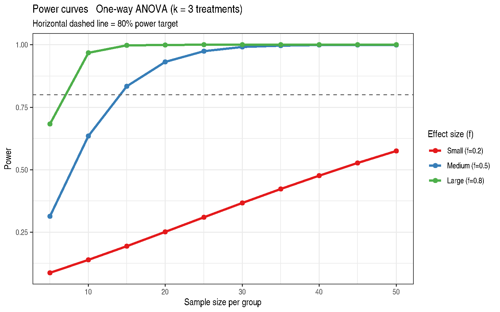

# Chapter 21: Precision, Power, Sample Size, and Planning

``` r
library(modernGLMM)
library(ggplot2)
library(emmeans)
```

## 1 Overview

Chapter 21 addresses **prospective power analysis** for experiments
involving GLMMs. The goals are to:

1.  Determine the **minimum sample size** for a desired power level
2.  Understand how effect size, variance, and design structure interact
3.  Extend classical power formulas to mixed model contexts

## 2 Theory: Power for a One-Way ANOVA

For a balanced one-way ANOVA with \\k\\ treatments and \\n\\
observations per group, the F-statistic under the alternative hypothesis
follows a **non-central F distribution**:

\\F \sim F\_{df_1,\\ df_2,\\ \lambda}\\

with non-centrality parameter:

\\\lambda = n \sum\_{i=1}^{k} \frac{\tau_i^2}{\sigma^2} = nk f^2\\

where Cohen’s \\f\\ is the standardised effect size:

\\f = \sqrt{\frac{\sum \tau_i^2 / k}{\sigma^2}}\\

Power is:

\\\text{Power} = 1 - F\_{df_1,df_2,\lambda}\left(F\_{\alpha, df_1,
df_2}\right)\\

## 3 Example 21.1 — Power Curves

``` r
data(DataSet21.1)
str(DataSet21.1)
```

    'data.frame':   30 obs. of  3 variables:
     $ n_per_group: int  5 10 15 20 25 30 35 40 45 50 ...
     $ effect_size: num  0.2 0.2 0.2 0.2 0.2 0.2 0.2 0.2 0.2 0.2 ...
     $ power      : num  0.0872 0.1394 0.1949 0.2521 0.3098 ...

``` r
ggplot(
  DataSet21.1,
  aes(x = n_per_group, y = power,
      colour = factor(effect_size),
      group  = factor(effect_size))
) +
  geom_line(linewidth = 1.2) +
  geom_point(size = 2) +
  geom_hline(yintercept = 0.80, linetype = "dashed", colour = "grey40") +
  scale_colour_manual(
    name   = "Effect size (f)",
    values = c("#E41A1C", "#377EB8", "#4DAF4A"),
    labels = c("Small (f=0.2)", "Medium (f=0.5)", "Large (f=0.8)")
  ) +
  labs(
    title    = "Power curves — One-way ANOVA (k = 3 treatments)",
    subtitle = "Horizontal dashed line = 80% power target",
    x        = "Sample size per group",
    y        = "Power"
  ) +
  theme_bw() +
  theme(legend.position = "right")
```



Figure 1: Power curves for one-way ANOVA (k = 3) by sample size and
effect size

## 4 Minimum Sample Sizes

``` r
power_anova <- function(n, k = 3L, f = 0.5, alpha = 0.05) {
  df1 <- k - 1L
  df2 <- k * (n - 1L)
  ncp <- k * n * f^2
  fc  <- stats::qf(1 - alpha, df1, df2)
  1 - stats::pf(fc, df1, df2, ncp = ncp)
}

min_n <- function(f, target = 0.80, k = 3L) {
  ns <- 2:300
  pw <- sapply(ns, power_anova, k = k, f = f)
  ns[which(pw >= target)[1L]]
}

results <- data.frame(
  effect_size  = c("Small (f=0.2)", "Medium (f=0.5)", "Large (f=0.8)"),
  f            = c(0.2, 0.5, 0.8),
  min_n_80pct  = sapply(c(0.2, 0.5, 0.8), min_n, target = 0.80),
  min_n_90pct  = sapply(c(0.2, 0.5, 0.8), min_n, target = 0.90)
)
knitr::kable(results, caption = "Minimum n per group for 80% and 90% power")
```

| effect_size    |   f | min_n_80pct | min_n_90pct |
|:---------------|----:|------------:|------------:|
| Small (f=0.2)  | 0.2 |          82 |         107 |
| Medium (f=0.5) | 0.5 |          14 |          18 |
| Large (f=0.8)  | 0.8 |           7 |           8 |

Minimum n per group for 80% and 90% power

## 5 Mixed Model Power Considerations

For a mixed model, the effective sample size and degrees of freedom
depend on the design structure. Key considerations:

- **Intra-class correlation (ICC)**: High ICC reduces effective \\n\\.
  The design effect is \\\text{DEFF} = 1 + (m-1)\rho\\ for \\m\\
  observations per cluster.
- **Degrees of freedom**: Satterthwaite or Kenward-Roger df affect
  critical values and therefore power.
- **Variance component uncertainty**: Pilot estimates of \\\sigma^2_b\\
  carry uncertainty; sensitivity analysis over a range of values is
  recommended.

``` r
## Illustration: effective sample size with ICC
icc_effect <- function(m, icc) 1 + (m - 1) * icc

cat("Design effect (m=5 obs/cluster) at various ICC:\n")
```

    Design effect (m=5 obs/cluster) at various ICC:

``` r
iccs <- c(0.0, 0.1, 0.3, 0.5)
for (icc in iccs) {
  cat(sprintf("  ICC = %.1f -> DEFF = %.2f\n", icc, icc_effect(5, icc)))
}
```

      ICC = 0.0 -> DEFF = 1.00
      ICC = 0.1 -> DEFF = 1.40
      ICC = 0.3 -> DEFF = 2.20
      ICC = 0.5 -> DEFF = 3.00

## 6 Key Takeaways

- Power depends on effect size (\\f\\ or \\d\\), sample size,
  significance level, and the number of groups.
- Pilot studies provide estimates of \\\delta\\ and \\\sigma\\, but
  these carry uncertainty — use conservative estimates.
- In mixed models, the ICC reduces effective sample size; high ICC
  requires larger \\n\\ than a simple one-way ANOVA.
- Always report power together with the assumed effect size and
  variance.

## 7 References

Stroup, W. W., Ptukhina, M., and Garai, S. (2024). *Generalized Linear
Mixed Models: Modern Concepts, Methods and Applications* (2nd ed.). CRC
Press.

Cohen, J. (1988). *Statistical Power Analysis for the Behavioral
Sciences*, 2nd ed. Lawrence Erlbaum Associates.
